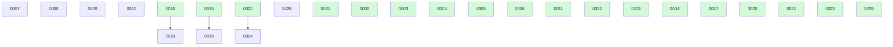

# Backlog

**26 changes** — 🟡 7 proposed · 🔵 1 implemented · ✅ 18 done

## 🟡 Proposed (7)

| # | Title | Priority | Readiness |
|---|-------|----------|-----------|
| [0007](active/0007-recurring-change-templates.md) | Recurring change templates — scheduled maintenance work that spawns proposed instances | `medium` | needs-brainstorm |
| [0008](active/0008-parallel-backlog-drain.md) | Parallel backlog drain — fan out concurrent implement-next runs over independent build-ready changes | `medium` | needs-brainstorm |
| [0009](active/0009-human-escalation-loop.md) | Human escalation loop — structured questions-for-you in the change file, answered asynchronously in git | `medium` | needs-brainstorm |
| [0010](active/0010-board-analytics.md) | Board analytics — throughput and cycle-time stats derived from git history, rendered on BOARD.md | `low` | needs-brainstorm |
| [0018](active/0018-yq-yaml-parsing.md) | Evaluate adopting yq for YAML parsing across docket scripts | `low` | needs-brainstorm |
| [0019](active/0019-finalize-ci-gate-functional-test.md) | Finalize ci/both gate — functional test against real GitHub CI (poll/retry) | `low` | needs-brainstorm |
| [0024](active/0024-retire-board-source-drift-check.md) | Retire or downgrade the inline board/source-drift health check once rendering is deterministic | `low` | needs-brainstorm |

## 🔵 Implemented — awaiting merge (1)

| # | Title | Priority | PR |
|---|-------|----------|----|
| [0026](active/0026-config-resolution-script.md) | Extract config resolution + bootstrap guard into a deterministic script | `medium` | [#38](https://github.com/danielhanold/docket/pull/38) |

✅ Archive — done (18)

| # | Title | Merged |
|---|-------|--------|
| [0025](archive/2026-06-19-0025-closeout-scripts.md) | Extract the shared terminal-transition close-out mechanics into deterministic scripts | 2026-06-19 |
| [0023](archive/2026-06-19-0023-script-sweep-and-health-checks.md) | Decide and apply scripting vs model-driven for the merge sweep and health checks | 2026-06-19 |
| [0022](archive/2026-06-19-0022-render-board-script.md) | Extract inline board rendering into a deterministic script | 2026-06-19 |
| [0021](archive/2026-06-19-0021-finalize-consent-model.md) | Finalize consent model — ambiguity-only prompt + require_pr_approval policy gate | 2026-06-19 |
| [0020](archive/2026-06-17-0020-convention-progressive-disclosure.md) | Split the docket-convention skill via progressive disclosure — extract the GitHub board mirror first | 2026-06-17 |
| [0017](archive/2026-06-17-0017-docket-subagent-composition-wiring.md) | docket subagent composition — nested status/adr/critic dispatch | 2026-06-17 |
| [0015](archive/2026-06-17-0015-finalize-rebase-retest-gate.md) | finalize — rebase onto base + re-run tests before merge | 2026-06-17 |
| [0016](archive/2026-06-16-0016-docket-subagent-model-effort.md) | docket skills as model/effort-pinned subagents — foundation | 2026-06-16 |
| [0011](archive/2026-06-16-0011-github-issues-board-mirror.md) | GitHub board mirror — selectable board surfaces, one-way Issues + Projects mirror | 2026-06-16 |
| [0014](archive/2026-06-12-0014-docket-auto-groom.md) | docket-auto-groom — autonomous grooming drain over auto-groomable stubs | 2026-06-12 |
| [0013](archive/2026-06-12-0013-groom-next-stub-recap.md) | Groom-next recap — introduce the selected stub before the brainstorm starts | 2026-06-12 |
| [0012](archive/2026-06-12-0012-groom-next-skill.md) | Groom-next skill — pick the next needs-brainstorm stub and groom it to build-ready | 2026-06-12 |
| [0006](archive/2026-06-12-0006-learnings-ledger.md) | Learnings ledger — an append-only per-repo memory that builds feed and future builds read | 2026-06-12 |
| [0005](archive/2026-06-10-0005-convention-extraction-skill.md) | Extract the shared convention into a docket-convention skill — reference-loaded, not embedded | 2026-06-10 |
| [0004](archive/2026-06-10-0004-board-refresh-on-status-transition.md) | BOARD.md goes stale during a build — refresh it on status transitions (claim / implemented), not only at Step 0 | 2026-06-10 |
| [0003](archive/2026-06-05-0003-migration-tool-pwd-target.md) | migrate-to-docket.sh targets the invoking repo ($PWD) — usable for consuming repos | 2026-06-05 |
| [0002](archive/2026-06-04-0002-docket-metadata-branch.md) | docket metadata branch — separate planning state from code history | 2026-06-04 |
| [0001](archive/2026-06-02-0001-results-artifact.md) | Change results artifact — linked, optional close-out file | 2026-06-02 |

