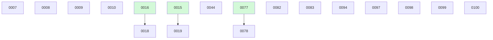

# Backlog

**100 changes** — 🟡 12 proposed · 🔴 1 blocked · 🔵 2 implemented · ✅ 80 done · 🗑️ 5 killed

## 🟡 Proposed (12)

| # | Title | Priority | Readiness |
|---|-------|----------|-----------|
| [0007](active/0007-recurring-change-templates.md) | Recurring change templates — scheduled maintenance work that spawns proposed instances | `medium` | needs-brainstorm |
| [0008](active/0008-parallel-backlog-drain.md) | Parallel backlog drain — fan out concurrent implement-next runs over independent build-ready changes | `medium` | needs-brainstorm |
| [0009](active/0009-human-escalation-loop.md) | Human escalation loop — structured questions-for-you in the change file, answered asynchronously in git | `medium` | needs-brainstorm |
| [0010](active/0010-board-analytics.md) | Board analytics — throughput and cycle-time stats derived from git history, rendered on BOARD.md | `low` | needs-brainstorm |
| [0018](active/0018-yq-yaml-parsing.md) | Evaluate adopting yq for YAML parsing across docket scripts | `low` | needs-brainstorm |
| [0019](active/0019-finalize-ci-gate-functional-test.md) | Finalize ci/both gate — functional test against real GitHub CI (poll/retry) | `low` | needs-brainstorm |
| [0082](active/0082-global-harnesses-per-repo-generation.md) | Global agent_harnesses doesn't reach per-repo generation — silent no-op | `low` | needs-brainstorm |
| [0083](active/0083-terminal-publish-gap-detection.md) | A terminal record can silently never reach the integration branch — mark deferred publishes, stop the checker lying | `medium` | build-ready |
| [0094](active/0094-selection-order-digest.md) | Selection-order backlog digest — implement-next selects from a digest instead of walking active/ | `medium` | build-ready |
| [0098](active/0098-stale-finalize-marker-health-check.md) | Health check for a stale `## Finalize blocked` marker | `medium` | build-ready |
| [0099](active/0099-finalize-marker-clearing-rule-wording.md) | Re-phrase the `## Finalize blocked` clearing rule around what it actually guards | `low` | build-ready |
| [0100](active/0100-force-push-lease-classifier-denial.md) | Force-push-with-lease denied by the auto-mode classifier — unblock finalize's merge gate | `medium` | needs-brainstorm |

## 🔴 Blocked (1)

| # | Title | Priority | Blocked by |
|---|-------|----------|------------|
| [0044](active/0044-configurable-build-model.md) | Configurable SDD build models for docket-implement-next | `low` | PR #69 is stale (predates the 0068/0072 facade rework and later agent-layer changes) and #0079 (runner delegation) reshapes the design — the build roles should grow a runner field (build.<role>.runner codex, the mixed topology 0079 deferred). Needs a rebase plus redesign pass before merge. |

## 🔵 Implemented — awaiting merge (2)

| # | Title | Priority | PR | Readiness |
|---|-------|----------|----|-----------|
| [0078](active/0078-codex-cli-validation-runbook.md) | Codex CLI live-validation runbook — prove docket works end-to-end under Codex | `high` | [#89](https://github.com/danielhanold/docket/pull/89) |  |
| [0097](active/0097-mirror-readiness-label-parity.md) | GitHub mirror readiness parity — readiness labels stop at `proposed` | `low` | [#105](https://github.com/danielhanold/docket/pull/105) |  |

✅🗑️ Archive — done + killed (85)

| # | Title | Merged |
|---|-------|--------|
| [0096](archive/2026-07-19-0096-suppress-plan-skill-execution-handoff.md) | An autonomous run can be halted by a sub-skill's interactive hand-off — pre-specify the outcome at every autonomous call site | 2026-07-19 |
| [0091](archive/2026-07-19-0091-auto-create-discovered-stubs.md) | Auto-create discovered stubs — a config flag that turns mid-run findings into proposed changes | 2026-07-19 |
| [0087](archive/2026-07-19-0087-headless-finalize-driver.md) | Headless finalize — the finalize-side disposition contract, mirroring 0088 | 2026-07-19 |
| [0095](archive/2026-07-18-0095-retire-auto-approve-workflow.md) | Retire the auto-approve workflow — document the classifier and the single-maintainer branch-protection solution | 2026-07-18 |
| [0093](archive/2026-07-18-0093-archive-decay-digest.md) | Archive decay — a rolling one-line digest so board and context cost stay flat as the archive grows | 2026-07-18 |
| [0092](archive/2026-07-18-0092-orphan-detection-script.md) | Orphan detection script — cross-reference change ids in merged commits against archive state | 2026-07-18 |
| [0090](archive/2026-07-18-0090-discovered-from-provenance.md) | discovered-from provenance links — record which change's build surfaced a new stub | 2026-07-18 |
| [0089](archive/2026-07-18-0089-claim-leases-reclaim-script.md) | Claim leases + reclaim script — expired in-progress claims self-heal back to proposed | 2026-07-18 |
| [0088](archive/2026-07-18-0088-implement-next-loop-continuation.md) | Loop continuation — implement-next chains into the next ready change instead of stopping | 2026-07-18 |
| [0086](archive/2026-07-18-0086-attended-finalize-merge-path.md) | Attended finalize has no merge path under auto_approve — scope the --admin ban to autonomous runs | 2026-07-18 |
| [0085](archive/2026-07-17-0085-skill-slimming-round-two.md) | Second-round skill slimming — re-slim regrown skills + regrowth guard | 2026-07-17 |
| [0062](archive/2026-07-17-0062-autonomous-finalize-merge-authorization.md) | Autonomous finalize merge — clear the auto-mode Merge-Without-Review soft-deny | 2026-07-17 |
| [0084](archive/2026-07-16-0084-terminal-publish-opt-in-default.md) | Flip terminal_publish default to false — publishing to the integration branch becomes opt-in | 2026-07-16 |
| [0081](archive/2026-07-16-0081-first-run-setup-config-example.md) | First-run setup — committed starter config + install.sh scaffolding + README Install restructure | 2026-07-16 |
| [0079](archive/2026-07-16-0079-codex-runner-delegation.md) | Cross-harness runner delegation framework (first runner — OpenAI Codex) | 2026-07-16 |
| [0077](archive/2026-07-16-0077-codex-harness-toml-agents.md) | Codex harness — TOML agent generation + AGENTS.md dispatch block | 2026-07-16 |
| [0033](archive/2026-07-16-0033-adr-index-main-maintenance.md) | Decide how the ADR index is maintained on the integration branch | 2026-07-16 |
| [0076](archive/2026-07-14-0076-cwd-independent-repo-root-resolution.md) | Resolve the repo root independently of CWD — preflight run inside `.docket` mints a nested metadata worktree | 2026-07-14 |
| [0043](archive/2026-07-08-0043-agent-model-tiers.md) | Model-tier indirection for agent model selection + config-driven advisories | 2026-07-08 |
| [0028](archive/2026-06-20-0028-wire-closeout-call-sites.md) | Wire the close-out call sites to the extracted scripts | 2026-06-20 |

**Older done (collapsed)**

| Month | Done |
|-------|------|
| [2026-07](archive/) | 33 done |
| [2026-06](archive/) | 32 done |

