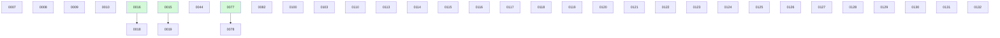

# Backlog

**132 changes** — 🟢 1 in progress · 🟡 26 proposed · 🔴 1 blocked · 🔵 4 implemented · ✅ 94 done · 🗑️ 6 killed

## 🟢 In progress (1)

| # | Title | Priority | Spec | Branch |
|---|-------|----------|------|--------|
| [0132](active/0132-install-configured-bash-runtime.md) | Install and use a configured Bash 4+ runtime | `high` | [spec](../superpowers/specs/2026-07-22-install-configured-bash-runtime-design.md) | `feat/install-configured-bash-runtime` |

## 🟡 Proposed (26)

| # | Title | Priority | Readiness |
|---|-------|----------|-----------|
| [0007](active/0007-recurring-change-templates.md) | Recurring change templates — scheduled maintenance work that spawns proposed instances | `medium` | needs-brainstorm |
| [0008](active/0008-parallel-backlog-drain.md) | Parallel backlog drain — fan out concurrent implement-next runs over independent build-ready changes | `medium` | needs-brainstorm |
| [0009](active/0009-human-escalation-loop.md) | Human escalation loop — structured questions-for-you in the change file, answered asynchronously in git | `medium` | needs-brainstorm |
| [0010](active/0010-board-analytics.md) | Board analytics — throughput and cycle-time stats derived from git history, rendered on BOARD.md | `low` | needs-brainstorm |
| [0018](active/0018-yq-yaml-parsing.md) | Evaluate adopting yq for YAML parsing across docket scripts | `low` | needs-brainstorm |
| [0019](active/0019-finalize-ci-gate-functional-test.md) | Finalize ci/both gate — functional test against real GitHub CI (poll/retry) | `low` | needs-brainstorm |
| [0082](active/0082-global-harnesses-per-repo-generation.md) | Global agent_harnesses doesn't reach per-repo generation — silent no-op | `low` | needs-brainstorm |
| [0100](active/0100-force-push-lease-classifier-denial.md) | Force-push-with-lease denied by the auto-mode classifier — unblock finalize's merge gate | `medium` | needs-brainstorm |
| [0103](active/0103-wire-the-github-project-config-read-documented-but-unwired-k.md) | Wire the github_project config read (documented-but-unwired key) | `low` | needs-brainstorm |
| [0110](active/0110-shared-metadata-worktree-contention.md) | Concurrent agents collide on the shared .docket worktree's dirty-tree window | `high` | needs-brainstorm |
| [0113](active/0113-suppressed-handoff-silently-ends-autonomous-run.md) | A suppressed hand-off can silently end an autonomous run — make step completion verifiable, not narrated | `high` | needs-brainstorm |
| [0115](active/0115-extend-the-board-row-dropped-invariant-to-archive-files.md) | Extend the board-row-dropped invariant to archive/ files | `medium` | build-ready |
| [0117](active/0117-deferred-adr-publish-visibility-decide-whether-docket-adr-s.md) | Deferred ADR-publish visibility — detect an unpublished ADR with a computed board-checks finding | `medium` | build-ready |
| [0118](active/0118-decide-whether-the-sweep-s-skip-publish-path-should-also-mar.md) | Decide whether the sweep's skip-publish path should also mark an unpublished terminal record | `medium` | needs-brainstorm |
| [0119](active/0119-scope-the-metadata-worktree-git-commit-calls-to-the-paths-th.md) | Scope the metadata-worktree git commit calls to the paths they own | `medium` | needs-brainstorm |
| [0120](active/0120-docket-finalize-change-claims-integration-branch-is-read-fro.md) | docket-finalize-change claims integration_branch is read from .docket.yml, but it is an exported resolver key | `medium` | needs-brainstorm |
| [0121](active/0121-the-manifest-s-elsewhere-check-proves-a-word-occurrence-not.md) | The manifest's elsewhere: check proves a word occurrence, not a real config read | `medium` | needs-brainstorm |
| [0122](active/0122-nested-keys-scope-tags-in-docket-example-yml-are-unguarded.md) | Nested keys' scope tags in .docket.example.yml are unguarded | `medium` | needs-brainstorm |
| [0123](active/0123-machine-check-the-docket-config-md-export-list-order-against.md) | Machine-check the docket-config.md export list order against the resolver | `medium` | needs-brainstorm |
| [0124](active/0124-backlog-triage-pass.md) | Backlog triage pass — kill, defer, or arm each needs-brainstorm stub | `medium` | needs-brainstorm |
| [0125](active/0125-decide-whether-the-rung-pair-completeness-claim-should-be-me.md) | Decide whether the rung-pair completeness claim should be mechanically enforced | `medium` | needs-brainstorm |
| [0126](active/0126-apply-the-poison-value-prelude-uniformly-to-every-resolver-e.md) | Apply the poison-value prelude uniformly to every resolver eval in the config suite | `medium` | needs-brainstorm |
| [0127](active/0127-typed-changes-selective-auto-capture.md) | Typed changes — configurable taxonomy, selective auto-capture, and backlog filters | `medium` | build-ready |
| [0129](active/0129-fix-the-pipefail-unsafe-plain-format-config-assertion.md) | Fix the pipefail-unsafe plain-format config assertion | `medium` | needs-brainstorm |
| [0130](active/0130-make-the-finalize-marker-reachability-guard-portable-to-bsd.md) | Make the finalize marker reachability guard portable to BSD grep | `medium` | needs-brainstorm |
| [0131](active/0131-make-board-conflict-rebase-continuation-noninteractive.md) | Make board-conflict rebase continuation noninteractive | `medium` | needs-brainstorm |

## 🔴 Blocked (1)

| # | Title | Priority | Blocked by |
|---|-------|----------|------------|
| [0044](active/0044-configurable-build-model.md) | Configurable SDD build models for docket-implement-next | `low` | PR #69 is stale (predates the 0068/0072 facade rework and later agent-layer changes) and #0079 (runner delegation) reshapes the design — the build roles should grow a runner field (build.<role>.runner codex, the mixed topology 0079 deferred). Needs a rebase plus redesign pass before merge. |

## 🔵 Implemented — awaiting merge (4)

| # | Title | Priority | PR | Readiness |
|---|-------|----------|----|-----------|
| [0078](active/0078-codex-cli-validation-runbook.md) | Codex CLI live-validation runbook — prove docket works end-to-end under Codex | `high` | [#89](https://github.com/danielhanold/docket/pull/89) |  |
| [0114](active/0114-decide-the-repo-s-posture-on-line-number-comment-anchors.md) | Decide the repo's posture on line-number comment anchors | `medium` | [#119](https://github.com/danielhanold/docket/pull/119) |  |
| [0116](active/0116-single-source-the-remaining-duplicated-board-vocabularies.md) | Single-source the remaining duplicated board vocabularies | `medium` | [#120](https://github.com/danielhanold/docket/pull/120) |  |
| [0128](active/0128-truthful-git-errors-harness-neutral-escalation-retry.md) | Truthful Git failures and harness-neutral sandbox escalation retry | `high` | [#121](https://github.com/danielhanold/docket/pull/121) | finalize blocked — needs you |

✅🗑️ Archive — done + killed (100)

| # | Title | Merged |
|---|-------|--------|
| [0112](archive/2026-07-22-0112-pin-the-reverse-cross-layer-masking-for-the-committed-over-l.md) | Complete the finalize.test_command cross-layer masking matrix (reverse committed-over-local + both skip-rung pairs) | 2026-07-22 |
| [0111](archive/2026-07-21-0111-guard-the-board-checks-check-id-enumerations-against-drift.md) | Guard the board-checks check-id enumerations against drift | 2026-07-21 |
| [0108](archive/2026-07-21-0108-guard-the-readme-s-remaining-config-fences-against-key-drift.md) | Guard the README's remaining config fences against key drift | 2026-07-21 |
| [0102](archive/2026-07-21-0102-finalize-require-pr-approval-has-no-layer-resolution.md) | finalize.require_pr_approval has no layer resolution | 2026-07-21 |
| [0083](archive/2026-07-21-0083-terminal-publish-gap-detection.md) | A terminal record can silently never reach the integration branch — mark deferred publishes, stop the checker lying | 2026-07-21 |
| [0109](archive/2026-07-20-0109-rename-docket-yml-example-to-docket-example-yml.md) | Rename .docket.yml.example to .docket.example.yml so editors syntax-highlight it | 2026-07-20 |
| [0107](archive/2026-07-20-0107-guard-the-readme-config-snippet-against-docket-yml-example-d.md) | Guard the README config snippet against .docket.yml.example drift | 2026-07-20 |
| [0106](archive/2026-07-20-0106-pin-the-finalize-test-command-auto-sentinel-s-cross-layer-ma.md) | Pin the finalize.test_command auto sentinel's cross-layer masking with a two-layer fixture | 2026-07-20 |
| [0105](archive/2026-07-20-0105-pin-docket-mode-main-coverage-for-docket-status-digest-only.md) | Pin DOCKET_MODE=main coverage for docket-status --digest-only | 2026-07-20 |
| [0104](archive/2026-07-20-0104-guard-frontmatter-field-domain-violations-that-silently-drop.md) | Guard frontmatter field-domain violations that silently drop board rows | 2026-07-20 |
| [0101](archive/2026-07-20-0101-docket-yml-example.md) | .docket.yml.example — the canonical all-comprehensive config reference | 2026-07-20 |
| [0099](archive/2026-07-19-0099-finalize-marker-clearing-rule-wording.md) | Re-phrase the `## Finalize blocked` clearing rule around what it actually guards | 2026-07-19 |
| [0098](archive/2026-07-19-0098-stale-finalize-marker-health-check.md) | Health check for a stale `## Finalize blocked` marker | 2026-07-19 |
| [0097](archive/2026-07-19-0097-mirror-readiness-label-parity.md) | GitHub mirror readiness parity — readiness labels stop at `proposed` | 2026-07-19 |
| [0096](archive/2026-07-19-0096-suppress-plan-skill-execution-handoff.md) | An autonomous run can be halted by a sub-skill's interactive hand-off — pre-specify the outcome at every autonomous call site | 2026-07-19 |
| [0094](archive/2026-07-19-0094-selection-order-digest.md) | Selection-order backlog digest — implement-next selects from a digest instead of walking active/ | 2026-07-19 |
| [0086](archive/2026-07-18-0086-attended-finalize-merge-path.md) | Attended finalize has no merge path under auto_approve — scope the --admin ban to autonomous runs | 2026-07-18 |
| [0033](archive/2026-07-16-0033-adr-index-main-maintenance.md) | Decide how the ADR index is maintained on the integration branch | 2026-07-16 |
| [0076](archive/2026-07-14-0076-cwd-independent-repo-root-resolution.md) | Resolve the repo root independently of CWD — preflight run inside `.docket` mints a nested metadata worktree | 2026-07-14 |
| [0043](archive/2026-07-08-0043-agent-model-tiers.md) | Model-tier indirection for agent model selection + config-driven advisories | 2026-07-08 |
| [0028](archive/2026-06-20-0028-wire-closeout-call-sites.md) | Wire the close-out call sites to the extracted scripts | 2026-06-20 |

**Older done (collapsed)**

| Month | Done |
|-------|------|
| [2026-07](archive/) | 47 done |
| [2026-06](archive/) | 32 done |

