# Backlog

**45 changes** — 🟢 1 in progress · 🟡 8 proposed · ✅ 34 done · 🗑️ 2 killed

## 🟢 In progress (1)

| # | Title | Priority | Spec | Branch |
|---|-------|----------|------|--------|
| [0045](active/0045-multi-harness-agent-generation.md) | Per-repo agent model config reaches Cursor via multi-harness generation | `medium` | [spec](../superpowers/specs/2026-07-08-multi-harness-agent-generation-design.md) | `feat/multi-harness-agent-generation` |

## 🟡 Proposed (8)

| # | Title | Priority | Readiness |
|---|-------|----------|-----------|
| [0007](active/0007-recurring-change-templates.md) | Recurring change templates — scheduled maintenance work that spawns proposed instances | `medium` | needs-brainstorm |
| [0008](active/0008-parallel-backlog-drain.md) | Parallel backlog drain — fan out concurrent implement-next runs over independent build-ready changes | `medium` | needs-brainstorm |
| [0009](active/0009-human-escalation-loop.md) | Human escalation loop — structured questions-for-you in the change file, answered asynchronously in git | `medium` | needs-brainstorm |
| [0010](active/0010-board-analytics.md) | Board analytics — throughput and cycle-time stats derived from git history, rendered on BOARD.md | `low` | needs-brainstorm |
| [0018](active/0018-yq-yaml-parsing.md) | Evaluate adopting yq for YAML parsing across docket scripts | `low` | needs-brainstorm |
| [0019](active/0019-finalize-ci-gate-functional-test.md) | Finalize ci/both gate — functional test against real GitHub CI (poll/retry) | `low` | needs-brainstorm |
| [0033](active/0033-adr-index-main-maintenance.md) | Decide how the ADR index is maintained on the integration branch | `medium` | auto-groom blocked — needs you |
| [0044](active/0044-configurable-build-model.md) | Configurable SDD build models for docket-implement-next | `low` | build-ready |

```mermaid
graph TD
  0007
  0008
  0009
  0010
  0016 --> 0018
  0015 --> 0019
  0030 --> 0033
  0044
  0045
  0001:::done
  0002:::done
  0003:::done
  0004:::done
  0005:::done
  0006:::done
  0011:::done
  0012:::done
  0013:::done
  0014:::done
  0015:::done
  0016:::done
  0017:::done
  0020:::done
  0021:::done
  0022:::done
  0023:::done
  0024:::done
  0025:::done
  0026:::done
  0027:::done
  0029:::done
  0030:::done
  0031:::done
  0032:::done
  0034:::done
  0035:::done
  0036:::done
  0037:::done
  0038:::done
  0039:::done
  0040:::done
  0041:::done
  0042:::done
  classDef done fill:#d3f9d8;
```

✅🗑️ Archive — done + killed (36)

| # | Title | Merged |
|---|-------|--------|
| [0043](archive/2026-07-08-0043-agent-model-tiers.md) | Model-tier indirection for agent model selection + config-driven advisories | 2026-07-08 |
| [0042](archive/2026-07-08-0042-retune-agent-model-defaults.md) | Re-tune default agent models for the Claude 5 lineup (pin explicit versions) | 2026-07-08 |
| [0024](archive/2026-07-08-0024-retire-board-source-drift-check.md) | Retire or downgrade the inline board/source-drift health check once rendering is deterministic | 2026-07-08 |
| [0041](archive/2026-06-24-0041-post-merge-sync-targets-consuming-repo.md) | Post-merge integration sync fast-forwards the docket clone, not the consuming repo where the merge landed | 2026-06-24 |
| [0040](archive/2026-06-23-0040-terminal-publish-refresh-adr-index.md) | terminal-publish leaves the integration-branch ADR index stale — regenerate it when an ADR is published | 2026-06-23 |
| [0039](archive/2026-06-21-0039-trim-docket-status-archive-prose.md) | Trim docket-status's residual archive-internals prose onto scripts/archive-change.md | 2026-06-21 |
| [0038](archive/2026-06-21-0038-test-grep-stray-dash-warning.md) | Test suite — drop over-escaped dashes in test_docket_metadata_branch.sh grep (silences "stray \ before -") | 2026-06-21 |
| [0037](archive/2026-06-21-0037-skill-fallback-progressive-disclosure.md) | Slim skills — move the per-skill manual-fallback / script-contract prose into on-demand sibling files | 2026-06-21 |
| [0036](archive/2026-06-21-0036-status-sweep-double-archive.md) | docket-status sweep — delegate archiving to archive-change.sh (remove the double-archive) | 2026-06-21 |
| [0035](archive/2026-06-21-0035-artifact-links.md) | Artifact links — a generated link block at the top of every change | 2026-06-21 |
| [0034](archive/2026-06-21-0034-consuming-repo-script-resolution.md) | Helper scripts unreachable in consuming repos — skills call repo-relative `scripts/…` that exists only in the docket source repo | 2026-06-21 |
| [0032](archive/2026-06-20-0032-frontmatter-id-validation.md) | Validate numeric id across the frontmatter script family | 2026-06-20 |
| [0031](archive/2026-06-20-0031-adr-status-check-verb-match.md) | ADR status-consistency check — match the supersede/reverse verb, not just the target id | 2026-06-20 |
| [0030](archive/2026-06-20-0030-script-adr-passes.md) | Script docket-adr's deterministic passes — index render, ledger checks, ADR-only publish | 2026-06-20 |
| [0029](archive/2026-06-20-0029-sync-integration-after-merge.md) | Fast-forward the local integration branch after a docket merge | 2026-06-20 |
| [0028](archive/2026-06-20-0028-wire-closeout-call-sites.md) | Wire the close-out call sites to the extracted scripts | 2026-06-20 |
| [0027](archive/2026-06-20-0027-claude-settings-publish-permission.md) | Auto-grant docket's integration-branch push permission via a per-repo Claude settings rule | 2026-06-20 |
| [0026](archive/2026-06-19-0026-config-resolution-script.md) | Extract config resolution + bootstrap guard into a deterministic script | 2026-06-19 |
| [0025](archive/2026-06-19-0025-closeout-scripts.md) | Extract the shared terminal-transition close-out mechanics into deterministic scripts | 2026-06-19 |
| [0023](archive/2026-06-19-0023-script-sweep-and-health-checks.md) | Decide and apply scripting vs model-driven for the merge sweep and health checks | 2026-06-19 |
| [0022](archive/2026-06-19-0022-render-board-script.md) | Extract inline board rendering into a deterministic script | 2026-06-19 |
| [0021](archive/2026-06-19-0021-finalize-consent-model.md) | Finalize consent model — ambiguity-only prompt + require_pr_approval policy gate | 2026-06-19 |
| [0020](archive/2026-06-17-0020-convention-progressive-disclosure.md) | Split the docket-convention skill via progressive disclosure — extract the GitHub board mirror first | 2026-06-17 |
| [0017](archive/2026-06-17-0017-docket-subagent-composition-wiring.md) | docket subagent composition — nested status/adr/critic dispatch | 2026-06-17 |
| [0015](archive/2026-06-17-0015-finalize-rebase-retest-gate.md) | finalize — rebase onto base + re-run tests before merge | 2026-06-17 |
| [0016](archive/2026-06-16-0016-docket-subagent-model-effort.md) | docket skills as model/effort-pinned subagents — foundation | 2026-06-16 |
| [0011](archive/2026-06-16-0011-github-issues-board-mirror.md) | GitHub board mirror — selectable board surfaces, one-way Issues + Projects mirror | 2026-06-16 |
| [0014](archive/2026-06-12-0014-docket-auto-groom.md) | docket-auto-groom — autonomous grooming drain over auto-groomable stubs | 2026-06-12 |
| [0013](archive/2026-06-12-0013-groom-next-stub-recap.md) | Groom-next recap — introduce the selected stub before the brainstorm starts | 2026-06-12 |
| [0012](archive/2026-06-12-0012-groom-next-skill.md) | Groom-next skill — pick the next needs-brainstorm stub and groom it to build-ready | 2026-06-12 |
| [0006](archive/2026-06-12-0006-learnings-ledger.md) | Learnings ledger — an append-only per-repo memory that builds feed and future builds read | 2026-06-12 |
| [0005](archive/2026-06-10-0005-convention-extraction-skill.md) | Extract the shared convention into a docket-convention skill — reference-loaded, not embedded | 2026-06-10 |
| [0004](archive/2026-06-10-0004-board-refresh-on-status-transition.md) | BOARD.md goes stale during a build — refresh it on status transitions (claim / implemented), not only at Step 0 | 2026-06-10 |
| [0003](archive/2026-06-05-0003-migration-tool-pwd-target.md) | migrate-to-docket.sh targets the invoking repo ($PWD) — usable for consuming repos | 2026-06-05 |
| [0002](archive/2026-06-04-0002-docket-metadata-branch.md) | docket metadata branch — separate planning state from code history | 2026-06-04 |
| [0001](archive/2026-06-02-0001-results-artifact.md) | Change results artifact — linked, optional close-out file | 2026-06-02 |

