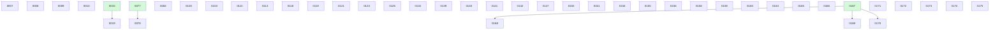

# Backlog

**175 changes** — 🟢 1 in progress · 🟡 34 proposed · ⚪ 4 deferred · 🔵 2 implemented · ✅ 115 done · 🗑️ 19 killed

## 🟢 In progress (1)

| # | Title | Priority | Type | Spec | Branch |
|---|-------|----------|------|------|--------|
| [0174](active/0174-reuse-test-git-fixtures.md) | Reuse test git fixtures instead of rebuilding them per assertion | `medium` | `chore` | [spec](../superpowers/specs/2026-07-31-reuse-test-git-fixtures-design.md) | `feat/reuse-test-git-fixtures` |

## 🟡 Proposed (34)

| # | Title | Priority | Type | Readiness |
|---|-------|----------|------|-----------|
| [0019](active/0019-finalize-ci-gate-functional-test.md) | Finalize ci/both gate — functional test against real GitHub CI (poll/retry) | `low` | `chore` | needs-brainstorm |
| [0082](active/0082-global-harnesses-per-repo-generation.md) | Global agent_harnesses doesn't reach per-repo generation — silent no-op | `low` | `fix` | needs-brainstorm |
| [0100](active/0100-force-push-lease-classifier-denial.md) | Force-push-with-lease denied by the auto-mode classifier — unblock finalize's merge gate | `medium` | `fix` | needs-brainstorm |
| [0103](active/0103-wire-the-github-project-config-read-documented-but-unwired-k.md) | Wire the github_project config read (documented-but-unwired key) | `low` | `fix` | needs-brainstorm |
| [0110](active/0110-shared-metadata-worktree-contention.md) | Concurrent agents collide on the shared .docket worktree's dirty-tree window | `high` | `fix` | needs-brainstorm |
| [0113](active/0113-suppressed-handoff-silently-ends-autonomous-run.md) | A suppressed hand-off can silently end an autonomous run — make step completion verifiable, not narrated | `high` | `fix` | needs-brainstorm |
| [0118](active/0118-decide-whether-the-sweep-s-skip-publish-path-should-also-mar.md) | Decide whether the sweep's skip-publish path should also mark an unpublished terminal record | `medium` | `fix` | needs-brainstorm |
| [0119](active/0119-scope-the-metadata-worktree-git-commit-calls-to-the-paths-th.md) | Scope the metadata-worktree git commit calls to the paths they own | `medium` | `fix` | auto-groom blocked — needs you |
| [0121](active/0121-the-manifest-s-elsewhere-check-proves-a-word-occurrence-not.md) | The manifest's elsewhere: check proves a word occurrence, not a real config read | `medium` | `fix` | needs-brainstorm |
| [0123](active/0123-machine-check-the-docket-config-md-export-list-order-against.md) | Machine-check the docket-config.md export list order against the resolver | `medium` | `chore` | needs-brainstorm |
| [0125](active/0125-decide-whether-the-rung-pair-completeness-claim-should-be-me.md) | Decide whether the rung-pair completeness claim should be mechanically enforced | `medium` | `chore` | needs-brainstorm |
| [0134](active/0134-audit-field-call-sites-for-frontmatter-anchored-reads.md) | Audit field() call sites for frontmatter-anchored reads | `medium` | `fix` | needs-brainstorm |
| [0139](active/0139-extend-the-tiered-dispatch-unavailability-posture-to-finaliz.md) | Extend the tiered dispatch-unavailability posture to finalize's two in-context-gating dispatches | `medium` | `fix` | needs-brainstorm |
| [0140](active/0140-normalize-the-inherit-model-sentinel-once-for-every-runner-a.md) | Normalize the inherit model sentinel once for every runner adapter | `medium` | `fix` | needs-brainstorm |
| [0141](active/0141-factor-the-shared-wrapper-source-parse-out-of-the-named-harn.md) | Factor the shared wrapper-source parse out of the named harness emitters | `medium` | `refactor` | needs-brainstorm |
| [0142](active/0142-make-the-unmapped-harness-wrapper-gap-loud-at-generation-tim.md) | Make the unmapped-harness wrapper gap loud at generation time | `medium` | `fix` | needs-brainstorm |
| [0147](active/0147-extend-the-2c-orphan-key-check-past-its-column-0-anchor-to-n.md) | Extend the (2c) orphan-key check past its column-0 anchor to nested keys | `medium` | `fix` | auto-groom blocked — needs you |
| [0150](active/0150-pin-or-report-the-resolved-shell-toolchain-across-the-test-s.md) | Pin or report the resolved shell toolchain across the test suite | `medium` | `chore` | auto-groom blocked — needs you |
| [0151](active/0151-vacuous-docket-bash-path-asserts-sit-in-eval-free-blocks-out.md) | Vacuous DOCKET_BASH_PATH asserts sit in eval-free blocks, out of the poison-prelude guard's reach | `medium` | `fix` | auto-groom blocked — needs you |
| [0154](active/0154-audit-skill-bodies-for-the-stale-restatement-class-change-01.md) | Audit skill bodies for the stale-restatement class change 0145 closed in one file | `medium` | `docs` | needs-brainstorm |
| [0155](active/0155-interior-tabs-in-a-frontmatter-value-shift-the-render-board.md) | Interior TABs in a frontmatter value shift the render-board sort feeder's fields | `medium` | `fix` | needs-brainstorm |
| [0156](active/0156-render-board-sh-exits-0-on-malformed-input-and-commits-a-cor.md) | render-board.sh exits 0 on malformed input and commits a corrupt board | `medium` | `fix` | needs-brainstorm |
| [0158](active/0158-batch-mode-for-docket-implement-next-build-several-coupled-c.md) | Batch mode for docket-implement-next — build several coupled changes on one branch | `medium` | `feat` | needs-brainstorm |
| [0159](active/0159-docket-status-skill-md-s-normal-outcomes-list-omits-the-heal.md) | docket-status SKILL.md's normal-outcomes list omits the 'health checks failed <exit>' line | `medium` | `docs` | needs-brainstorm |
| [0160](active/0160-a-committed-too-deep-runtime-bash-lost-its-machine-local-ign.md) | A committed too-deep runtime.bash lost its machine-local ignored advisory | `medium` | `fix` | needs-brainstorm |
| [0163](active/0163-six-phase-tier-3-guard-counts-headings-instead-of-asserting.md) | Six-phase Tier 3 guard counts headings instead of asserting the phase set | `medium` | `fix` | needs-brainstorm |
| [0165](active/0165-consolidate-or-document-the-duplicated-flat-scalar-docket-ym.md) | Consolidate or document the duplicated flat-scalar .docket.yml reader in migrate-to-docket.sh | `medium` | `refactor` | needs-brainstorm |
| [0166](active/0166-retune-the-interactive-skills-advisory-session-model-recomme.md) | Retune the interactive skills' advisory session-model recommendation | `medium` | `chore` | needs-brainstorm |
| [0169](active/0169-codex-profile-routed-build-support.md) | Codex support for profile-routed Docket builds | `medium` | `feat` | needs-brainstorm |
| [0170](active/0170-lean-whole-branch-review-skill.md) | Lean Docket-owned whole-branch review skill | `medium` | `feat` | needs-brainstorm |
| [0171](active/0171-settle-a-reflow-tolerant-house-pattern-for-prose-anchored-gu.md) | Settle a reflow-tolerant house pattern for prose-anchored guards | `medium` | `refactor` | needs-brainstorm |
| [0172](active/0172-normalize-the-banned-producer-pipe-shape-across-tests-and-he.md) | Normalize the banned producer-pipe shape across tests and helpers | `medium` | `chore` | needs-brainstorm |
| [0173](active/0173-field-of-silently-truncates-a-model-id-containing-or.md) | field_of() silently truncates a model ID containing / or : | `medium` | `fix` | needs-brainstorm |
| [0175](active/0175-sync-agents-per-invocation-cost.md) | sync-agents.sh costs ~5.5s per invocation and dominates the test suite | `medium` | `perf` | needs-brainstorm |

## ⚪ Deferred (4)

| # | Title | Priority | Type |
|---|-------|----------|------|
| [0007](active/0007-recurring-change-templates.md) | Recurring change templates — scheduled maintenance work that spawns proposed instances | `medium` | `feat` |
| [0008](active/0008-parallel-backlog-drain.md) | Parallel backlog drain — fan out concurrent implement-next runs over independent build-ready changes | `medium` | `feat` |
| [0009](active/0009-human-escalation-loop.md) | Human escalation loop — structured questions-for-you in the change file, answered asynchronously in git | `medium` | `feat` |
| [0010](active/0010-board-analytics.md) | Board analytics — throughput and cycle-time stats derived from git history, rendered on BOARD.md | `low` | `feat` |

## 🔵 Implemented — awaiting merge (2)

| # | Title | Priority | Type | PR | Readiness |
|---|-------|----------|------|----|-----------|
| [0078](active/0078-codex-cli-validation-runbook.md) | Codex CLI live-validation runbook — prove docket works end-to-end under Codex | `high` | `chore` | [#89](https://github.com/danielhanold/docket/pull/89) |  |
| [0168](active/0168-cursor-profile-routed-build-support.md) | Cursor support for profile-routed Docket builds | `medium` | `feat` | [#140](https://github.com/danielhanold/docket/pull/140) |  |

```mermaid
graph TD
  0007
  0008
  0009
  0010
  0015 --> 0019
  0077 --> 0078
  0082
  0100
  0103
  0110
  0113
  0118
  0119
  0121
  0123
  0125
  0134
  0139
  0140
  0141
  0142
  0147
  0150
  0151
  0154
  0155
  0156
  0158
  0159
  0160
  0163
  0165
  0166
  0167 --> 0168
  0167 --> 0169
  0167 --> 0170
  0171
  0172
  0173
  0174
  0175
  0015:::done
  0077:::done
  0167:::done
  classDef done fill:#d3f9d8;
```

✅🗑️ Archive — done + killed (134)

| # | Title | Merged |
|---|-------|--------|
| [0167](archive/2026-07-30-0167-lean-profile-routed-build.md) | Lean profile-routed build — fresh task workers without review loops | 2026-07-30 |
| [0044](archive/2026-07-30-0044-configurable-build-model.md) | Configurable SDD build models for docket-implement-next | 2026-07-30 |
| [0164](archive/2026-07-29-0164-retune-agent-model-effort-defaults-for-all-three-harnesses.md) | Retune agent model/effort defaults for all three supported harnesses | 2026-07-29 |
| [0162](archive/2026-07-28-0162-restore-the-machine-local-ignored-advisory-for-a-committed-t.md) | Restore the machine-local-ignored advisory for a committed too-deep runtime.bash | 2026-07-28 |
| [0161](archive/2026-07-28-0161-enumerate-the-health-checks-failed-outcome-in-docket-status.md) | Enumerate the health-checks-failed outcome in docket-status SKILL.md | 2026-07-28 |
| [0157](archive/2026-07-28-0157-roll-up-the-seven-build-ready-changes-into-one-branch.md) | Roll up the seven build-ready changes into one branch | 2026-07-28 |
| [0153](archive/2026-07-28-0153-decide-whether-the-runtime-bash-leaf-match-should-be-depth-a.md) | Decide whether the runtime.bash leaf match should be depth-anchored | 2026-07-28 |
| [0152](archive/2026-07-28-0152-consolidate-the-two-surviving-hand-rolled-gnu-bash-4-validat.md) | Consolidate the two surviving hand-rolled GNU Bash 4+ validator copies | 2026-07-28 |
| [0149](archive/2026-07-28-0149-make-the-prelude-guard-s-exemption-bound-proportional-and-cl.md) | Make the prelude guard's exemption bound proportional, and close the partial-rename gap | 2026-07-28 |
| [0148](archive/2026-07-28-0148-two-unfalsifiable-z-asserts-in-the-config-suite-sit-in-eval.md) | Two unfalsifiable -z asserts in the config suite sit in eval-free blocks | 2026-07-28 |
| [0146](archive/2026-07-28-0146-widen-the-config-read-channel-guard-to-the-sibling-config-la.md) | Widen the config read-channel guard to the sibling config layers it does not match | 2026-07-28 |
| [0145](archive/2026-07-28-0145-docket-status-skill-md-restates-a-stale-check-count-and-list.md) | docket-status SKILL.md restates a stale check count and list the 0111 guard does not pin | 2026-07-28 |
| [0144](archive/2026-07-28-0144-a-board-checks-sh-non-zero-exit-silently-voids-the-entire-he.md) | A board-checks.sh non-zero exit silently voids the entire health pass | 2026-07-28 |
| [0143](archive/2026-07-28-0143-empty-id-collapses-the-archive-sort-feeder-s-tab-joined-fiel.md) | Empty id collapses the archive sort feeder's TAB-joined fields in render-board.sh | 2026-07-28 |
| [0135](archive/2026-07-28-0135-cursor-agent-wrapper-contract.md) | Generated Cursor wrappers violate Cursor's subagent contract, disabling skills and model effort | 2026-07-28 |
| [0133](archive/2026-07-28-0133-centralize-runtime-config-helpers.md) | Centralize shared Bash runtime configuration helpers | 2026-07-28 |
| [0130](archive/2026-07-28-0130-make-the-finalize-marker-reachability-guard-portable-to-bsd.md) | Make the finalize marker reachability guard portable to BSD grep | 2026-07-28 |
| [0126](archive/2026-07-28-0126-apply-the-poison-value-prelude-uniformly-to-every-resolver-e.md) | Apply the poison-value prelude uniformly to every resolver eval in the config suite | 2026-07-28 |
| [0122](archive/2026-07-28-0122-nested-keys-scope-tags-in-docket-example-yml-are-unguarded.md) | Nested keys' scope tags in .docket.example.yml are unguarded | 2026-07-28 |
| [0120](archive/2026-07-28-0120-docket-finalize-change-claims-integration-branch-is-read-fro.md) | docket-finalize-change claims integration_branch is read from .docket.yml, but it is an exported resolver key | 2026-07-28 |
| [0117](archive/2026-07-28-0117-deferred-adr-publish-visibility-decide-whether-docket-adr-s.md) | Deferred ADR-publish visibility — detect an unpublished ADR with a computed board-checks finding | 2026-07-28 |
| [0115](archive/2026-07-28-0115-extend-the-board-row-dropped-invariant-to-archive-files.md) | Extend the board-row-dropped invariant to archive/ files | 2026-07-28 |
| [0018](archive/2026-07-28-0018-yq-yaml-parsing.md) | Record the pure-bash YAML/frontmatter parsing stance as an ADR | 2026-07-28 |
| [0137](archive/2026-07-27-0137-forked-claude-code-skills-assume-absent-task-dispatch.md) | Claude Code dispatch-capability detection: name-based probing silently drops SDD build and review discipline | 2026-07-27 |
| [0131](archive/2026-07-26-0131-make-board-conflict-rebase-continuation-noninteractive.md) | Make board-conflict rebase continuation noninteractive | 2026-07-26 |
| [0129](archive/2026-07-26-0129-fix-the-pipefail-unsafe-plain-format-config-assertion.md) | Fix the pipefail-unsafe plain-format config assertion | 2026-07-26 |
| [0124](archive/2026-07-26-0124-backlog-triage-pass.md) | Backlog triage pass — kill, defer, or arm each needs-brainstorm stub | 2026-07-26 |
| [0138](archive/2026-07-24-0138-unquote-board-change-titles.md) | Board generator wraps each change title in literal double quotes | 2026-07-24 |
| [0105](archive/2026-07-20-0105-pin-docket-mode-main-coverage-for-docket-status-digest-only.md) | Pin DOCKET_MODE=main coverage for docket-status --digest-only | 2026-07-20 |
| [0086](archive/2026-07-18-0086-attended-finalize-merge-path.md) | Attended finalize has no merge path under auto_approve — scope the --admin ban to autonomous runs | 2026-07-18 |
| [0033](archive/2026-07-16-0033-adr-index-main-maintenance.md) | Decide how the ADR index is maintained on the integration branch | 2026-07-16 |
| [0076](archive/2026-07-14-0076-cwd-independent-repo-root-resolution.md) | Resolve the repo root independently of CWD — preflight run inside `.docket` mints a nested metadata worktree | 2026-07-14 |
| [0043](archive/2026-07-08-0043-agent-model-tiers.md) | Model-tier indirection for agent model selection + config-driven advisories | 2026-07-08 |
| [0028](archive/2026-06-20-0028-wire-closeout-call-sites.md) | Wire the close-out call sites to the extracted scripts | 2026-06-20 |

**Older done (collapsed)**

| Month | Done |
|-------|------|
| [2026-07](archive/) | 68 done |
| [2026-06](archive/) | 32 done |

