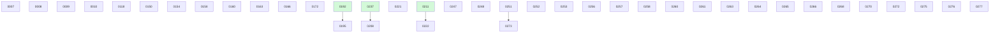

# Backlog

**278 changes** — 🟢 2 in progress · 🟡 31 proposed · ⚪ 4 deferred · ✅ 165 done · 🗑️ 76 killed

## 🟢 In progress (2)

| # | Title | Priority | Type | Spec | Branch |
|---|-------|----------|------|------|--------|
| [0258](active/0258-guard-the-config-suite-s-enumerated-claims-export-order-and.md) | Guard the config-suite's enumerated claims: export order and rung pairs | `medium` | `chore` | [spec](../superpowers/specs/2026-08-07-guard-the-config-suite-s-enumerated-claims-export-order-and-design.md) | `feat/guard-the-config-suite-s-enumerated-claims-export-order-and` |
| [0276](active/0276-dummy-mode.md) | Dummy mode — persona-calibrated human-facing language simplification | `medium` | `feat` | [spec](../superpowers/specs/2026-08-09-dummy-mode-design.md) | `feat/dummy-mode` |

## 🟡 Proposed (31)

| # | Title | Priority | Type | Readiness |
|---|-------|----------|------|-----------|
| [0118](active/0118-decide-whether-the-sweep-s-skip-publish-path-should-also-mar.md) | Decide whether the sweep's skip-publish path should also mark an unpublished terminal record | `medium` | `fix` | build-ready |
| [0150](active/0150-pin-or-report-the-resolved-shell-toolchain-across-the-test-s.md) | Pin or report the resolved shell toolchain across the test suite | `medium` | `chore` | build-ready |
| [0154](active/0154-audit-skill-bodies-for-the-stale-restatement-class-change-01.md) | Audit skill bodies for the stale-restatement class change 0145 closed in one file | `medium` | `docs` | build-ready |
| [0158](active/0158-batch-mode-for-docket-implement-next-build-several-coupled-c.md) | Batch mode for docket-implement-next — build several coupled changes on one branch | `medium` | `feat` | needs-brainstorm |
| [0160](active/0160-a-committed-too-deep-runtime-bash-lost-its-machine-local-ign.md) | A committed too-deep runtime.bash lost its machine-local ignored advisory | `medium` | `fix` | build-ready |
| [0163](active/0163-six-phase-tier-3-guard-counts-headings-instead-of-asserting.md) | Six-phase Tier 3 guard counts headings instead of asserting the phase set | `medium` | `fix` | build-ready |
| [0166](active/0166-retune-the-interactive-skills-advisory-session-model-recomme.md) | Retune the interactive skills' advisory session-model recommendation | `medium` | `chore` | build-ready |
| [0172](active/0172-normalize-the-banned-producer-pipe-shape-across-tests-and-he.md) | Normalize the banned producer-pipe shape across tests and helpers | `medium` | `chore` | build-ready |
| [0195](active/0195-retune-the-opencode-shipped-model-defaults-for-cost.md) | Retune the opencode shipped model defaults for cost | `medium` | `chore` | needs-brainstorm |
| [0208](active/0208-runner-dispatch-worktree-gate-3-proves-repo-containment-not.md) | Harden runner-dispatch — worktree membership gate, feature-scoped coverage, flag-parse guards | `medium` | `fix` | build-ready |
| [0221](active/0221-assert-executes-backticks-in-its-test-description-so-a-verba.md) | assert() executes backticks in its test description, so a verbatim-quoted anchor can run shell | `medium` | `fix` | build-ready |
| [0222](active/0222-raise-docket-s-minimum-bash-from-4-to-4-4.md) | Raise docket's minimum Bash from 4+ to 4.4 | `medium` | `chore` | build-ready |
| [0247](active/0247-make-shared-metadata-worktree-contention-survivable-and-scop.md) | Make shared metadata worktree contention survivable and scope its commits | `high` | `fix` | needs-brainstorm |
| [0248](active/0248-role-self-description-enforce-the-positive-half-and-harden-t.md) | Role self-description: enforce the positive half and harden the guard | `medium` | `chore` | build-ready |
| [0251](active/0251-retune-the-run-tests-budget-regime-for-portability-and-shard.md) | Retune the run-tests budget regime for portability and sharding | `medium` | `refactor` | build-ready |
| [0252](active/0252-harden-test-fixtures-and-hermeticity-into-tests-lib.md) | Harden test fixtures and hermeticity into tests-lib | `medium` | `chore` | build-ready |
| [0253](active/0253-settle-and-enforce-the-prose-anchored-guard-house-pattern.md) | Settle and enforce the prose-anchored guard house pattern | `medium` | `chore` | build-ready |
| [0256](active/0256-config-reader-consolidation-one-extractor-or-a-recorded-adr.md) | Config-reader consolidation: one extractor or a recorded ADR | `medium` | `refactor` | build-ready |
| [0257](active/0257-clear-the-residual-review-findings-from-0193-and-0201.md) | Clear the residual review findings from 0193 and 0201 | `medium` | `chore` | build-ready |
| [0260](active/0260-tier-finalize-s-in-context-dispatches-and-name-the-push-deni.md) | Tier finalize's in-context dispatches and name the push-denial posture | `medium` | `fix` | build-ready |
| [0261](active/0261-give-run-halted-a-board-surface-and-a-health-check-like-its.md) | Give '## Run halted' a board surface and a health check, like its two family members | `medium` | `feat` | needs-brainstorm |
| [0263](active/0263-guard-the-remaining-agents-md-shell-rules-across-scripts-tes.md) | Guard the remaining AGENTS.md Shell rules across scripts, tests, and agent-executed markdown | `medium` | `chore` | needs-brainstorm |
| [0264](active/0264-measure-the-claude-harness-s-forked-mode-gate-verdict-and-pi.md) | Measure the claude harness's forked-mode gate verdict and pin a surviving launch shape | `medium` | `docs` | needs-brainstorm |
| [0265](active/0265-branch-the-adr-0065-quote-leg-diagnostic-so-it-stops-claimin.md) | Branch the ADR-0065 quote-leg diagnostic so it stops claiming a truncation that did not happen | `medium` | `fix` | needs-brainstorm |
| [0266](active/0266-deterministic-frontmatter-field-writer-no-skill-hand-rolls-a.md) | Deterministic frontmatter field writer — no skill hand-rolls a manifest edit | `medium` | `feat` | needs-brainstorm |
| [0268](active/0268-de-flake-the-reclaim-leg-of-test-docket-status-under-paralle.md) | De-flake the reclaim leg of test_docket_status under parallel contention | `medium` | `fix` | needs-brainstorm |
| [0270](active/0270-machine-local-runner-config-is-unreachable-from-a-feature-wo.md) | Machine-local runner config is unreachable from a feature worktree (opencode permissions locality) | `medium` | `fix` | needs-brainstorm |
| [0272](active/0272-de-duplicate-the-gitignore-block-writer-s-second-copy-of-the.md) | De-duplicate the gitignore-block writer's second copy of the write orchestration | `medium` | `fix` | needs-brainstorm |
| [0273](active/0273-put-runtime-budgets-on-a-host-relative-basis-and-re-seed-the.md) | Put runtime budgets on a host-relative basis and re-seed the table | `medium` | `refactor` | ⏳ waiting on #251 — not yet built |
| [0275](active/0275-run-gate-has-no-runnable-path-for-slash-command-or-backgroun.md) | Run gate has no runnable path for slash-command or backgrounded implement-next dispatch | `medium` | `fix` | needs-brainstorm |
| [0277](active/0277-delegated-task-briefs-travel-through-shell-argv-a-lossy-mode.md) | Delegated task briefs travel through shell argv, a lossy model-performed transformation | `medium` | `refactor` | needs-brainstorm |

## ⚪ Deferred (4)

| # | Title | Priority | Type |
|---|-------|----------|------|
| [0007](active/0007-recurring-change-templates.md) | Recurring change templates — scheduled maintenance work that spawns proposed instances | `medium` | `feat` |
| [0008](active/0008-parallel-backlog-drain.md) | Parallel backlog drain — fan out concurrent implement-next runs over independent build-ready changes | `medium` | `feat` |
| [0009](active/0009-human-escalation-loop.md) | Human escalation loop — structured questions-for-you in the change file, answered asynchronously in git | `medium` | `feat` |
| [0010](active/0010-board-analytics.md) | Board analytics — throughput and cycle-time stats derived from git history, rendered on BOARD.md | `low` | `feat` |

```mermaid
graph TD
  0007
  0008
  0009
  0010
  0118
  0150
  0154
  0158
  0160
  0163
  0166
  0172
  0192 --> 0195
  0237 --> 0208
  0221
  0211 --> 0222
  0247
  0248
  0251
  0252
  0253
  0256
  0257
  0258
  0260
  0261
  0263
  0264
  0265
  0266
  0268
  0270
  0272
  0251 --> 0273
  0275
  0276
  0277
  0192:::done
  0211:::done
  0237:::done
  classDef done fill:#d3f9d8;
```

✅🗑️ Archive — done + killed (241)

| # | Title | Merged |
|---|-------|--------|
| [0278](archive/2026-08-09-0278-test-docket-example-yml-s-fidelity-fixture-goes-intermittent.md) | test_docket_example_yml's fidelity fixture goes intermittently red under parallel contention | 2026-08-09 |
| [0274](archive/2026-08-09-0274-runner-dispatch-s-value-taking-flags-hang-instead-of-abortin.md) | runner-dispatch's value-taking flags hang instead of aborting when given with no value | 2026-08-09 |
| [0271](archive/2026-08-09-0271-runner-delegation-has-no-execution-posture-for-a-child-that.md) | Runner delegation has no execution posture for a child that outlives its foreground call | 2026-08-09 |
| [0269](archive/2026-08-09-0269-decouple-the-shim-wrapper-s-own-pin-from-the-delegated-child.md) | Decouple the shim wrapper's own pin from the delegated child's | 2026-08-09 |
| [0267](archive/2026-08-09-0267-correct-the-stale-field-quote-handling-claim-in-script-contr.md) | Correct the stale field() quote-handling claim in script contracts | 2026-08-09 |
| [0262](archive/2026-08-09-0262-ban-the-single-backslash-word-boundary-form-too-not-just-its.md) | Ban the single-backslash word-boundary form too, not just its escaped spelling | 2026-08-09 |
| [0259](archive/2026-08-08-0259-harden-render-board-sanitize-feeder-values-and-settle-the-fa.md) | Harden render-board: sanitize feeder values and settle the failure contract | 2026-08-08 |
| [0255](archive/2026-08-08-0255-complete-adr-0065-s-quote-leg-and-document-the-unquoted-rule.md) | Complete ADR-0065's quote leg and document the unquoted rule | 2026-08-08 |
| [0254](archive/2026-08-08-0254-bsd-tool-default-sweep-templated-mktemp-and-non-interactive.md) | BSD tool-default sweep: templated mktemp and non-interactive mv | 2026-08-08 |
| [0250](archive/2026-08-08-0250-repo-scope-detect-merged-s-fallback-and-guard-the-idle-secs.md) | Repo-scope detect-merged's fallback and guard the idle-secs duplication | 2026-08-08 |
| [0249](archive/2026-08-08-0249-build-worker-contract-gate-execution-pointer-and-staging-dis.md) | Build-worker contract: gate-execution pointer and staging discipline | 2026-08-08 |
| [0246](archive/2026-08-08-0246-make-the-docket-example-yml-guard-suite-bite.md) | Make the docket-example-yml guard suite bite | 2026-08-08 |
| [0245](archive/2026-08-08-0245-harden-sync-agents-wrapper-generation-and-clear-the-0192-fin.md) | Harden sync-agents wrapper generation and clear the 0192 findings | 2026-08-08 |
| [0244](archive/2026-08-08-0244-one-selection-rule-for-the-four-frontmatter-read-shapes.md) | One selection rule for the four frontmatter read shapes | 2026-08-08 |
| [0242](archive/2026-08-08-0242-close-the-claude-gap-in-the-run-completion-gate-with-a-comma.md) | Close the Claude gap in the run-completion gate with a caller-side verify in the dispatch rules | 2026-08-08 |
| [0237](archive/2026-08-08-0237-prose-levers-fail-to-hold-the-step-boundary-add-a-mechanical.md) | Prose levers fail to hold the step boundary — give the disposition contract a consumer | 2026-08-08 |
| [0200](archive/2026-08-08-0200-clear-the-unfixed-review-findings-from-change-0191.md) | Board-checks hardening — sanitize LF escape, capture-shape mutation, minor-finding clearance | 2026-08-08 |
| [0140](archive/2026-08-08-0140-normalize-the-inherit-model-sentinel-once-for-every-runner-a.md) | Normalize the inherit model sentinel once for every runner adapter | 2026-08-08 |
| [0243](archive/2026-08-07-0243-make-test-suite-git-fixture-setup-fail-loudly-instead-of-fla.md) | Make test-suite git fixture setup fail loudly instead of flaking | 2026-08-07 |
| [0241](archive/2026-08-07-0241-correspondence-guard-over-leg-c-s-by-value-duplicated-predic.md) | Correspondence guard over leg C's by-value duplicated predicate (ADR-0072 drift risk) | 2026-08-07 |
| [0240](archive/2026-08-07-0240-audit-which-frontmatter-accessor-each-call-site-should-use-n.md) | Audit which frontmatter accessor each call site should use, now that three anchored read shapes exist | 2026-08-07 |
| [0239](archive/2026-08-07-0239-detect-merged-s-gh-pr-list-fallback-ignores-repo-so-a-scoped.md) | detect_merged's gh pr list fallback ignores --repo, so a scoped pass queries the wrong repository | 2026-08-07 |
| [0238](archive/2026-08-07-0238-a-build-worker-may-stage-paths-its-task-never-touched.md) | A build worker may stage paths its task never touched | 2026-08-07 |
| [0236](archive/2026-08-07-0236-suppressed-execution-handoff-still-ends-run-at-plan.md) | A suppressed execution hand-off still ends the run at the plan — 0113 recurrence | 2026-08-07 |
| [0235](archive/2026-08-07-0235-writers-emit-unquoted-yaml-title-scalars-so-six-change-files.md) | Writers emit unquoted YAML title scalars, so six change files fail to parse | 2026-08-07 |
| [0233](archive/2026-08-07-0233-guard-against-stacked-gap-ere-patterns-that-hang-instead-of.md) | Guard against stacked-gap ERE patterns that hang instead of failing | 2026-08-07 |
| [0232](archive/2026-08-07-0232-the-gate-execution-posture-never-reaches-the-build-workers-t.md) | The gate execution posture never reaches the build workers that also run the full suite | 2026-08-07 |
| [0230](archive/2026-08-07-0230-a-self-scanning-population-floor-pins-test-docket-config-sh.md) | a self-scanning population floor pins test_docket_config.sh's size and blocks sharding | 2026-08-07 |
| [0229](archive/2026-08-07-0229-the-runner-s-budget-slack-factor-is-a-hardware-dependent-con.md) | the runner's budget slack factor is a hardware-dependent constant | 2026-08-07 |
| [0225](archive/2026-08-07-0225-the-test-suite-has-grown-into-the-harness-s-foreground-ceilin.md) | The test suite has grown into the harness's foreground ceiling — cut its wall-clock runtime | 2026-08-07 |
| [0204](archive/2026-08-07-0204-restore-rationale-dropped-by-round-three-compression-finaliz.md) | Restore dropped doc rationale (compression losses) and complete AGENTS.md's frontmatter-edit rule | 2026-08-07 |
| [0199](archive/2026-08-07-0199-harden-the-role-self-description-guard-co-occurrence-gap-har.md) | Harden the role-self-description guard — co-occurrence gap, hardcoded population, broad default matcher | 2026-08-07 |
| [0198](archive/2026-08-07-0198-settle-the-role-self-description-rule-s-positive-half-docket.md) | Settle the role-self-description rule's positive half — docket-review names no skills.review binding | 2026-08-07 |
| [0197](archive/2026-08-07-0197-clear-the-unfixed-review-findings-from-change-0193.md) | Clear the unfixed review findings from change 0193 | 2026-08-07 |
| [0196](archive/2026-08-07-0196-shared-agents-md-dispatch-block-restate-and-test-the-single.md) | Shared AGENTS.md dispatch block — restate and test the single-owner assumptions | 2026-08-07 |
| [0189](archive/2026-08-07-0189-sweep-the-15-remaining-bare-mv-install-sites-a-tty-prompt-ma.md) | Sweep the 15 remaining bare-mv install sites — a tty prompt makes their || die guards unreachable | 2026-08-07 |
| [0188](archive/2026-08-07-0188-backfill-change-types-sh-calls-mktemp-d-with-no-template-so.md) | backfill-change-types.sh calls mktemp -d with no template, so TMPDIR is ignored on macOS and uchg fixtures leak undeletable dirs | 2026-08-07 |
| [0187](archive/2026-08-07-0187-harden-the-docket-example-yml-mirror-guards-one-directional.md) | Harden the .docket.example.yml mirror guards — one-directional coverage, an unexercised round-trip slice, and a prefix-weak terminator | 2026-08-07 |
| [0182](archive/2026-08-07-0182-facade-tests-read-the-developer-s-real-global-config-instead.md) | Facade tests read the developer's real global config instead of a sandbox | 2026-08-07 |
| [0181](archive/2026-08-07-0181-document-the-unquoted-space-free-rule-for-agent-model-effort.md) | Document the unquoted, space-free rule for agent model/effort config values | 2026-08-07 |
| [0180](archive/2026-08-07-0180-apply-adr-0065-s-quote-leg-to-hd-validate-and-the-remaining.md) | Apply ADR-0065's quote leg to hd_validate and the remaining flow-map truncation corners | 2026-08-07 |
| [0179](archive/2026-08-07-0179-revisit-factoring-a-shared-config-value-extractor-across-the.md) | Revisit factoring a shared config value extractor across the three readers | 2026-08-07 |
| [0178](archive/2026-08-07-0178-fix-the-bsd-grep-parse-error-truncating-test-docket-example.md) | Fix the BSD-grep parse error truncating test_docket_example_yml.sh | 2026-08-07 |
| [0177](archive/2026-08-07-0177-harden-the-0174-fixture-template-helpers-sticky-failure-ungu.md) | Harden the 0174 fixture-template helpers (sticky failure, unguarded mktemp, destructive pre-clean, leaked root) | 2026-08-07 |
| [0171](archive/2026-08-07-0171-settle-a-reflow-tolerant-house-pattern-for-prose-anchored-gu.md) | Settle a reflow-tolerant house pattern for prose-anchored guards | 2026-08-07 |
| [0165](archive/2026-08-07-0165-consolidate-or-document-the-duplicated-flat-scalar-docket-ym.md) | Consolidate or document the duplicated flat-scalar .docket.yml reader in migrate-to-docket.sh | 2026-08-07 |
| [0159](archive/2026-08-07-0159-docket-status-skill-md-s-normal-outcomes-list-omits-the-heal.md) | docket-status SKILL.md's normal-outcomes list omits the 'health checks failed <exit>' line | 2026-08-07 |
| [0156](archive/2026-08-07-0156-render-board-sh-exits-0-on-malformed-input-and-commits-a-cor.md) | render-board.sh exits 0 on malformed input and commits a corrupt board | 2026-08-07 |
| [0155](archive/2026-08-07-0155-interior-tabs-in-a-frontmatter-value-shift-the-render-board.md) | Interior TABs in a frontmatter value shift the render-board sort feeder's fields | 2026-08-07 |
| [0151](archive/2026-08-07-0151-vacuous-docket-bash-path-asserts-sit-in-eval-free-blocks-out.md) | Vacuous DOCKET_BASH_PATH asserts sit in eval-free blocks, out of the poison-prelude guard's reach | 2026-08-07 |
| [0147](archive/2026-08-07-0147-extend-the-2c-orphan-key-check-past-its-column-0-anchor-to-n.md) | Extend the (2c) orphan-key check past its column-0 anchor to nested keys | 2026-08-07 |
| [0142](archive/2026-08-07-0142-make-the-unmapped-harness-wrapper-gap-loud-at-generation-tim.md) | Make the unmapped-harness wrapper gap loud at generation time | 2026-08-07 |
| [0141](archive/2026-08-07-0141-factor-the-shared-wrapper-source-parse-out-of-the-named-harn.md) | Factor the shared wrapper-source parse out of the named harness emitters | 2026-08-07 |
| [0139](archive/2026-08-07-0139-extend-the-tiered-dispatch-unavailability-posture-to-finaliz.md) | Extend the tiered dispatch-unavailability posture to finalize's two in-context-gating dispatches | 2026-08-07 |
| [0134](archive/2026-08-07-0134-audit-field-call-sites-for-frontmatter-anchored-reads.md) | Audit field() call sites for frontmatter-anchored reads | 2026-08-07 |
| [0125](archive/2026-08-07-0125-decide-whether-the-rung-pair-completeness-claim-should-be-me.md) | Decide whether the rung-pair completeness claim should be mechanically enforced | 2026-08-07 |
| [0123](archive/2026-08-07-0123-machine-check-the-docket-config-md-export-list-order-against.md) | Machine-check the docket-config.md export list order against the resolver | 2026-08-07 |
| [0121](archive/2026-08-07-0121-the-manifest-s-elsewhere-check-proves-a-word-occurrence-not.md) | The manifest's elsewhere: check proves a word occurrence, not a real config read | 2026-08-07 |
| [0119](archive/2026-08-07-0119-scope-the-metadata-worktree-git-commit-calls-to-the-paths-th.md) | Scope the metadata-worktree git commit calls to the paths they own | 2026-08-07 |
| [0110](archive/2026-08-07-0110-shared-metadata-worktree-contention.md) | Concurrent agents collide on the shared .docket worktree's dirty-tree window | 2026-08-07 |
| [0103](archive/2026-08-07-0103-wire-the-github-project-config-read-documented-but-unwired-k.md) | Wire the github_project config read (documented-but-unwired key) | 2026-08-07 |
| [0100](archive/2026-08-07-0100-force-push-lease-classifier-denial.md) | Force-push-with-lease denied by the auto-mode classifier — unblock finalize's merge gate | 2026-08-07 |
| [0082](archive/2026-08-07-0082-global-harnesses-per-repo-generation.md) | Global agent_harnesses doesn't reach per-repo generation — silent no-op | 2026-08-07 |
| [0019](archive/2026-08-07-0019-finalize-ci-gate-functional-test.md) | Finalize ci/both gate — functional test against real GitHub CI (poll/retry) | 2026-08-07 |
| [0217](archive/2026-08-05-0217-clear-change-0202-s-three-minor-findings-dead-guard-stale-ba.md) | Clear change 0202's three minor findings: dead guard, stale baseline comment, wrong plan pattern | 2026-08-05 |
| [0216](archive/2026-08-05-0216-guard-the-capture-shape-constraint-in-branch-only-artifact-w.md) | Guard the capture-shape constraint in branch_only_artifact with a mutation G | 2026-08-05 |
| [0215](archive/2026-08-05-0215-escape-newlines-in-board-checks-sanitize-now-that-z-can-deli.md) | Escape newlines in board-checks sanitize now that -z can deliver a raw LF | 2026-08-05 |
| [0214](archive/2026-08-05-0214-agents-md-s-promoted-frontmatter-rule-omits-the-whitespace-c.md) | AGENTS.md's promoted frontmatter rule omits the whitespace-class half that corrupted two field writes | 2026-08-05 |
| [0213](archive/2026-08-05-0213-settle-the-bash-4-4-mapfile-d-floor-inconsistency-between-te.md) | Settle the bash 4.4 mapfile -d floor inconsistency between tests and shipped scripts | 2026-08-05 |
| [0210](archive/2026-08-05-0210-a-valueless-trailing-flag-hangs-runner-dispatch-forever-inst.md) | A valueless trailing flag hangs runner-dispatch forever instead of aborting | 2026-08-05 |
| [0209](archive/2026-08-05-0209-the-worktree-requirement-covers-build-only-leaving-three-fea.md) | The --worktree requirement covers build-* only, leaving three feature-scoped agent families ungated | 2026-08-05 |
| [0183](archive/2026-08-01-0183-cursor-dispatch-head-ships-a-stale-unpinned-claim-its-guard.md) | Cursor dispatch head ships a stale unpinned claim; its guard retired itself | 2026-08-01 |
| [0044](archive/2026-07-30-0044-configurable-build-model.md) | Configurable SDD build models for docket-implement-next | 2026-07-30 |
| [0162](archive/2026-07-28-0162-restore-the-machine-local-ignored-advisory-for-a-committed-t.md) | Restore the machine-local-ignored advisory for a committed too-deep runtime.bash | 2026-07-28 |
| [0161](archive/2026-07-28-0161-enumerate-the-health-checks-failed-outcome-in-docket-status.md) | Enumerate the health-checks-failed outcome in docket-status SKILL.md | 2026-07-28 |
| [0153](archive/2026-07-28-0153-decide-whether-the-runtime-bash-leaf-match-should-be-depth-a.md) | Decide whether the runtime.bash leaf match should be depth-anchored | 2026-07-28 |
| [0152](archive/2026-07-28-0152-consolidate-the-two-surviving-hand-rolled-gnu-bash-4-validat.md) | Consolidate the two surviving hand-rolled GNU Bash 4+ validator copies | 2026-07-28 |
| [0149](archive/2026-07-28-0149-make-the-prelude-guard-s-exemption-bound-proportional-and-cl.md) | Make the prelude guard's exemption bound proportional, and close the partial-rename gap | 2026-07-28 |
| [0148](archive/2026-07-28-0148-two-unfalsifiable-z-asserts-in-the-config-suite-sit-in-eval.md) | Two unfalsifiable -z asserts in the config suite sit in eval-free blocks | 2026-07-28 |
| [0146](archive/2026-07-28-0146-widen-the-config-read-channel-guard-to-the-sibling-config-la.md) | Widen the config read-channel guard to the sibling config layers it does not match | 2026-07-28 |
| [0144](archive/2026-07-28-0144-a-board-checks-sh-non-zero-exit-silently-voids-the-entire-he.md) | A board-checks.sh non-zero exit silently voids the entire health pass | 2026-07-28 |
| [0143](archive/2026-07-28-0143-empty-id-collapses-the-archive-sort-feeder-s-tab-joined-fiel.md) | Empty id collapses the archive sort feeder's TAB-joined fields in render-board.sh | 2026-07-28 |
| [0131](archive/2026-07-26-0131-make-board-conflict-rebase-continuation-noninteractive.md) | Make board-conflict rebase continuation noninteractive | 2026-07-26 |
| [0129](archive/2026-07-26-0129-fix-the-pipefail-unsafe-plain-format-config-assertion.md) | Fix the pipefail-unsafe plain-format config assertion | 2026-07-26 |
| [0124](archive/2026-07-26-0124-backlog-triage-pass.md) | Backlog triage pass — kill, defer, or arm each needs-brainstorm stub | 2026-07-26 |
| [0105](archive/2026-07-20-0105-pin-docket-mode-main-coverage-for-docket-status-digest-only.md) | Pin DOCKET_MODE=main coverage for docket-status --digest-only | 2026-07-20 |
| [0086](archive/2026-07-18-0086-attended-finalize-merge-path.md) | Attended finalize has no merge path under auto_approve — scope the --admin ban to autonomous runs | 2026-07-18 |
| [0033](archive/2026-07-16-0033-adr-index-main-maintenance.md) | Decide how the ADR index is maintained on the integration branch | 2026-07-16 |
| [0076](archive/2026-07-14-0076-cwd-independent-repo-root-resolution.md) | Resolve the repo root independently of CWD — preflight run inside `.docket` mints a nested metadata worktree | 2026-07-14 |
| [0043](archive/2026-07-08-0043-agent-model-tiers.md) | Model-tier indirection for agent model selection + config-driven advisories | 2026-07-08 |
| [0028](archive/2026-06-20-0028-wire-closeout-call-sites.md) | Wire the close-out call sites to the extracted scripts | 2026-06-20 |

**Older done (collapsed)**

| Month | Done |
|-------|------|
| [2026-08](archive/) | 32 done |
| [2026-07](archive/) | 86 done |
| [2026-06](archive/) | 32 done |

