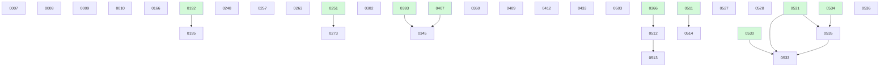

# Backlog

**536 changes** — 🟢 1 in progress · 🟣 2 groomed · 🟡 8 proposed · ⚪ 14 deferred · ✅ 372 done · 🗑️ 139 killed

## 🟢 In progress (1)

| # | Title | Priority | Type | Spec | Branch | Readiness |
|---|-------|----------|------|------|--------|-----------|
| [0535](active/0535-load-a-private-repository-s-agent-instructions-without-repos.md) | Load a private repository's agent instructions without repository files | `medium` | `feat` | [spec](../superpowers/specs/2026-10-06-load-a-private-repository-s-agent-instructions-without-repos-design.md) | `feat/load-a-private-repository-s-agent-instructions-without-repos` | run halted — needs you |

## 🟣 Groomed (2)

| # | Title | Priority | Type | Spec |
|---|-------|----------|------|------|
| [0409](active/0409-document-remote-agent-session-setup-using-a-locally-built-do.md) | Document remote-agent session setup using a locally built Docket binary | `medium` | `docs` | [spec](../superpowers/specs/2026-09-07-document-remote-agent-session-setup-using-a-locally-built-do-design.md) |
| [0345](active/0345-slash-command-implement-dispatch-attribution-gap.md) | Slash-command implement dispatch isn't agent-owned — attribution gap forces human-in-the-loop | `high` | `feat` | [spec](../superpowers/specs/2026-09-07-slash-command-implement-dispatch-attribution-gap-design.md) |

## 🟡 Proposed (8)

| # | Title | Priority | Type | Readiness |
|---|-------|----------|------|-----------|
| [0536](active/0536-split-the-private-leak-check-tests-out-of-the-workflow-lifec.md) | Split the private leak-check tests out of the workflow lifecycle shard | `low` | `fix` | needs-grooming |
| [0533](active/0533-switch-a-repository-between-shared-and-private-visibility.md) | Switch a repository between shared and private visibility | `medium` | `feat` | ⏳ waiting on #535 — not yet built |
| [0527](active/0527-fix-test-suite-hygiene-gaps-found-while-stabilizing-flaky-te.md) | Fix test-suite hygiene gaps found while stabilizing flaky tests | `low` | `fix` | needs-grooming |
| [0528](active/0528-make-the-solo-budget-re-check-detect-a-concurrent-suite-in-a.md) | Make the solo budget re-check detect a concurrent suite in another worktree | `medium` | `fix` | needs-grooming |
| [0512](active/0512-release-v1-0-0-alpha-2-prove-and-publish-cursor-support.md) | Release v1.0.0-alpha.2: prove and publish Cursor support | `high` | `chore` | needs-grooming |
| [0513](active/0513-release-v1-0-0-alpha-3-prove-and-publish-opencode-support.md) | Release v1.0.0-alpha.3: prove and publish OpenCode support | `high` | `chore` | ⏳ waiting on #512 — not yet built |
| [0412](active/0412-forked-implement-next-build-agent-still-backgrounds-the-gate.md) | Forked implement-next/build agent still backgrounds the gate driver and yields (recurring suite-gate yield-wedge) | `critical` | `fix` | needs-grooming |
| [0360](active/0360-cut-implement-next-coordination-tax-context-after-claim-sess.md) | Cut implement-next coordination tax (context after claim, session-scoped sync, evidence from PASSED drives) | `high` | `feat` | needs-grooming |

## ⚪ Deferred (14)

| # | Title | Priority | Type |
|---|-------|----------|------|
| [0514](active/0514-retire-the-saved-bash-upgrade-test-cases-when-stable-v1-0-0.md) | Retire the saved Bash upgrade test cases when stable v1.0.0 ships | `low` | `chore` |
| [0503](active/0503-auto-name-claude-code-sessions-from-docket-workflow-prompts.md) | Auto-name Claude Code sessions from docket workflow prompts | `low` | `feat` |
| [0433](active/0433-pilot-top-level-codex-coordinators-with-one-level-native-dis.md) | Pilot top-level Codex coordinators with one-level native dispatch | `high` | `refactor` |
| [0273](active/0273-put-runtime-budgets-on-a-host-relative-basis-and-re-seed-the.md) | Put runtime budgets on a host-relative basis and re-seed the table | `high` | `refactor` |
| [0263](active/0263-guard-the-remaining-agents-md-shell-rules-across-scripts-tes.md) | Guard the remaining AGENTS.md Shell rules across scripts, tests, and agent-executed markdown | `medium` | `chore` |
| [0257](active/0257-clear-the-residual-review-findings-from-0193-and-0201.md) | Clear the residual review findings from 0193 and 0201 | `low` | `chore` |
| [0248](active/0248-role-self-description-enforce-the-positive-half-and-harden-t.md) | Role self-description: enforce the positive half and harden the guard | `low` | `chore` |
| [0195](active/0195-retune-the-opencode-shipped-model-defaults-for-cost.md) | Retune the opencode shipped model defaults for cost | `low` | `chore` |
| [0166](active/0166-retune-the-interactive-skills-advisory-session-model-recomme.md) | Retune the interactive skills' advisory session-model recommendation | `low` | `chore` |
| [0302](active/0302-mint-stub-dedup-misses-a-general-form-parent-of-a-specific-d.md) | mint-stub dedup misses a general-form parent of a specific discovery | `medium` | `fix` |
| [0010](active/0010-board-analytics.md) | Board analytics — throughput and cycle-time stats derived from git history, rendered on BOARD.md | `low` | `feat` |
| [0009](active/0009-human-escalation-loop.md) | Human escalation loop — structured questions-for-you in the change file, answered asynchronously in git | `medium` | `feat` |
| [0008](active/0008-parallel-backlog-drain.md) | Parallel backlog drain — fan out concurrent implement-next runs over independent build-ready changes | `medium` | `feat` |
| [0007](active/0007-recurring-change-templates.md) | Recurring change templates — scheduled maintenance work that spawns proposed instances | `medium` | `feat` |

```mermaid
graph TD
  0007
  0008
  0009
  0010
  0166
  0192 --> 0195
  0248
  0257
  0263
  0251 --> 0273
  0302
  0393 --> 0345
  0407 --> 0345
  0360
  0409
  0412
  0433
  0503
  0366 --> 0512
  0512 --> 0513
  0511 --> 0514
  0527
  0528
  0530 --> 0533
  0531 --> 0533
  0535 --> 0533
  0531 --> 0535
  0534 --> 0535
  0536
  0192:::done
  0251:::done
  0366:::done
  0393:::done
  0407:::done
  0511:::done
  0530:::done
  0531:::done
  0534:::done
  classDef done fill:#d3f9d8;
```

✅🗑️ Archive — done + killed (511)

| # | Title | Merged |
|---|-------|--------|
| [0534](archive/2026-10-06-0534-install-an-alias-for-the-docket-binary.md) | Install an alias for the docket binary | 2026-10-06 |
| [0532](archive/2026-10-06-0532-private-visibility-keep-docket-out-of-prs-commits-and-shippe.md) | Implement private visibility for PRs, commits, and shipped files | 2026-10-06 |
| [0531](archive/2026-10-06-0531-private-visibility-keep-the-metadata-branch-on-a-local-remot.md) | Keep the metadata branch on a local remote with neutral naming | 2026-10-06 |
| [0530](archive/2026-10-06-0530-keep-plan-results-and-build-evidence-on-the-metadata-branch.md) | Keep plan, results, and build evidence on the metadata branch, and ship the spec with the PR | 2026-10-06 |
| [0529](archive/2026-10-06-0529-repoint-a-merged-pr-s-change-backlink-when-the-change-is-arc.md) | Repoint a merged PR's change backlink when the change is archived | 2026-10-06 |
| [0526](archive/2026-10-05-0526-repository-init-writes-gate-off-and-configure-tests-then-ref.md) | repository configure-tests takes the test command as input | 2026-10-05 |
| [0525](archive/2026-10-05-0525-finalize-stops-on-a-private-repo-without-the-branch-rules-ap.md) | Finalize stops on a private repo without the branch-rules API, and leaves half-removed workspaces | 2026-10-05 |
| [0524](archive/2026-10-05-0524-release-candidate-evidence-json-drops-the-trailing-newline-f.md) | Release-candidate evidence.json drops the trailing newline from its checksums copy | 2026-10-05 |
| [0523](archive/2026-10-05-0523-repository-check-reports-a-behind-only-docket-copy-as-diverg.md) | Treat a behind-only .docket copy as healthy and make prepare fast-forward it in place | 2026-10-05 |
| [0522](archive/2026-10-05-0522-share-the-json-key-rules-between-internal-cli-and-internal-a.md) | Share the JSON-key rules between internal/cli and internal/app | 2026-10-05 |
| [0507](archive/2026-10-05-0507-flaky-tests-track-and-stabilize-intermittent-suite-failures.md) | Fix the observe-test hang and bring two test files back under their time limits | 2026-10-05 |
| [0366](archive/2026-10-05-0366-human-attended-v1-0-0-rc1-acceptance-and-publication.md) | v1.0.0-alpha.1 acceptance and publication (Claude Code) | 2026-10-05 |
| [0521](archive/2026-10-04-0521-finish-schema-operation-documentation-outcomes-md-flag-only.md) | Mark every nested required request field in the schema, and fix the stale schema docs | 2026-10-04 |
| [0520](archive/2026-10-04-0520-make-the-published-finalize-request-schemas-match-what-input.md) | Make every published request schema match the JSON file the operation reads | 2026-10-04 |
| [0519](archive/2026-10-04-0519-make-the-finalize-block-schema-list-only-the-keys-input-acce.md) | Make the finalize.block schema list only the keys --input accepts | 2026-10-04 |
| [0518](archive/2026-10-04-0518-publish-a-request-schema-for-finalize-rebase-continue-so-res.md) | Publish a request schema for finalize.rebase-continue so resolver reports stop carrying schema_version | 2026-10-04 |
| [0517](archive/2026-10-04-0517-make-evidence-record-certify-a-finalize-re-test-with-the-fin.md) | Make evidence.record certify a finalize re-test with the finalize gate settings | 2026-10-04 |
| [0508](archive/2026-10-04-0508-bring-tests-test-go-finalize-e2e-sh-back-under-its-serial-wa.md) | Bring tests/test_go_finalize_e2e.sh back under its serial wall-clock budget | 2026-10-04 |
| [0499](archive/2026-10-04-0499-a-cancelled-publish-s-git-push-or-gh-child-can-still-land-af.md) | A cancelled publish's git push or gh child can still land after cancel | 2026-10-04 |
| [0380](archive/2026-10-04-0380-descendant-receipt-negative-fixture-root-anchored-trailer-read.md) | Add a descendant-receipt negative fixture pinning the root-anchored trailer read | 2026-10-04 |
| [0320](archive/2026-10-04-0320-guard-the-testdata-gitignore-negation.md) | Guard the testdata gitignore negation | 2026-10-04 |
| [0486](archive/2026-10-02-0486-run-plan-mutation-checks-outside-a-gate-drive-not-by-editing.md) | Run plan mutation checks outside a gate drive, not by editing the tree under it | 2026-10-02 |
| [0483](archive/2026-10-02-0483-clean-up-a-killed-change-s-workspace-in-finalize-cleanup.md) | Clean up a killed change's workspace in finalize cleanup | 2026-10-02 |
| [0457](archive/2026-10-02-0457-a-freshly-reserved-successor-on-an-epoch-less-scope-can-stil.md) | A freshly reserved successor on an epoch-less scope can still release a slot a later drive adopted | 2026-10-02 |
| [0443](archive/2026-10-02-0443-clarify-gate-operation-ids-versus-executable-argv.md) | Clarify gate operation IDs versus executable argv | 2026-10-02 |
| [0422](archive/2026-10-02-0422-bind-outer-run-gate-retry-consumption-to-a-dispatch-epoch-no.md) | Bind outer run-gate retry consumption to a dispatch epoch, not each observation | 2026-10-02 |
| [0387](archive/2026-10-02-0387-re-cut-frozen-fixtures-to-clear-stale-retired-token-comments.md) | Re-cut frozen fixtures to clear stale retired-token comments in harness-defaults and .docket.yml | 2026-10-02 |
| [0301](archive/2026-10-02-0301-the-convention-doc-s-lifecycle-cardinalities-are-hardcoded-p.md) | The convention doc's lifecycle cardinalities are hardcoded prose with no guard | 2026-10-02 |
| [0291](archive/2026-10-02-0291-load-gate-failure-md-before-the-dispatch-verb-at-both-finali.md) | Load gate-failure.md before the dispatch verb at both finalize gate steps | 2026-10-02 |
| [0485](archive/2026-10-01-0485-test-go-race-hits-its-8-minute-backstop-in-internal-repoguar.md) | test_go_race hits its 8-minute backstop in internal/repoguard under concurrent gate load | 2026-10-01 |
| [0484](archive/2026-10-01-0484-bring-test-go-race-back-under-its-budget-row-testretiredvoca.md) | Bring test_go_race back under its budget row (TestRetiredVocabularySeal scan cost) | 2026-10-01 |
| [0478](archive/2026-10-01-0478-gofmt-internal-githubcli-comment-integration-test-go.md) | gofmt internal/githubcli/comment_integration_test.go | 2026-10-01 |
| [0476](archive/2026-10-01-0476-bring-test-go-integration-app-rebaserecovery-back-under-its.md) | Bring test_go_integration_app_rebaserecovery back under its runtime budget | 2026-10-01 |
| [0475](archive/2026-10-01-0475-bring-test-go-integration-app-closeout-sh-back-under-its-bud.md) | Bring test_go_integration_app_closeout.sh back under its budget row | 2026-10-01 |
| [0292](archive/2026-09-29-0292-shared-tested-mutation-probe-harness-take-the-landing-check.md) | Shared, tested mutation-probe harness — take the landing check out of each plan author's care | 2026-09-29 |
| [0432](archive/2026-09-18-0432-complete-native-codex-runner.md) | Complete native Codex runner | 2026-09-18 |
| [0431](archive/2026-09-18-0431-native-codex-acceptance-for-active-worker-validation.md) | Native Codex acceptance for active worker validation | 2026-09-18 |
| [0426](archive/2026-09-18-0426-constrain-agent-enter-to-explicit-legacy-and-feature-worktre.md) | Constrain agent.enter to explicit legacy and feature-worktree use | 2026-09-18 |
| [0425](archive/2026-09-18-0425-restore-native-codex-dispatch-for-multi-agent-v2-docket-coor.md) | Restore native Codex dispatch for Multi-Agent V2 Docket coordinators | 2026-09-18 |
| [0424](archive/2026-09-18-0424-validate-codex-coordinator-models-against-a-versioned-capabi.md) | Validate Codex coordinator models against a versioned capability registry | 2026-09-18 |
| [0430](archive/2026-09-17-0430-native-codex-acceptance-for-durable-review-evidence.md) | Native Codex acceptance for durable review evidence | 2026-09-17 |
| [0391](archive/2026-09-03-0391-carry-skipped-build-evidence-through-the-pr-publish-path.md) | Carry skipped build-evidence through the PR publish path | 2026-09-03 |
| [0385](archive/2026-09-03-0385-correct-cursor-permissions-docs-referencing-the-deleted-scri.md) | Correct cursor permissions docs referencing the deleted scripts/docket.sh | 2026-09-03 |
| [0343](archive/2026-09-03-0343-harden-managed-block-renderers-against-marker-mentions-in-pr.md) | Harden managed-block renderers against marker mentions in prose/code (fence-aware block finder) | 2026-09-03 |
| [0321](archive/2026-09-03-0321-render-artifact-backlink-sh-eats-artifact-tails-on-marker-sh.md) | render-artifact-backlink.sh eats artifact tails on marker-shaped literals — anchor whole-line, validate balance, refuse | 2026-09-03 |
| [0319](archive/2026-09-03-0319-test-bash-runtime-routing-sh-s-inventory-assert-is-cwd-depen.md) | test_bash_runtime_routing.sh's inventory assert is cwd-dependent — relative rg globs resolve against the process cwd | 2026-09-03 |
| [0300](archive/2026-09-03-0300-close-the-single-backslash-word-boundary-gap-convert-the-56.md) | Close the single-backslash word-boundary gap: convert the 56 sites and make the census gating | 2026-09-03 |
| [0297](archive/2026-09-03-0297-relax-0212-s-sites-backtick-ban-now-that-the-hygiene-gate-en.md) | Relax 0212's SITES backtick ban now that the hygiene gate enforces it | 2026-09-03 |
| [0296](archive/2026-09-03-0296-shard-tests-test-docket-status-sh-its-runtime-row-is-at-the.md) | Shard tests/test_docket_status.sh — its runtime row is at the table's hard 60s ceiling | 2026-09-03 |
| [0295](archive/2026-09-03-0295-make-render-change-links-sh-genuinely-offline-safe-stop-re-r.md) | Make render-change-links.sh genuinely offline-safe — stop re-resolving config with a network fetch | 2026-09-03 |
| [0293](archive/2026-09-03-0293-test-gate-run-stop-s-term-escalation-fixture-deadline-is-at.md) | test_gate_run_stop's TERM-escalation fixture deadline is at exact parity with stop_run's own TERM budget | 2026-09-03 |
| [0290](archive/2026-09-03-0290-run-tests-sh-timings-truncates-a-test-file-passed-as-its-tar.md) | run-tests.sh --timings truncates a test file passed as its target | 2026-09-03 |
| [0289](archive/2026-09-03-0289-bind-budget-ledger-entries-to-the-numbers-they-narrate.md) | Bind budget-ledger entries to the numbers they narrate | 2026-09-03 |
| [0288](archive/2026-09-03-0288-namespace-the-remaining-un-namespaced-mock-seams-runners-dir.md) | Namespace the remaining un-namespaced mock seams (RUNNERS_DIR, GIT) repo-wide | 2026-09-03 |
| [0287](archive/2026-09-03-0287-make-docket-frontmatter-sh-usable-from-the-bootstrap-path-or.md) | Make docket-frontmatter.sh usable from the bootstrap path, or split a Bash 3.2-safe core out of it | 2026-09-03 |
| [0280](archive/2026-09-03-0280-shard-or-re-budget-the-test-files-the-suite-runner-reports-o.md) | Shard or re-budget the test files the suite runner reports OVER BUDGET | 2026-09-03 |
| [0279](archive/2026-09-03-0279-settle-the-walk-site-classifier-s-reachability-gap-and-re-la.md) | Settle the walk-site classifier's reachability gap and re-land 0258's reverted fixes | 2026-09-03 |
| [0272](archive/2026-09-03-0272-de-duplicate-the-gitignore-block-writer-s-second-copy-of-the.md) | De-duplicate the gitignore-block writer's second copy of the write orchestration | 2026-09-03 |
| [0266](archive/2026-09-03-0266-deterministic-frontmatter-field-writer-no-skill-hand-rolls-a.md) | Deterministic frontmatter field writer — no skill hand-rolls a manifest edit | 2026-09-03 |
| [0265](archive/2026-09-03-0265-branch-the-adr-0065-quote-leg-diagnostic-so-it-stops-claimin.md) | Branch the ADR-0065 quote-leg diagnostic so it stops claiming a truncation that did not happen | 2026-09-03 |
| [0264](archive/2026-09-03-0264-measure-the-claude-harness-s-forked-mode-gate-verdict-and-pi.md) | Measure the claude harness's forked-mode gate verdict and pin a surviving launch shape | 2026-09-03 |
| [0256](archive/2026-09-03-0256-config-reader-consolidation-one-extractor-or-a-recorded-adr.md) | Config-reader consolidation: one extractor or a recorded ADR | 2026-09-03 |
| [0253](archive/2026-09-03-0253-settle-and-enforce-the-prose-anchored-guard-house-pattern.md) | Settle and enforce the prose-anchored guard house pattern | 2026-09-03 |
| [0222](archive/2026-09-03-0222-raise-docket-s-minimum-bash-from-4-to-4-4.md) | Raise docket's minimum Bash from 4+ to 4.4 | 2026-09-03 |
| [0172](archive/2026-09-03-0172-normalize-the-banned-producer-pipe-shape-across-tests-and-he.md) | Normalize the banned producer-pipe shape across tests and helpers | 2026-09-03 |
| [0163](archive/2026-09-03-0163-six-phase-tier-3-guard-counts-headings-instead-of-asserting.md) | Six-phase Tier 3 guard counts headings instead of asserting the phase set | 2026-09-03 |
| [0160](archive/2026-09-03-0160-a-committed-too-deep-runtime-bash-lost-its-machine-local-ign.md) | A committed too-deep runtime.bash lost its machine-local ignored advisory | 2026-09-03 |
| [0158](archive/2026-09-03-0158-batch-mode-for-docket-implement-next-build-several-coupled-c.md) | Batch mode for docket-implement-next — build several coupled changes on one branch | 2026-09-03 |
| [0150](archive/2026-09-03-0150-pin-or-report-the-resolved-shell-toolchain-across-the-test-s.md) | Pin or report the resolved shell toolchain across the test suite | 2026-09-03 |
| [0381](archive/2026-09-02-0381-stabilize-internal-process-observe-running-terminal-race-flake.md) | Stabilize internal/process TestObserveRunningThenTerminal parallel-load -race flake | 2026-09-02 |
| [0252](archive/2026-09-01-0252-harden-test-fixtures-and-hermeticity-into-tests-lib.md) | Harden test fixtures and hermeticity into tests-lib | 2026-09-01 |
| [0386](archive/2026-08-31-0386-discharge-adr-0100-s-deferred-disposition-for-the-surviving.md) | Discharge ADR-0100's deferred disposition for the surviving product runners | 2026-08-31 |
| [0353](archive/2026-08-26-0353-dispatched-docket-implement-next-subagent-cannot-reach-agent.md) | Dispatched docket-implement-next subagent cannot reach agent-only workers, halting every non-trivial change at Step 4 | 2026-08-26 |
| [0294](archive/2026-08-26-0294-shrink-agents-md-s-always-loaded-footprint-script-ify-the-ru.md) | Shrink AGENTS.md's always-loaded footprint: script-ify the run gate's caller procedure and de-duplicate the dispatch table | 2026-08-26 |
| [0303](archive/2026-08-12-0303-go-migration-program-record-and-bash-backlog-disposition.md) | Go migration program record and Bash-backlog disposition | 2026-08-12 |
| [0299](archive/2026-08-12-0299-reshard-tests-test-sync-agents-runners-so-every-file-measure.md) | Reshard tests/test_sync_agents_runners so every file measures under its wall-clock ceiling | 2026-08-12 |
| [0285](archive/2026-08-12-0285-gate-run-rung-2-a-discovered-python-runtime-for-a-real-sessi.md) | gate-run rung 2 — a discovered Python runtime for a real session and an exact child status | 2026-08-12 |
| [0268](archive/2026-08-11-0268-de-flake-the-reclaim-leg-of-test-docket-status-under-paralle.md) | De-flake the reclaim leg of test_docket_status under parallel contention | 2026-08-11 |
| [0278](archive/2026-08-09-0278-test-docket-example-yml-s-fidelity-fixture-goes-intermittent.md) | test_docket_example_yml's fidelity fixture goes intermittently red under parallel contention | 2026-08-09 |
| [0274](archive/2026-08-09-0274-runner-dispatch-s-value-taking-flags-hang-instead-of-abortin.md) | runner-dispatch's value-taking flags hang instead of aborting when given with no value | 2026-08-09 |
| [0267](archive/2026-08-09-0267-correct-the-stale-field-quote-handling-claim-in-script-contr.md) | Correct the stale field() quote-handling claim in script contracts | 2026-08-09 |
| [0262](archive/2026-08-09-0262-ban-the-single-backslash-word-boundary-form-too-not-just-its.md) | Ban the single-backslash word-boundary form too, not just its escaped spelling | 2026-08-09 |
| [0243](archive/2026-08-07-0243-make-test-suite-git-fixture-setup-fail-loudly-instead-of-fla.md) | Make test-suite git fixture setup fail loudly instead of flaking | 2026-08-07 |
| [0241](archive/2026-08-07-0241-correspondence-guard-over-leg-c-s-by-value-duplicated-predic.md) | Correspondence guard over leg C's by-value duplicated predicate (ADR-0072 drift risk) | 2026-08-07 |
| [0240](archive/2026-08-07-0240-audit-which-frontmatter-accessor-each-call-site-should-use-n.md) | Audit which frontmatter accessor each call site should use, now that three anchored read shapes exist | 2026-08-07 |
| [0239](archive/2026-08-07-0239-detect-merged-s-gh-pr-list-fallback-ignores-repo-so-a-scoped.md) | detect_merged's gh pr list fallback ignores --repo, so a scoped pass queries the wrong repository | 2026-08-07 |
| [0238](archive/2026-08-07-0238-a-build-worker-may-stage-paths-its-task-never-touched.md) | A build worker may stage paths its task never touched | 2026-08-07 |
| [0236](archive/2026-08-07-0236-suppressed-execution-handoff-still-ends-run-at-plan.md) | A suppressed execution hand-off still ends the run at the plan — 0113 recurrence | 2026-08-07 |
| [0233](archive/2026-08-07-0233-guard-against-stacked-gap-ere-patterns-that-hang-instead-of.md) | Guard against stacked-gap ERE patterns that hang instead of failing | 2026-08-07 |
| [0232](archive/2026-08-07-0232-the-gate-execution-posture-never-reaches-the-build-workers-t.md) | The gate execution posture never reaches the build workers that also run the full suite | 2026-08-07 |
| [0230](archive/2026-08-07-0230-a-self-scanning-population-floor-pins-test-docket-config-sh.md) | a self-scanning population floor pins test_docket_config.sh's size and blocks sharding | 2026-08-07 |
| [0229](archive/2026-08-07-0229-the-runner-s-budget-slack-factor-is-a-hardware-dependent-con.md) | the runner's budget slack factor is a hardware-dependent constant | 2026-08-07 |
| [0225](archive/2026-08-07-0225-the-test-suite-has-grown-into-the-harness-s-foreground-ceilin.md) | The test suite has grown into the harness's foreground ceiling — cut its wall-clock runtime | 2026-08-07 |
| [0204](archive/2026-08-07-0204-restore-rationale-dropped-by-round-three-compression-finaliz.md) | Restore dropped doc rationale (compression losses) and complete AGENTS.md's frontmatter-edit rule | 2026-08-07 |
| [0199](archive/2026-08-07-0199-harden-the-role-self-description-guard-co-occurrence-gap-har.md) | Harden the role-self-description guard — co-occurrence gap, hardcoded population, broad default matcher | 2026-08-07 |
| [0198](archive/2026-08-07-0198-settle-the-role-self-description-rule-s-positive-half-docket.md) | Settle the role-self-description rule's positive half — docket-review names no skills.review binding | 2026-08-07 |
| [0197](archive/2026-08-07-0197-clear-the-unfixed-review-findings-from-change-0193.md) | Clear the unfixed review findings from change 0193 | 2026-08-07 |
| [0196](archive/2026-08-07-0196-shared-agents-md-dispatch-block-restate-and-test-the-single.md) | Shared AGENTS.md dispatch block — restate and test the single-owner assumptions | 2026-08-07 |
| [0189](archive/2026-08-07-0189-sweep-the-15-remaining-bare-mv-install-sites-a-tty-prompt-ma.md) | Sweep the 15 remaining bare-mv install sites — a tty prompt makes their \|\| die guards unreachable | 2026-08-07 |
| [0188](archive/2026-08-07-0188-backfill-change-types-sh-calls-mktemp-d-with-no-template-so.md) | backfill-change-types.sh calls mktemp -d with no template, so TMPDIR is ignored on macOS and uchg fixtures leak undeletable dirs | 2026-08-07 |
| [0187](archive/2026-08-07-0187-harden-the-docket-example-yml-mirror-guards-one-directional.md) | Harden the .docket.example.yml mirror guards — one-directional coverage, an unexercised round-trip slice, and a prefix-weak terminator | 2026-08-07 |
| [0182](archive/2026-08-07-0182-facade-tests-read-the-developer-s-real-global-config-instead.md) | Facade tests read the developer's real global config instead of a sandbox | 2026-08-07 |
| [0181](archive/2026-08-07-0181-document-the-unquoted-space-free-rule-for-agent-model-effort.md) | Document the unquoted, space-free rule for agent model/effort config values | 2026-08-07 |
| [0180](archive/2026-08-07-0180-apply-adr-0065-s-quote-leg-to-hd-validate-and-the-remaining.md) | Apply ADR-0065's quote leg to hd_validate and the remaining flow-map truncation corners | 2026-08-07 |
| [0179](archive/2026-08-07-0179-revisit-factoring-a-shared-config-value-extractor-across-the.md) | Revisit factoring a shared config value extractor across the three readers | 2026-08-07 |
| [0178](archive/2026-08-07-0178-fix-the-bsd-grep-parse-error-truncating-test-docket-example.md) | Fix the BSD-grep parse error truncating test_docket_example_yml.sh | 2026-08-07 |
| [0177](archive/2026-08-07-0177-harden-the-0174-fixture-template-helpers-sticky-failure-ungu.md) | Harden the 0174 fixture-template helpers (sticky failure, unguarded mktemp, destructive pre-clean, leaked root) | 2026-08-07 |
| [0171](archive/2026-08-07-0171-settle-a-reflow-tolerant-house-pattern-for-prose-anchored-gu.md) | Settle a reflow-tolerant house pattern for prose-anchored guards | 2026-08-07 |
| [0165](archive/2026-08-07-0165-consolidate-or-document-the-duplicated-flat-scalar-docket-ym.md) | Consolidate or document the duplicated flat-scalar .docket.yml reader in migrate-to-docket.sh | 2026-08-07 |
| [0159](archive/2026-08-07-0159-docket-status-skill-md-s-normal-outcomes-list-omits-the-heal.md) | docket-status SKILL.md's normal-outcomes list omits the 'health checks failed <exit>' line | 2026-08-07 |
| [0156](archive/2026-08-07-0156-render-board-sh-exits-0-on-malformed-input-and-commits-a-cor.md) | render-board.sh exits 0 on malformed input and commits a corrupt board | 2026-08-07 |
| [0155](archive/2026-08-07-0155-interior-tabs-in-a-frontmatter-value-shift-the-render-board.md) | Interior TABs in a frontmatter value shift the render-board sort feeder's fields | 2026-08-07 |
| [0151](archive/2026-08-07-0151-vacuous-docket-bash-path-asserts-sit-in-eval-free-blocks-out.md) | Vacuous DOCKET_BASH_PATH asserts sit in eval-free blocks, out of the poison-prelude guard's reach | 2026-08-07 |
| [0147](archive/2026-08-07-0147-extend-the-2c-orphan-key-check-past-its-column-0-anchor-to-n.md) | Extend the (2c) orphan-key check past its column-0 anchor to nested keys | 2026-08-07 |
| [0142](archive/2026-08-07-0142-make-the-unmapped-harness-wrapper-gap-loud-at-generation-tim.md) | Make the unmapped-harness wrapper gap loud at generation time | 2026-08-07 |
| [0141](archive/2026-08-07-0141-factor-the-shared-wrapper-source-parse-out-of-the-named-harn.md) | Factor the shared wrapper-source parse out of the named harness emitters | 2026-08-07 |
| [0139](archive/2026-08-07-0139-extend-the-tiered-dispatch-unavailability-posture-to-finaliz.md) | Extend the tiered dispatch-unavailability posture to finalize's two in-context-gating dispatches | 2026-08-07 |
| [0134](archive/2026-08-07-0134-audit-field-call-sites-for-frontmatter-anchored-reads.md) | Audit field() call sites for frontmatter-anchored reads | 2026-08-07 |
| [0125](archive/2026-08-07-0125-decide-whether-the-rung-pair-completeness-claim-should-be-me.md) | Decide whether the rung-pair completeness claim should be mechanically enforced | 2026-08-07 |
| [0123](archive/2026-08-07-0123-machine-check-the-docket-config-md-export-list-order-against.md) | Machine-check the docket-config.md export list order against the resolver | 2026-08-07 |
| [0121](archive/2026-08-07-0121-the-manifest-s-elsewhere-check-proves-a-word-occurrence-not.md) | The manifest's elsewhere: check proves a word occurrence, not a real config read | 2026-08-07 |
| [0119](archive/2026-08-07-0119-scope-the-metadata-worktree-git-commit-calls-to-the-paths-th.md) | Scope the metadata-worktree git commit calls to the paths they own | 2026-08-07 |
| [0110](archive/2026-08-07-0110-shared-metadata-worktree-contention.md) | Concurrent agents collide on the shared .docket worktree's dirty-tree window | 2026-08-07 |
| [0103](archive/2026-08-07-0103-wire-the-github-project-config-read-documented-but-unwired-k.md) | Wire the github_project config read (documented-but-unwired key) | 2026-08-07 |
| [0100](archive/2026-08-07-0100-force-push-lease-classifier-denial.md) | Force-push-with-lease denied by the auto-mode classifier — unblock finalize's merge gate | 2026-08-07 |
| [0082](archive/2026-08-07-0082-global-harnesses-per-repo-generation.md) | Global agent_harnesses doesn't reach per-repo generation — silent no-op | 2026-08-07 |
| [0019](archive/2026-08-07-0019-finalize-ci-gate-functional-test.md) | Finalize ci/both gate — functional test against real GitHub CI (poll/retry) | 2026-08-07 |
| [0217](archive/2026-08-05-0217-clear-change-0202-s-three-minor-findings-dead-guard-stale-ba.md) | Clear change 0202's three minor findings: dead guard, stale baseline comment, wrong plan pattern | 2026-08-05 |
| [0216](archive/2026-08-05-0216-guard-the-capture-shape-constraint-in-branch-only-artifact-w.md) | Guard the capture-shape constraint in branch_only_artifact with a mutation G | 2026-08-05 |
| [0215](archive/2026-08-05-0215-escape-newlines-in-board-checks-sanitize-now-that-z-can-deli.md) | Escape newlines in board-checks sanitize now that -z can deliver a raw LF | 2026-08-05 |
| [0214](archive/2026-08-05-0214-agents-md-s-promoted-frontmatter-rule-omits-the-whitespace-c.md) | AGENTS.md's promoted frontmatter rule omits the whitespace-class half that corrupted two field writes | 2026-08-05 |
| [0213](archive/2026-08-05-0213-settle-the-bash-4-4-mapfile-d-floor-inconsistency-between-te.md) | Settle the bash 4.4 mapfile -d floor inconsistency between tests and shipped scripts | 2026-08-05 |
| [0210](archive/2026-08-05-0210-a-valueless-trailing-flag-hangs-runner-dispatch-forever-inst.md) | A valueless trailing flag hangs runner-dispatch forever instead of aborting | 2026-08-05 |
| [0209](archive/2026-08-05-0209-the-worktree-requirement-covers-build-only-leaving-three-fea.md) | The --worktree requirement covers build-* only, leaving three feature-scoped agent families ungated | 2026-08-05 |
| [0183](archive/2026-08-01-0183-cursor-dispatch-head-ships-a-stale-unpinned-claim-its-guard.md) | Cursor dispatch head ships a stale unpinned claim; its guard retired itself | 2026-08-01 |
| [0044](archive/2026-07-30-0044-configurable-build-model.md) | Configurable SDD build models for docket-implement-next | 2026-07-30 |
| [0162](archive/2026-07-28-0162-restore-the-machine-local-ignored-advisory-for-a-committed-t.md) | Restore the machine-local-ignored advisory for a committed too-deep runtime.bash | 2026-07-28 |
| [0161](archive/2026-07-28-0161-enumerate-the-health-checks-failed-outcome-in-docket-status.md) | Enumerate the health-checks-failed outcome in docket-status SKILL.md | 2026-07-28 |
| [0153](archive/2026-07-28-0153-decide-whether-the-runtime-bash-leaf-match-should-be-depth-a.md) | Decide whether the runtime.bash leaf match should be depth-anchored | 2026-07-28 |
| [0152](archive/2026-07-28-0152-consolidate-the-two-surviving-hand-rolled-gnu-bash-4-validat.md) | Consolidate the two surviving hand-rolled GNU Bash 4+ validator copies | 2026-07-28 |
| [0149](archive/2026-07-28-0149-make-the-prelude-guard-s-exemption-bound-proportional-and-cl.md) | Make the prelude guard's exemption bound proportional, and close the partial-rename gap | 2026-07-28 |
| [0148](archive/2026-07-28-0148-two-unfalsifiable-z-asserts-in-the-config-suite-sit-in-eval.md) | Two unfalsifiable -z asserts in the config suite sit in eval-free blocks | 2026-07-28 |
| [0146](archive/2026-07-28-0146-widen-the-config-read-channel-guard-to-the-sibling-config-la.md) | Widen the config read-channel guard to the sibling config layers it does not match | 2026-07-28 |
| [0144](archive/2026-07-28-0144-a-board-checks-sh-non-zero-exit-silently-voids-the-entire-he.md) | A board-checks.sh non-zero exit silently voids the entire health pass | 2026-07-28 |
| [0143](archive/2026-07-28-0143-empty-id-collapses-the-archive-sort-feeder-s-tab-joined-fiel.md) | Empty id collapses the archive sort feeder's TAB-joined fields in render-board.sh | 2026-07-28 |
| [0131](archive/2026-07-26-0131-make-board-conflict-rebase-continuation-noninteractive.md) | Make board-conflict rebase continuation noninteractive | 2026-07-26 |
| [0129](archive/2026-07-26-0129-fix-the-pipefail-unsafe-plain-format-config-assertion.md) | Fix the pipefail-unsafe plain-format config assertion | 2026-07-26 |
| [0124](archive/2026-07-26-0124-backlog-triage-pass.md) | Backlog triage pass — kill, defer, or arm each needs-brainstorm stub | 2026-07-26 |
| [0105](archive/2026-07-20-0105-pin-docket-mode-main-coverage-for-docket-status-digest-only.md) | Pin DOCKET_MODE=main coverage for docket-status --digest-only | 2026-07-20 |
| [0086](archive/2026-07-18-0086-attended-finalize-merge-path.md) | Attended finalize has no merge path under auto_approve — scope the --admin ban to autonomous runs | 2026-07-18 |
| [0033](archive/2026-07-16-0033-adr-index-main-maintenance.md) | Decide how the ADR index is maintained on the integration branch | 2026-07-16 |
| [0076](archive/2026-07-14-0076-cwd-independent-repo-root-resolution.md) | Resolve the repo root independently of CWD — preflight run inside `.docket` mints a nested metadata worktree | 2026-07-14 |
| [0043](archive/2026-07-08-0043-agent-model-tiers.md) | Model-tier indirection for agent model selection + config-driven advisories | 2026-07-08 |
| [0028](archive/2026-06-20-0028-wire-closeout-call-sites.md) | Wire the close-out call sites to the extracted scripts | 2026-06-20 |

**Older done (collapsed)**

| Month | Done |
|-------|------|
| [2026-10](archive/) | 29 done |
| [2026-09](archive/) | 92 done |
| [2026-08](archive/) | 118 done |
| [2026-07](archive/) | 86 done |
| [2026-06](archive/) | 32 done |

