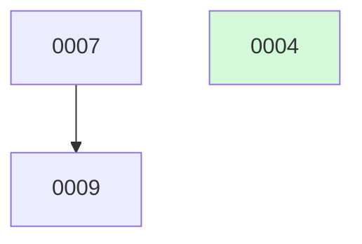

# docket Skill Set Implementation Plan

> **For agentic workers:** REQUIRED SUB-SKILL: Use superpowers:subagent-driven-development (recommended) or superpowers:executing-plans to implement this plan task-by-task. Steps use checkbox (`- [ ]`) syntax for tracking.
>
> **Also REQUIRED for the skill-authoring tasks (Tasks 1–5, 8):** superpowers:writing-skills — these tasks author `SKILL.md` files and the README; follow its frontmatter rules (third-person `description` starting "Use when…", names hyphen-only, frontmatter ≤ 1024 chars) and its "keep concepts inline, factor heavy reference / reusable tools into sibling files" guidance.

**Goal:** Build **docket** — a portable, harness-neutral set of five skills (plus two shell scripts and a README) that adds a change-lifecycle and project-management layer on top of superpowers, coordinated entirely through git with no CLI or database.

**Architecture:** Five self-contained `SKILL.md` directories under `skills/`, each embedding one shared, byte-identical `## Convention` block (kept in step by `sync-convention.sh`). The skills are pure prose process-guides that read/write markdown change files, run `git`/`gh`, and dispatch `superpowers:*` skills for all heavy lifting (brainstorm, plan, build, review, merge). Two bash scripts handle distribution (`link-skills.sh` symlinks the skills into each present harness's global skill dir) and maintenance (`sync-convention.sh`). The change *data* lives per-consuming-project under `docs/changes/`; the skills themselves are installed once from this repo (`~/dev/docket`).

**Tech Stack:** Markdown (`SKILL.md` + templates + README), POSIX `bash` (the two scripts + their tests), `git` + `gh` (the coordination medium, invoked from the skill prose). No language runtime, no package manager, no schema.

---

## Scope & Decisions This Plan Locks In

Read these before starting — they bound the work and explain choices the spec left to implementation.

1. **This repo (`~/dev/docket`) is the build target.** It currently holds only `docs/superpowers/specs/2026-05-30-docket-design.md` (the spec) and now this plan. Everything else in §4 of the spec is created here. The change *data* tree (`docs/changes/`, `docs/adrs/`) is **per consuming project** and is **not** created in this repo — do not scaffold it here.

2. **Deliverable = a skill set, not application code.** Per spec §12, "Skills are not unit-tested like code; verification is behavioural and dogfood-driven." So:
   - The **two bash scripts get real RED→GREEN TDD** (failing test first, against temp fixtures).
   - The **five `SKILL.md` files get structural verification per-task** (frontmatter valid, required sections present, convention markers present and byte-identical across skills, no dangling skill/template references) plus a **behavioural smoke run** at the end (Task 9).
   - This is the honest analog of TDD for process documentation; do not fabricate unit tests for prose.

3. **Canonical convention source = `docket-new-change/SKILL.md`.** Decision #9 mandates "one canonical block" propagated by `sync-convention.sh`. We do **not** add a top-level `convention.md` (spec §4's file tree doesn't list one, and a runtime skill must carry the block inline). The block is authored once (defined verbatim in **Shared Artifacts §SA-1** below), embedded into all five skills, and `sync-convention.sh` treats `docket-new-change`'s copy as canonical.

4. **Default `metadata_branch: main` is the supported v1 path.** Per spec §13, the dedicated-`docket`-branch mode is a documented rough edge: skills and README must *describe* it and its trade-offs/caveats, but its cross-branch read/write mechanics are **not** to be fully implemented or smoke-tested in v1. Every skill's procedure is written for `main` mode, with a clearly-marked "`docket` mode caveat" note where §8 calls one out.

5. **Markhaus dogfood (§12) is a separate dependent plan, not an in-plan task.** The Markhaus repo lives at `/Users/homer/dev/macmd`; the migration *exercises* docket against a real repo rather than *building* docket, so per the writing-plans one-subsystem-per-plan rule it is its own plan — `docs/superpowers/plans/2026-05-30-markhaus-docket-migration.md` — runnable after Tasks 1–9 complete. In-plan behavioural verification here is the throwaway-repo smoke path (Task 9).

6. **Commit hygiene.** New skills/scripts use `feat(docket): …`; README/convention/docs use `docs: …`. Each task ends with its own commit. Do **not** create branches or push for *this* build unless the human asks — the skills *describe* branch/push flows for consuming projects, but building docket itself is plain commits on the current branch.

---

## File Structure

What this plan creates in `~/dev/docket` (the spec's §4 layout):

```
docket/
  skills/
    docket-new-change/
      SKILL.md             # Task 3 — producer (interactive); CANONICAL convention block
      change-template.md   # Task 3 — change-file stub
    docket-implement-next/
      SKILL.md             # Task 4 — autonomous implementer: select→claim→reconcile→build→PR→stop
    docket-finalize-change/
      SKILL.md             # Task 5 — human close-out to `done`
    docket-status/
      SKILL.md             # Task 1 — board + merge-sweep + health checks
    docket-adr/
      SKILL.md             # Task 2 — ADR ledger
      adr-template.md      # Task 2 — ADR stub
  tests/
    test_sync_convention.sh  # Task 6
    test_link_skills.sh      # Task 7
  link-skills.sh           # Task 7 — symlink skills into present harness global skill dirs
  sync-convention.sh       # Task 6 — propagate / --check the shared Convention block
  README.md                # Task 8 — what/install/prerequisite; showcases reconcile + main-as-pseudo-db
  docs/                    # already exists — spec + this plan; repo-only, never copied into a harness
```

**Responsibility boundaries (decomposition rationale):**
- Each skill is one file with one lifecycle responsibility (produce / implement / finalize / report / decide). They communicate only through the committed change files and by *invoking* one another by name (`docket-implement-next` → `docket-status` sweep + `docket-adr`; `docket-finalize-change` reuses `docket-status`'s archive logic). Keeping them separate files mirrors the runtime fact that each is loaded independently.
- The **Convention block** is the single shared contract. It is duplicated into all five skills *by design* (skills travel as standalone directories) and kept identical by `sync-convention.sh`. Authoring it once (Shared Artifacts §SA-1) and embedding verbatim avoids drift in the plan itself.
- **Tests live in `tests/`** beside the scripts they exercise; they are plain bash (no bats/jq dependency — lowest common denominator per spec §11) and self-contained (temp fixtures, no mutation of the real repo or `$HOME`).

---

## Shared Artifacts (defined once — referenced verbatim by the tasks below)

These three artifacts are referenced by name from multiple tasks. They are written out **in full** here so each task can say "embed §SA-1 verbatim" without repeating ~200 lines five times (which would itself risk drift). When a task says *"embed the Convention block (§SA-1)"*, it means paste the block below **byte-for-byte**, including the marker comments.

### §SA-1 — The Canonical Convention Block

This is the `## Convention` section embedded (identically) in **all five** `SKILL.md` files, wrapped in the marker comments `sync-convention.sh` keys on. Content is drawn from spec §5 + §6.

````markdown
<!-- docket:convention:begin -->
## Convention

docket tracks planned work as **changes** — one markdown file each, roughly one PR — and records architecture decisions as **ADRs**. This block is the shared contract every docket skill embeds. It is kept byte-identical across the five skills by `sync-convention.sh` (canonical source: `docket-new-change/SKILL.md`); never hand-edit it in a non-canonical skill.

### Configuration — `.docket.yml` (optional, committed at repo root)

Read at startup by every docket skill. Absent ⇒ all defaults. It is **committed** (never gitignored), because it governs cross-agent coordination and must be identical for every clone, agent, and device. It always lives on `main` (it is *not* routed by `metadata_branch`), so any checkout can read it before it knows where metadata lives.

```yaml
# .docket.yml — committed; read by every docket skill at startup
metadata_branch: main        # main (default) | docket  — where PM commits land (see "Branch model")
changes_dir: docs/changes    # default
adrs_dir: docs/adrs          # default
```

### Directory layout (paths relative to the configured knobs)

```
<changes_dir>/            # default docs/changes/
  active/                 # every NON-terminal change:   <id>-<slug>.md            (id zero-padded to 4 digits)
  archive/                # the two terminal outcomes:    <YYYY-MM-DD>-<id>-<slug>.md
  BOARD.md                # generated board (NEVER hand-edited); spans active + archive
  README.md               # small static blurb linking to BOARD.md (NOT generated)
<adrs_dir>/               # default docs/adrs/  — flat; ADRs are NEVER archived
  <NNNN>-<slug>.md        # immutable once Accepted (only its status: line ever changes)
  README.md               # generated ADR index
```

The `archive/` filename date prefix is **UTC**: the **merge commit's** date for `done`, the **kill commit's** date for `killed`.

### Change manifest (frontmatter at the top of each change file)

```yaml
---
id: 7                     # integer; zero-padded to 4 digits in the filename
slug: quicklook-interactions
title: Quick Look interactions — external links + local images
status: proposed          # proposed | in-progress | blocked | deferred | implemented | done | killed
priority: medium          # low | medium | high | critical   (default: medium)
created: 2026-05-30
updated: 2026-05-30
depends_on: [4]           # change ids that must reach `done` (PR merged) first
related: [4, 6]           # cross-links the reconcile pass reads
adrs: [24]                # ADRs this change cites or produces
spec:                     # superpowers design doc path; set at brainstorm (propose) time, on metadata_branch
plan:                     # superpowers plan path; set at build time, on the feature branch
trivial: false            # true = no spec needed (small mechanical change); still build-ready
branch:                   # planned feat/<slug> name, set on claim; branch itself created at build (step 4)
pr:                       # set when the PR is opened
blocked_by:               # free text; set only when status: blocked
reconciled: false         # set true after the just-in-time reconcile pass
---
```

### Change body sections

- `## Why` — the motivation, as detailed as warranted (no length limit).
- `## What changes` — scope of the work.
- `## Out of scope` — explicit non-goals.
- `## Open questions` — unknowns to resolve during reconcile/design.
- `## Reconcile log` — dated entries appended by the implementer's reconcile pass.
- `## Why deferred` / `## Why killed` — added when entering those states.

The change body is a **PM-altitude proposal** (intent + scope). Detailed design lives in the linked superpowers spec; the task breakdown in the linked superpowers plan. Different zoom levels, no duplication.

### ADR file (`<adrs_dir>/<NNNN>-<slug>.md`)

```yaml
---
id: 24                    # integer; zero-padded to 4 digits in the filename
slug: quicklook-interaction-limits
title: Quick Look interaction limits under sandbox
status: Accepted          # Accepted | Superseded by ADR-NN | Reversed by ADR-NN | Deprecated
date: 2026-05-20
supersedes: []            # ADR ids this replaces (sets the old one's status)
reverses: []              # ADR ids this undoes
relates_to: [22]          # cross-links
change: 4                 # back-link: the change that produced this decision, if any
---

## Context       — the forces / problem that prompted the decision
## Decision      — what was chosen, and the rule a reader needs to know
## Consequences  — what it enables, what it costs, what is given up
```

An `Accepted` ADR is immutable except its `status:` line; a non-reversing context change is appended as a dated `## Update` note, never an edit to the decision. A reversal/supersession is always a **new** ADR.

### Lifecycle — seven states

```
                         ┌──────────────── deferred ──────────────┐
                         │ (conscious shelve; revive → proposed)   │
                         ▼                                          │
  proposed ──claim──▶ in-progress ──PR open──▶ implemented ──merge+sweep──▶ done
     │                    │                                                  (archive/)
     │                    └──blocker──▶ blocked ──clears──▶ in-progress
     │
     └──── killed (obsolete — from proposed, or from in-progress via reconcile; → archive/) ────▶
```

| status | meaning | directory |
|---|---|---|
| `proposed` | drafted, awaiting work | `active/` |
| `in-progress` | claimed, being built | `active/` |
| `blocked` | external blocker (`blocked_by:`) | `active/` |
| `deferred` | consciously shelved, may revive | `active/` |
| `implemented` | built, PR open — **human merge gate** | `active/` |
| `done` | PR merged, filed away (happy terminal) | `archive/` |
| `killed` | abandoned — obsolete or never shipped (sad terminal) | `archive/` |

**Rules.** `active/` holds every non-terminal status; `archive/` holds the two terminal outcomes. The single physical move (`active/ → archive/`, date-prefixed) happens once on the terminal transition and is **idempotent**: re-pull, re-read `status` on `metadata_branch`, no-op if already terminal. `deferred` may be entered from `proposed` or `in-progress` (add `## Why deferred`) and revived to `proposed`; clearing a blocker or reviving is a one-line frontmatter edit, no move. A change whose `depends_on` is unsatisfied is *implicitly* blocked — the selector skips it (no status change) and the board shows it **waiting on #N**. A dependency is **satisfied when it reaches `done`**. If `#N` is still `implemented` (PR open, unmerged), the dependent is gated on a human merge — the board flags **waiting on #N — needs your merge**, distinct from **waiting on #N — not yet built**. Reserve explicit `blocked` for external blockers the system can't infer.

### Build-readiness & selection (shared definition)

A change is **build-ready** — eligible for `docket-implement-next` — only when it is `proposed`, has a `spec:` **or** `trivial: true`, and all `depends_on` are satisfied (`done`). A `proposed` change with neither a spec nor `trivial: true` is **needs-brainstorm** (not build-ready). The implementer's deterministic selection order is `priority` (`critical` > `high` > `medium` > `low`) → age (`created`) → **lowest `id`**.

### Branch model (one-line rule)

Metadata (change file, `BOARD.md`, ADRs) commits to `metadata_branch` (default `main`). **A change's `feat/<slug>` branch is ALWAYS cut from `origin/main`** in both modes — `metadata_branch` only redirects bookkeeping commits, never where code branches start. The feature branch adds only the plan + code and **never modifies** docket metadata.
<!-- docket:convention:end -->
````

> **Note for the executor:** the fenced sub-blocks above (` ```yaml `, ` ``` `) are part of the literal content to paste into each `SKILL.md`. Keep them. Only the outer 4-backtick fence in *this plan* is the plan's own wrapper — do not paste that.

### §SA-2 — `skills/docket-new-change/change-template.md`

The stub `docket-new-change` instantiates. Verbatim content:

```markdown
---
id:                       # set by docket-new-change (max existing id + 1)
slug:
title:
status: proposed
priority: medium
created:                  # YYYY-MM-DD (UTC)
updated:                  # YYYY-MM-DD (UTC)
depends_on: []
related: []
adrs: []
spec:                     # path under docs/superpowers/specs/ once brainstormed (omit if trivial)
plan:                     # left empty; set by docket-implement-next at build time
trivial: false            # true for a small mechanical change with no design questions
branch:
pr:
blocked_by:
reconciled: false
---

## Why

<!-- The motivation. Why does this work matter now? As detailed as warranted. -->

## What changes

<!-- PM-altitude scope of the work. The detailed design lives in the linked spec, not here. -->

## Out of scope

<!-- Explicit non-goals, so reconcile and review don't scope-creep. -->

## Open questions

<!-- Unknowns to resolve during reconcile/design. Delete if none. -->

## Reconcile log

<!-- Appended by docket-implement-next's reconcile pass: dated entries of what changed. -->
```

### §SA-3 — `skills/docket-adr/adr-template.md`

The stub `docket-adr` instantiates. Verbatim content:

```markdown
---
id:                       # set by docket-adr (max existing ADR id + 1)
slug:
title:
status: Accepted
date:                     # YYYY-MM-DD (UTC)
supersedes: []
reverses: []
relates_to: []
change:                   # back-link to the change id that produced this decision, if any
---

## Context

<!-- The forces / problem that prompted the decision. -->

## Decision

<!-- What was chosen, and the rule a reader needs to know. -->

## Consequences

<!-- What it enables, what it costs, what is given up. -->
```

---

## Phase A — The Five Skills (Tasks 1–5)

Built in dependency order: `docket-status` first (its sweep + dependency-resolution pass are reused by the implementer and finalizer), then `docket-adr` (invoked by the implementer), then the producer, implementer, and finalizer.

> For every skill task: author the prose with **superpowers:writing-skills** open. The numbered **procedures** given below are the load-bearing logic and must appear in the skill essentially verbatim (re-worded for prose flow is fine; the *steps, their order, and their guards* must not change). The surrounding Overview / When-to-use framing is yours to write per writing-skills, subject to the structural checks in each task's verification step.

---

### Task 1: `docket-status` — board, merge-sweep, health checks

**Files:**
- Create: `skills/docket-status/SKILL.md`

This skill is built first because `docket-implement-next` (step 0) and `docket-finalize-change` both reuse its **merge-sweep / idempotent-archive** procedure and its **dependency-resolution pass**.

- [ ] **Step 1: Create the skill directory and write the frontmatter + Overview**

Create `skills/docket-status/` and start `SKILL.md` with this exact frontmatter:

```markdown
---
name: docket-status
description: Use when you want to see or refresh the docket backlog — what is proposed, in progress, blocked, implemented, or done — by regenerating the BOARD.md board, sweeping merged changes to done, or running health checks for stale claims, broken spec/plan links, and dependency stalls.
---

# docket-status — the board & janitor
```

Then an `## Overview` (1–2 sentences: the queryable state of the backlog plus housekeeping — board render, merge-sweep, health checks; source of truth is the change files, never the board) and a `## When to use` bullet list (symptoms: "what's done / next / stuck", "after a PR merged via the GitHub button", "links look stale").

- [ ] **Step 2: Embed the Convention block (§SA-1) verbatim**

Paste §SA-1 byte-for-byte (including the `<!-- docket:convention:begin -->` / `…:end -->` markers) as the `## Convention` section.

- [ ] **Step 3: Write the `## Shared dependency-resolution pass` section**

This pass is computed **once** and consumed by both the board and the health checks (spec §7.4). Required content:

```
For every change, resolve each id in its `depends_on`:
  - target status `done`                     → satisfied
  - target status `implemented` (PR unmerged)→ NOT satisfied; reason = "needs your merge"
  - target any other active status / missing → NOT satisfied; reason = "not yet built"
A change with all deps satisfied (or none) is dependency-clear; otherwise it is
dependency-waiting, carrying the worst unmet reason for display.
```

- [ ] **Step 4: Write the `## Board` section (regenerate `BOARD.md` wholesale)**

Required rules (spec §7.4):
- Scan `<changes_dir>/active/` + `archive/`; parse frontmatter. **Regenerate `BOARD.md` wholesale** — never hand-edit, never merge; on a git conflict, regenerate from the change files.
- **No churny timestamp** — counts convey freshness, not a generated-at line.
- Structure, in order:
  1. A one-line count summary (e.g. `**12 changes** — 🟢 2 in progress · 🟡 3 proposed · 🔴 1 blocked · ⚪ 1 deferred · 🔵 2 implemented · ✅ 3 done`).
  2. Emoji-grouped `##` sections per status with live counts in the heading (e.g. `## 🟢 In progress (2)`).
  3. Per-group tables with columns: id · title · priority chip (`critical`/`high`/`medium`/`low`) · clickable `spec`/`pr` links · readiness. A dependency-waiting change renders **⏳ waiting on #N — not yet built** or **⏳ waiting on #N — needs your merge** (from the §Shared dependency-resolution pass), never as build-ready. A `proposed` change with no spec and not `trivial` renders **needs-brainstorm**.
  4. A **Mermaid dependency graph** built from `depends_on` edges, `done` nodes tinted. (Renders on GitHub and Markhaus; degrades gracefully in plain CommonMark.)
  5. A collapsible `<details>` "Done" section for the archive.

Include a **concrete abbreviated example** of the rendered `BOARD.md` in the skill so the format is unambiguous, e.g.:

````markdown
# Backlog

**4 changes** — 🟢 1 in progress · 🟡 1 proposed · 🔵 1 implemented · ✅ 1 done

## 🟢 In progress (1)
| # | Title | Priority | Spec | Branch |
|---|-------|----------|------|--------|
| [0007](active/0007-quicklook-interactions.md) | Quick Look interactions | `high` | [spec](../superpowers/specs/2026-05-30-quicklook.md) | `feat/quicklook-interactions` |

## 🟡 Proposed (1)
| # | Title | Priority | Readiness |
|---|-------|----------|-----------|
| [0009](active/0009-export-pdf.md) | Export to PDF | `medium` | ⏳ waiting on #7 — not yet built |

## 🔵 Implemented — awaiting merge (1)
| # | Title | Priority | PR |
|---|-------|----------|----|
| [0008](active/0008-onboarding-tour.md) | Onboarding tour | `medium` | [#142](https://github.com/o/r/pull/142) |



<details><summary>✅ Done (1)</summary>

| # | Title | Merged |
|---|-------|--------|
| [0004](archive/2026-05-30-0004-quicklook-extension.md) | Quick Look extension | 2026-05-30 |

</details>
````

- [ ] **Step 5: Write the `## Merge sweep` section (idempotent archive)**

The bulk safety net (spec §7.4 + §10). Required procedure:

```
For each `implemented` change:
  1. Determine its PR: use `pr:`; if empty, fall back to `gh pr list --head feat/<slug>`.
  2. Ask gh whether that PR is merged. Not merged → skip.
  3. Merged → ARCHIVE IDEMPOTENTLY:
     a. `git pull --rebase` on metadata_branch; re-read `status`.
        Already `done` (or already under archive/) → no-op, continue.
     b. Compute the merge date in UTC — `gh`'s mergedAt, or
        `TZ=UTC git show -s --date=format-local:%Y-%m-%d <merge-sha>` — NOT now().
     c. `git mv active/<id>-<slug>.md archive/<merge-date>-<id>-<slug>.md`.
     d. Set `status: done` and `updated: <merge-date>` (the SAME UTC date — never now()).
     e. Commit the CHANGE FILE ONLY (BOARD.md is regenerated by the Board pass,
        NOT bundled here — this is what keeps concurrent archivers byte-identical).
        Push to metadata_branch; on non-fast-forward, `pull --rebase` and retry.
     f. Remove the merged feature branch + worktree, provenance-guarded
        (only auto-remove worktrees under a known .worktrees/ path — same guard as
        superpowers:finishing-a-development-branch).
```

State the **determinism invariant** explicitly (spec §10 "Concurrent archive"): two racers both reading `implemented` produce a **byte-identical add** (change-file-only, UTC merge date, no `now()`), which the loser's `pull --rebase` resolves cleanly; `BOARD.md` is regenerated separately, never hand-merged.

- [ ] **Step 6: Write the `## Health checks` section**

Flag (do not auto-fix unless asked) all of (spec §7.4):
- Stale `in-progress` **past the build step** — branch gone, or no commits in **N days (default 3)**. A just-claimed change with a planned `branch:` but no branch yet is **not** stale.
- A `spec:` that is set but does **not** resolve against `metadata_branch` (skip `trivial: true` changes — they have no spec).
- A `plan:` that doesn't resolve **on a `done` change** only (link rot). Ignore a missing `plan:` on an `implemented` change — its plan legitimately still lives on the unmerged feature branch.
- A build-ready change blocked only by a dependency stuck at `implemented` (**needs a human merge**) — from the §Shared dependency-resolution pass.
- `blocked` changes whose `blocked_by` may have cleared.
- `depends_on` **cycles**.

State that board + health checks **share the one dependency-resolution pass** (computed once).

- [ ] **Step 7: Verify structure**

Run (expected: all `ok`, exit 0):

```bash
F=skills/docket-status/SKILL.md
grep -q '^name: docket-status$' "$F" && echo "ok name"
grep -q '^description: Use when' "$F" && echo "ok description"
grep -qF '<!-- docket:convention:begin -->' "$F" && grep -qF '<!-- docket:convention:end -->' "$F" && echo "ok convention markers"
for s in '## Overview' '## When to use' '## Convention' '## Shared dependency-resolution pass' '## Board' '## Merge sweep' '## Health checks'; do
  grep -qF "$s" "$F" || { echo "MISSING: $s"; exit 1; }
done; echo "ok sections"
# Frontmatter ≤ 1024 chars (writing-skills limit):
awk 'NR==1&&/^---$/{f=1;next} f&&/^---$/{exit} f{c+=length($0)+1} END{print (c<=1024)?"ok frontmatter size":"TOO BIG: "c}' "$F"
```

Expected output includes: `ok name`, `ok description`, `ok convention markers`, `ok sections`, `ok frontmatter size`.

- [ ] **Step 8: Commit**

```bash
git add skills/docket-status/SKILL.md
git commit -m "feat(docket): add docket-status skill (board, merge-sweep, health checks)"
```

---

### Task 2: `docket-adr` — the decision ledger

**Files:**
- Create: `skills/docket-adr/SKILL.md`
- Create: `skills/docket-adr/adr-template.md` (content = §SA-3)

- [ ] **Step 1: Create the template**

Write `skills/docket-adr/adr-template.md` with the exact content of **§SA-3**.

- [ ] **Step 2: Write the frontmatter + Overview**

```markdown
---
name: docket-adr
description: Use when recording, superseding, reversing, or indexing an architecture decision (ADR) — capturing why a non-obvious technical decision was made into the immutable docs/adrs ledger, or regenerating and validating the ADR index. Invoked by docket-implement-next, or directly any time a decision must be recorded or changed.
---

# docket-adr — the decision ledger
```

Add `## Overview` (the project-wide, immutable, numbered record of *why*; changes *cite* and *produce* ADRs; ADRs are never archived/rewritten/moved) and `## When to use`.

- [ ] **Step 3: Embed the Convention block (§SA-1) verbatim**

Paste §SA-1 as the `## Convention` section.

- [ ] **Step 4: Write the `## Actions` section**

Four actions (spec §7.5). Required procedures:

```
### Create
  1. Allocate the next ADR number: scan the `id:` frontmatter of every file in
     <adrs_dir>/, take max + 1. (Filename uses the 4-digit zero-pad: 0024-…)
  2. Write <NNNN>-<slug>.md from adr-template.md: status: Accepted, date: <UTC today>,
     optional `change:` back-link to the producing change.
  3. Commit the NEW ADR FILE ONLY. The README.md index is regenerated in a SEPARATE
     commit (see Index/validate) — like BOARD.md, so two concurrent creates never
     conflict on the shared index.
  4. On a lost compare-and-swap push (someone minted the same id first):
     re-read max id, RENAME the file + fix any id-bearing links, re-push.
  5. RETURN THE NUMBER so the caller (e.g. docket-implement-next step 6) can cite it.

### Supersede / reverse
  - NEVER edits an Accepted ADR's body. Write a NEW ADR with supersedes:/reverses:
    pointing at the old one. Flip ONLY the old ADR's status: line to
    "Superseded by ADR-NN" / "Reversed by ADR-NN". Annotate BOTH entries in the index.

### Update note
  - For a non-reversing material change, append a dated `## Update` to the ADR body.
    Allowed; the Decision section itself is never edited.

### Index / validate
  - (Re)render <adrs_dir>/README.md grouped Active / Superseded-Reversed / Deprecated.
    Row example: `- [ADR-0024](0024-quicklook-interaction-limits.md) — Quick Look
    interaction limits (Accepted) ← change #4`.
  - Regenerated wholesale (like BOARD.md); on conflict, regenerate from the ADR files.
  - Validate: flag numbering gaps, dangling supersedes/reverses/relates_to links,
    and status inconsistencies (e.g. an ADR marked superseded with no superseding ADR).
```

- [ ] **Step 5: Verify structure**

```bash
F=skills/docket-adr/SKILL.md; T=skills/docket-adr/adr-template.md
grep -q '^name: docket-adr$' "$F" && echo "ok name"
grep -q '^description: Use when' "$F" && echo "ok description"
grep -qF '<!-- docket:convention:begin -->' "$F" && echo "ok convention"
for s in '## Overview' '## When to use' '## Convention' '## Actions' '### Create' '### Supersede / reverse' '### Update note' '### Index / validate'; do
  grep -qF "$s" "$F" || { echo "MISSING: $s"; exit 1; }
done; echo "ok sections"
grep -q '^status: Accepted$' "$T" && grep -qF '## Decision' "$T" && echo "ok template"
```

Expected: `ok name`, `ok description`, `ok convention`, `ok sections`, `ok template`.

- [ ] **Step 6: Commit**

```bash
git add skills/docket-adr/SKILL.md skills/docket-adr/adr-template.md
git commit -m "feat(docket): add docket-adr skill + ADR template (decision ledger)"
```

---

### Task 3: `docket-new-change` — the producer (interactive) + CANONICAL convention

**Files:**
- Create: `skills/docket-new-change/SKILL.md` (← the **canonical** convention source)
- Create: `skills/docket-new-change/change-template.md` (content = §SA-2)

- [ ] **Step 1: Create the template**

Write `skills/docket-new-change/change-template.md` with the exact content of **§SA-2**.

- [ ] **Step 2: Write the frontmatter + Overview**

```markdown
---
name: docket-new-change
description: Use when capturing a new unit of planned work (a change, roughly one PR) into the docket backlog — turning an idea into a tracked, build-ready change through up-front design brainstorming, or (opt-in) scanning a project for candidate work into proposed stubs. Interactive; the entry point a human runs to propose work before it is implemented. Writes markdown only — never branches, worktrees, or code.
---

# docket-new-change — the producer (interactive)
```

Add `## Overview` (this is where the human is in the loop; turns an idea into a build-ready change by brainstorming the design up front; **only ever mints new `proposed` ids**, so it structurally cannot collide with the implementer) and `## When to use`.

- [ ] **Step 3: Embed the Convention block (§SA-1) verbatim — THIS COPY IS CANONICAL**

Paste §SA-1 as the `## Convention` section. `sync-convention.sh` (Task 6) treats this copy as the source of truth.

- [ ] **Step 4: Write the `## Brainstorm mode (default)` section**

Five steps (spec §7.1). Required procedure:

```
1. Allocate — `git pull --rebase` on metadata_branch; scan the `id:` frontmatter of
   EVERY change in active/ + archive/ (archive filenames are date-prefixed, so
   frontmatter is the reliable id source); next id = max + 1; derive slug from title.
   The id is finalized at the step-5 push (compare-and-swap): if that push is rejected
   because another docket-new-change minted the same id first, re-pull → re-read max id
   → re-allocate, RENAME active/<id>-<slug>.md and fix any id-bearing links, then re-push.
2. Brainstorm — run superpowers:brainstorming WITH THE HUMAN. This is the decision point.
   STOP AT THE SPEC — do NOT continue to writing-plans (that is build-time). The spec is
   written natively to docs/superpowers/specs/… and committed to metadata_branch; record
   its path in `spec:`.
3. Recon — scan neighbouring changes (active + recent archive) and the ADR index to
   pre-fill `related`, `depends_on`, `adrs`.
4. Draft the change — write the thin active/<id>-<slug>.md from change-template.md:
   frontmatter (status: proposed, spec:, created/updated = UTC today, priority default
   medium) + a PM-altitude why/what/scope body distilled from the brainstorm. Design
   detail lives in the linked spec, NOT here.
5. Board, commit & push — refresh BOARD.md (via docket-status's Board pass), commit the
   change + spec, and PUSH to the remote metadata_branch (immediately reviewable on
   GitHub; visible to the autonomous implementer). STOP. Never implements.
```

- [ ] **Step 5: Write the `## Trivial path` and `## Scan mode (opt-in)` sections**

```
### Trivial path
  For a small mechanical change with no real design questions: skip the brainstorm,
  set trivial: true, write the change body directly — no spec, still build-ready.

### Scan mode (opt-in, explicitly triggered)
  Survey TODOs, deferred changes, known gaps, and the ADR backlog; emit several
  lightweight `proposed` STUBS in one pass — WITHOUT specs. Scan-stubs are NOT
  build-ready (no spec, not trivial) — the board calls this state needs-brainstorm.
  They form an "ideas to brainstorm" backlog a later brainstorm pass turns build-ready.
  Kept opt-in so routine runs don't generate speculative noise.
```

- [ ] **Step 6: Verify structure**

```bash
F=skills/docket-new-change/SKILL.md; T=skills/docket-new-change/change-template.md
grep -q '^name: docket-new-change$' "$F" && echo "ok name"
grep -q '^description: Use when' "$F" && echo "ok description"
grep -qF '<!-- docket:convention:begin -->' "$F" && echo "ok convention"
for s in '## Overview' '## When to use' '## Convention' '## Brainstorm mode' '## Trivial path' '## Scan mode'; do
  grep -qF "$s" "$F" || { echo "MISSING: $s"; exit 1; }
done; echo "ok sections"
grep -q '^status: proposed$' "$T" && grep -qF '## Why' "$T" && echo "ok template"
```

Expected: `ok name`, `ok description`, `ok convention`, `ok sections`, `ok template`.

- [ ] **Step 7: Commit**

```bash
git add skills/docket-new-change/SKILL.md skills/docket-new-change/change-template.md
git commit -m "feat(docket): add docket-new-change skill + change template (producer)"
```

---

### Task 4: `docket-implement-next` — the autonomous implementer

**Files:**
- Create: `skills/docket-implement-next/SKILL.md`

This is the largest skill. It references `docket-status` (step 0 sweep) and `docket-adr` (step 6), both already built.

- [ ] **Step 1: Write the frontmatter + Overview**

```markdown
---
name: docket-implement-next
description: Use when you want the next build-ready change in the docket backlog implemented end-to-end to an open PR with no human interaction — picking, claiming, reconciling against current reality, planning, building with TDD, reviewing, and stopping at the human merge gate. The autonomous backlog-drainer; runs solo per change.
---

# docket-implement-next — the implementer (autonomous)
```

Add `## Overview` (runs with **no human interaction**; picks the next build-ready change and drives it to a PR, then stops at the human merge gate) and `## When to use`.

- [ ] **Step 2: Embed the Convention block (§SA-1) verbatim**

- [ ] **Step 3: Write the `## Procedure` section (steps 0–7)**

Required procedure (spec §7.2), verbatim in intent:

```
0. Sync & sweep — `git pull --rebase`; invoke docket-status's merge-sweep so any
   `implemented` change whose PR merged is swept to archive/ (status → done) FIRST
   (self-cleaning safety net for changes not closed via docket-finalize-change).

1. Select — among active/ changes that are `proposed`, BUILD-READY (have a spec: or
   trivial: true), and have all depends_on satisfied (satisfied = `done`), rank by
   priority (critical > high > medium > low) → age (created) → LOWEST id (the final
   deterministic tie-break §8 relies on). Pick the top, or accept an explicit id.
   Skip in-progress / blocked / deferred and not-build-ready stubs.

2. Claim (compare-and-swap) — re-read the manifest after the pull; if still `proposed`,
   set status: in-progress + branch: feat/<slug> + updated: <UTC today>; commit and
   push on metadata_branch. On a non-fast-forward rejection: DISCARD the pending local
   claim commit (it edits the same status:/branch: lines and would conflict on replay),
   `git pull --rebase`, RE-READ (mandatory); if still `proposed`, re-claim and push —
   LOOP until the push lands (it can be rejected repeatedly under load). The arbiter is
   the re-read (abort if no longer `proposed`), not that any single push succeeds.
   No worktree yet. [Two agents must NOT share one local clone — each needs its own.]

3. Reconcile ⭐ — re-read the change + its spec against `related` + recently-archived
   changes, cited + recent ADRs, and CURRENT code; refresh the change body and spec to
   what is true NOW (drop work done elsewhere, adjust scope, fold in new constraints),
   NON-INTERACTIVELY (a trivial change has no spec — refresh the body only). Append a
   dated `## Reconcile log` entry; set reconciled: true; commit and push on
   metadata_branch. Two escape hatches:
     • change now OBSOLETE → set killed (+ `## Why killed`), archive, loop back to Select.
     • design FUNDAMENTALLY invalidated (not just scope-adjustable) → STOP and escalate
       to the human (it cannot re-brainstorm alone).

4. Worktree + plan — `git fetch origin`; CONFIRM the step-3 reconcile push has landed on
   origin/main (default mode). If it hasn't (push was rejected): `pull --rebase`, re-push,
   re-fetch — loop until the reconcile commit is on origin/main BEFORE continuing. Then
   `git worktree add .worktrees/<slug> -b feat/<slug> origin/main` — the freshly-fetched
   origin/main carries the reconciled spec in default mode. (NEVER base on a separate
   metadata branch; in default mode metadata_branch IS main, the correct base.) Run
   superpowers:writing-plans (writes docs/superpowers/plans/ ON THE FEATURE BRANCH);
   record the path in plan:.

5. Build — superpowers:subagent-driven-development executes the plan task-by-task with
   TDD + per-task review.

6. Review + ADRs — superpowers:requesting-code-review (whole-branch). For any non-obvious
   decision, invoke docket-adr to record it (it assigns the number + updates the index);
   append the returned number to the change's adrs:.

7. PR + stop — invoke superpowers:finishing-a-development-branch, DIRECTED to: push the
   feature branch and open a PR — do NOT merge — then stop. (Pre-specifying the outcome
   keeps it non-interactive while reusing its push/PR mechanics.) Then, BACK IN THE MAIN
   WORKING TREE, set status: implemented + pr: and commit + push on metadata_branch —
   NEVER in the feature worktree (metadata always lands on metadata_branch; this is also
   what lets the sweep read pr:). STOP. The change stays in active/ as `implemented`
   until a human merges it, or approves docket-finalize-change to merge it.
```

- [ ] **Step 4: Write the `## The reconcile pass and the `reconciled` flag` section**

This is **docket's quiet superpower** — the README must surface it (Task 8), and the skill must explain it (spec §7.2 sub-section). Required content:
- Why it exists: a change is drafted against a *snapshot*; in an async backlog the world moves (other changes ship, ADRs land, code moves). Most backlog systems build the stale ticket as written; reconcile is the antidote, run at the **last responsible moment**.
- The `reconciled` flag semantics: `false` at birth, `true` after the pass. It is an **audit signal** (paired with the dated `## Reconcile log`) and a **resume-safety guard** — **not a selection criterion** (build-readiness is `spec:`-or-`trivial`). On resume, a claimed (`in-progress`) change still showing `reconciled: false` means reconcile didn't finish → re-run. On **any** resume, also re-run reconcile if `origin/main` advanced since (idempotent, non-interactive; must reflect the last responsible moment).

- [ ] **Step 5: Write the `## Branch & metadata discipline` section**

Encode the load-bearing invariants (spec §8):
- **The one-line rule:** *new change ⇒ `git worktree add .worktrees/<slug> -b feat/<slug> origin/main`* — in **both** modes. `metadata_branch` only redirects bookkeeping; never where the code branch starts.
- The feature branch is cut from `origin/main` **after** claim + reconcile, adds only plan + code, and **never modifies** metadata — so at merge the 3-way merge takes `main`'s side for the change file unconditionally (feat == base on that path): **no conflict, no revert.**
- Metadata commits happen **in the main working tree**; code/plan commits in the feature worktree.
- This skill is **invocation-branch-agnostic**: it `git fetch`es and operates against `origin/main` (feature base) and `metadata_branch` (bookkeeping) explicitly, so it doesn't matter which branch the human invoked from.
- **`docket` mode caveat (v1 rough edge — §13):** code still branches from `origin/main`, but the spec lives on `docket` and must be read cross-tree (`git show docket:docs/superpowers/specs/<file>`), and the reconcile push lands on `docket`. These cross-branch mechanics are **not fully specified for v1** — default `main` mode is the supported path.

- [ ] **Step 6: Verify structure**

```bash
F=skills/docket-implement-next/SKILL.md
grep -q '^name: docket-implement-next$' "$F" && echo "ok name"
grep -q '^description: Use when' "$F" && echo "ok description"
grep -qF '<!-- docket:convention:begin -->' "$F" && echo "ok convention"
for s in '## Overview' '## When to use' '## Convention' '## Procedure' 'reconciled' '## Branch & metadata discipline'; do
  grep -qF "$s" "$F" || { echo "MISSING: $s"; exit 1; }
done; echo "ok sections"
# It must invoke the right superpowers + docket skills:
for ref in 'superpowers:brainstorming' 'superpowers:writing-plans' 'superpowers:subagent-driven-development' 'superpowers:requesting-code-review' 'superpowers:finishing-a-development-branch' 'docket-status' 'docket-adr'; do
  grep -qF "$ref" "$F" || { echo "MISSING REF: $ref"; exit 1; }
done; echo "ok references"
```
> Note: `superpowers:brainstorming` appears because the escape-hatch text references that re-brainstorming is a human act; if you phrase it without that token, drop it from the ref list. All other refs are mandatory.

Expected: `ok name`, `ok description`, `ok convention`, `ok sections`, `ok references`.

- [ ] **Step 7: Commit**

```bash
git add skills/docket-implement-next/SKILL.md
git commit -m "feat(docket): add docket-implement-next skill (autonomous implementer)"
```

---

### Task 5: `docket-finalize-change` — human close-out to `done`

**Files:**
- Create: `skills/docket-finalize-change/SKILL.md`

Mirrors `docket-new-change` as the human's *closing* bookend. Reuses `docket-status`'s archive logic; delegates git mechanics to `superpowers:finishing-a-development-branch`.

- [ ] **Step 1: Write the frontmatter + Overview**

```markdown
---
name: docket-finalize-change
description: Use when a change's PR is approved or merged and you want to close it out to done promptly rather than waiting for the safety-net sweep — merging if approved, verifying the merge landed, archiving the change, cleaning up its branch and worktree, and refreshing the board. The human's closing bookend; mirrors docket-new-change.
---

# docket-finalize-change — close out a change (human)
```

Add `## Overview` and `## When to use`.

- [ ] **Step 2: Embed the Convention block (§SA-1) verbatim**

- [ ] **Step 3: Write the `## Selection` section (explicit id or auto-detect)**

```
Given an explicit change id, OR auto-detect:
  • auto-detect FINALIZES every `implemented` change whose pr: is already merged
    (safe, idempotent), AND
  • for any that are only approved-and-mergeable (not yet merged), PROMPT before merging
    — merging is a deliberate act.
The per-change steps below run for each selected change.
```

- [ ] **Step 4: Write the `## Per-change steps` section (1–5)**

```
1. Check the PR (gh). Already merged → straight to archive. Approved + mergeable but
   not merged → MERGE IT (invoking finalize IS the merge decision — the gate is
   respected), then continue.
2. Verify the merge landed on main (optionally: tests green on the merged result).
3. Archive (idempotent) — `git pull --rebase`, re-read status; if already `done` (or
   already under archive/), no-op. Otherwise `git mv active/<id>-<slug>.md
   archive/<merge-date>-<id>-<slug>.md` where the YYYY-MM-DD prefix AND `updated:` are
   BOTH the merge commit's date in UTC (gh's mergedAt, or
   `TZ=UTC git show -s --date=format-local:%Y-%m-%d`) — never now(). Set status: done.
   Commit on metadata_branch — the CHANGE FILE ONLY (BOARD.md regen is step 5, kept
   separate so concurrent archivers stay byte-identical). Push; retry on non-fast-forward.
4. Clean up — remove the merged feature branch + worktree (provenance-guarded, like
   superpowers:finishing-a-development-branch — only auto-remove worktrees under .worktrees/).
5. Board — regenerate BOARD.md (docket-status's Board pass).
```

Note: this archive procedure is **identical** to `docket-status`'s merge-sweep archive — phrase it so the two skills agree (same UTC date, same change-file-only commit, same idempotency). It is fine for both skills to describe it; they must not diverge.

- [ ] **Step 5: Write the `## Where finishing-a-development-branch fits` and `## docket mode caveat` notes**

- docket **delegates git integration mechanics** to `superpowers:finishing-a-development-branch` rather than reimplementing them. When a human is present it can also drive a **non-standard close-out** (keep the branch, discard it, or merge locally without a PR) — its merge/keep/discard chooser fits. docket borrows its **worktree provenance-guard** for cleanup.
- **`docket` mode caveat (v1 rough edge):** finalize spans two branches — merges code into `main` (step 1) but commits the archive to `docket` (step 3), so the `done` state won't appear on `main` until the periodic `docket → main` sync. The bulk sweep (and `docket-implement-next` step 0) remain a self-healing safety net for changes merged via the GitHub button without running this skill.

- [ ] **Step 6: Verify structure**

```bash
F=skills/docket-finalize-change/SKILL.md
grep -q '^name: docket-finalize-change$' "$F" && echo "ok name"
grep -q '^description: Use when' "$F" && echo "ok description"
grep -qF '<!-- docket:convention:begin -->' "$F" && echo "ok convention"
for s in '## Overview' '## When to use' '## Convention' '## Selection' '## Per-change steps'; do
  grep -qF "$s" "$F" || { echo "MISSING: $s"; exit 1; }
done; echo "ok sections"
grep -qF 'superpowers:finishing-a-development-branch' "$F" && echo "ok delegate ref"
```

Expected: `ok name`, `ok description`, `ok convention`, `ok sections`, `ok delegate ref`.

- [ ] **Step 7: Commit**

```bash
git add skills/docket-finalize-change/SKILL.md
git commit -m "feat(docket): add docket-finalize-change skill (human close-out)"
```

---

## Phase B — The Scripts (Tasks 6–7), real TDD

Plain bash; tests use temp fixtures and a `DOCKET_*` env override so they never touch the real repo skills or `$HOME`. RED first.

---

### Task 6: `sync-convention.sh` — keep the Convention block in step

**Files:**
- Create: `tests/test_sync_convention.sh`
- Create: `sync-convention.sh`

- [ ] **Step 1: Write the failing test first**

Create `tests/test_sync_convention.sh`:

```bash
#!/usr/bin/env bash
# tests/test_sync_convention.sh — run: bash tests/test_sync_convention.sh
set -uo pipefail
REPO="$(cd "$(dirname "${BASH_SOURCE[0]}")/.." && pwd)"
fail=0
assert(){ if eval "$2"; then echo "ok - $1"; else echo "NOT OK - $1"; fail=1; fi; }

tmp="$(mktemp -d)"; trap 'rm -rf "$tmp"' EXIT
mkdir -p "$tmp/skills/docket-new-change" "$tmp/skills/docket-status"
cp "$REPO/sync-convention.sh" "$tmp/sync-convention.sh"

B='<!-- docket:convention:begin -->'
E='<!-- docket:convention:end -->'
# Canonical (docket-new-change) holds the real block; status holds a STALE one.
printf '# head\n%s\n## Convention\nCANON v2\n%s\nrest-new\n' "$B" "$E" > "$tmp/skills/docket-new-change/SKILL.md"
printf '# head\n%s\n## Convention\nOLD v1\n%s\nrest-status\n'  "$B" "$E" > "$tmp/skills/docket-status/SKILL.md"

# --check detects drift (exit 1)
( cd "$tmp" && bash sync-convention.sh --check >/dev/null 2>&1 ); rc=$?
assert "--check flags drift (exit 1)" '[ "$rc" = "1" ]'

# sync propagates canonical into status, preserving non-block content
( cd "$tmp" && bash sync-convention.sh >/dev/null )
assert "status block now matches canonical" 'grep -q "CANON v2" "$tmp/skills/docket-status/SKILL.md"'
assert "stale block removed"               '! grep -q "OLD v1" "$tmp/skills/docket-status/SKILL.md"'
assert "non-block content preserved"        'grep -q "rest-status" "$tmp/skills/docket-status/SKILL.md"'
assert "canonical left untouched"           'grep -q "rest-new" "$tmp/skills/docket-new-change/SKILL.md"'

# --check now passes (exit 0)
( cd "$tmp" && bash sync-convention.sh --check >/dev/null 2>&1 ); rc=$?
assert "--check passes after sync (exit 0)" '[ "$rc" = "0" ]'

# Missing markers in a non-canonical skill is an error in sync mode (exit != 0,1)
mkdir -p "$tmp/skills/docket-adr"; printf 'no markers here\n' > "$tmp/skills/docket-adr/SKILL.md"
( cd "$tmp" && bash sync-convention.sh >/dev/null 2>&1 ); rc=$?
assert "sync errors when markers missing (exit 2)" '[ "$rc" = "2" ]'

exit $fail
```

- [ ] **Step 2: Run the test, watch it fail**

```bash
bash tests/test_sync_convention.sh
```
Expected: fails — `sync-convention.sh` does not exist yet (`cp` errors / asserts NOT OK). This confirms RED.

- [ ] **Step 3: Write `sync-convention.sh`**

Create `sync-convention.sh`:

```bash
#!/usr/bin/env bash
# sync-convention.sh — keep the embedded "## Convention" block byte-identical across
# all docket skills. Canonical source: docket-new-change/SKILL.md.
#
#   bash sync-convention.sh           # propagate the canonical block into the others
#   bash sync-convention.sh --check   # exit 0 if all in sync; 1 (and list drift) if not
#
# Exit codes: 0 ok · 1 drift (--check) · 2 setup error (canonical/markers missing).
set -euo pipefail

SCRIPT_DIR="$(cd "$(dirname "${BASH_SOURCE[0]}")" && pwd)"
SKILLS_DIR="$SCRIPT_DIR/skills"
CANONICAL="${DOCKET_CANONICAL_SKILL:-docket-new-change}"
BEGIN='<!-- docket:convention:begin -->'
END='<!-- docket:convention:end -->'

extract() {  # print the block inclusive of its markers from file $1
  awk -v b="$BEGIN" -v e="$END" '$0==b{g=1} g{print} $0==e{g=0}' "$1"
}

src="$SKILLS_DIR/$CANONICAL/SKILL.md"
[ -f "$src" ] || { echo "canonical not found: $src" >&2; exit 2; }

blockfile="$(mktemp)"; trap 'rm -f "$blockfile"' EXIT
extract "$src" > "$blockfile"
[ -s "$blockfile" ] || { echo "no convention block in canonical $src" >&2; exit 2; }

mode="${1:-sync}"
status=0
for f in "$SKILLS_DIR"/*/SKILL.md; do
  [ "$f" = "$src" ] && continue
  cur="$(extract "$f")"
  if [ "$cur" = "$(cat "$blockfile")" ]; then
    continue
  fi
  if [ "$mode" = "--check" ]; then
    echo "DRIFT: $f"
    status=1
    continue
  fi
  # sync mode: the markers must already be present (skills are authored with them).
  if ! grep -qF "$BEGIN" "$f" || ! grep -qF "$END" "$f"; then
    echo "markers missing in $f — add the convention markers before syncing" >&2
    exit 2
  fi
  tmp="$(mktemp)"
  awk -v b="$BEGIN" -v e="$END" -v rf="$blockfile" '
    $0==b { while ((getline line < rf) > 0) print line; close(rf); skip=1; next }
    $0==e { skip=0; next }
    !skip { print }
  ' "$f" > "$tmp"
  mv "$tmp" "$f"
  echo "synced $f"
done

if [ "$mode" = "--check" ] && [ "$status" -eq 0 ]; then
  echo "convention in sync"
fi
exit $status
```

- [ ] **Step 4: Run the test, watch it pass**

```bash
chmod +x sync-convention.sh
bash tests/test_sync_convention.sh
```
Expected: all `ok -` lines, exit 0.

- [ ] **Step 5: Cross-validate against the REAL skills (proves Tasks 1–5 embedded §SA-1 identically)**

```bash
bash sync-convention.sh --check
```
Expected: `convention in sync`, exit 0. If it reports `DRIFT:`, the listed non-canonical skill's `## Convention` block diverged from `docket-new-change`'s — run `bash sync-convention.sh` to fix it, then re-run `--check`. (This is the real-world proof the five embedded blocks match.)

- [ ] **Step 6: Commit**

```bash
git add sync-convention.sh tests/test_sync_convention.sh
git commit -m "feat(docket): add sync-convention.sh + test (keep Convention block in step)"
```

---

### Task 7: `link-skills.sh` — install skills into present harness dirs

**Files:**
- Create: `tests/test_link_skills.sh`
- Create: `link-skills.sh`

- [ ] **Step 1: Write the failing test first**

Create `tests/test_link_skills.sh`:

```bash
#!/usr/bin/env bash
# tests/test_link_skills.sh — run: bash tests/test_link_skills.sh
set -uo pipefail
REPO="$(cd "$(dirname "${BASH_SOURCE[0]}")/.." && pwd)"
fail=0
assert(){ if eval "$2"; then echo "ok - $1"; else echo "NOT OK - $1"; fail=1; fi; }

tmp="$(mktemp -d)"; trap 'rm -rf "$tmp"' EXIT
# Fake harness root: SOME dirs present, some absent on purpose.
mkdir -p "$tmp/.claude/skills" "$tmp/.agents/skills"   # present
# .cursor/.codex/.kiro/.windsurf intentionally absent

DOCKET_HARNESS_ROOT="$tmp" bash "$REPO/link-skills.sh" >/dev/null

assert "links into present .claude/skills"  '[ -L "$tmp/.claude/skills/docket-status" ]'
assert "links into present .agents/skills"  '[ -L "$tmp/.agents/skills/docket-status" ]'
assert "symlink target is absolute repo path" '[ "$(readlink "$tmp/.claude/skills/docket-status")" = "$REPO/skills/docket-status" ]'
assert "does NOT create an absent harness dir" '[ ! -d "$tmp/.cursor/skills" ]'
assert "all five skills linked" '[ "$(find "$tmp/.claude/skills" -maxdepth 1 -type l | wc -l | tr -d " ")" = "5" ]'

# Idempotency: a second run creates nothing new.
out="$(DOCKET_HARNESS_ROOT="$tmp" bash "$REPO/link-skills.sh")"
assert "second run idempotent (Created: 0)" 'echo "$out" | grep -q "Created: 0"'

# A pre-existing entry at a link path is left untouched (not clobbered).
rm "$tmp/.agents/skills/docket-adr"; echo "do not touch" > "$tmp/.agents/skills/docket-adr"
DOCKET_HARNESS_ROOT="$tmp" bash "$REPO/link-skills.sh" >/dev/null
assert "pre-existing file preserved" 'grep -q "do not touch" "$tmp/.agents/skills/docket-adr"'

exit $fail
```
> Note: the "all five skills linked" assert encodes decision #6 (exactly five skills). It requires Tasks 1–5 done (the five `skills/*/` dirs exist) — which they are by this phase.

- [ ] **Step 2: Run the test, watch it fail**

```bash
bash tests/test_link_skills.sh
```
Expected: fails — `link-skills.sh` does not exist yet. Confirms RED.

- [ ] **Step 3: Write `link-skills.sh`**

Create `link-skills.sh` (modeled on `~/dev/obsidian-wiki/link-skills.sh`'s idempotency, but **absolute** symlinks into **global** harness dirs per decision #10):

```bash
#!/usr/bin/env bash
# link-skills.sh — symlink docket's skills into each PRESENT agent-harness GLOBAL skill dir.
#
# Absolute symlinks point back to this repo's skills/<name>, so the source of truth stays
# in this clone (default ~/dev/docket): edit once, picked up everywhere, no copying.
# Idempotent: only creates MISSING links, and only into harness dirs that ALREADY EXIST
# (we never create a harness you don't use). Verify each harness's exact skills dir if
# this list drifts.
#
# Usage: bash link-skills.sh
set -euo pipefail

SCRIPT_DIR="$(cd "$(dirname "${BASH_SOURCE[0]}")" && pwd)"
SKILLS_DIR="$SCRIPT_DIR/skills"

# Tests override the harness root; real runs use $HOME.
HARNESS_ROOT="${DOCKET_HARNESS_ROOT:-$HOME}"

HARNESS_SKILL_DIRS=(
  "$HARNESS_ROOT/.claude/skills"
  "$HARNESS_ROOT/.codex/skills"
  "$HARNESS_ROOT/.cursor/skills"
  "$HARNESS_ROOT/.agents/skills"
  "$HARNESS_ROOT/.kiro/skills"
  "$HARNESS_ROOT/.windsurf/skills"
)

created=0
skipped=0

for skill_path in "$SKILLS_DIR"/*/; do
  [ -d "$skill_path" ] || continue
  name="$(basename "$skill_path")"
  target="$SKILLS_DIR/$name"            # absolute
  for dir in "${HARNESS_SKILL_DIRS[@]}"; do
    [ -d "$dir" ] || continue           # only link into harnesses that exist
    link="$dir/$name"
    if [ -e "$link" ] || [ -L "$link" ]; then
      skipped=$((skipped + 1))
      continue
    fi
    ln -s "$target" "$link"
    echo "linked $link -> $target"
    created=$((created + 1))
  done
done

echo ""
echo "Created: $created   Skipped (already present): $skipped"
```

- [ ] **Step 4: Run the test, watch it pass**

```bash
chmod +x link-skills.sh
bash tests/test_link_skills.sh
```
Expected: all `ok -` lines, exit 0.

- [ ] **Step 5: Commit**

```bash
git add link-skills.sh tests/test_link_skills.sh
git commit -m "feat(docket): add link-skills.sh + test (install skills into harness dirs)"
```

---

## Phase C — README (Task 8)

### Task 8: `README.md`

**Files:**
- Create: `README.md`

- [ ] **Step 1: Write the README**

Required content (spec §4 mandates it "must showcase the reconcile feature (§7.2) + the main-as-pseudo-database transparency note (§8)"; §7.2 says the reconcile superpower "must be surfaced prominently"; §8 says the pseudo-database note "must state this plainly"). Sections:

- `# docket` — the one-line definition (spec §1): *"A change is a self-contained, tracked unit of planned work (≈ one PR). docket records each change as a single markdown file with a status lifecycle, and provides five skills … all coordinated through git, no CLI or database."*
- `## What docket is` — the middle path between superpowers (execution, no backlog) and OpenSpec/superspec (lifecycle, but a CLI + rigid markdown). Thin lifecycle layer = plain files + five skills, reusing superpowers wholesale.
- `## Prerequisite: superpowers` — a **declared prerequisite** on every harness; installing it is the user's responsibility, not docket's. docket calls `superpowers:*` directly.
- `## Install` — clone to `~/dev/docket`, run `bash link-skills.sh` (absolute symlinks into each present harness's global skill dir; idempotent). Optionally add `.docket.yml` to a consuming project to override defaults.
- `## The reconcile superpower` — **prominent section** (spec §7.2): plans rot; a change drafted weeks ago is built against a stale snapshot. docket's reconcile step re-reads the change + spec against current code/ADRs/changes at the **last responsible moment**, drops work done elsewhere, folds in new constraints, kills the change if obsolete, or escalates if fundamentally invalidated. The `reconciled` flag is the visible audit record. "Plans rot; refresh them just-in-time, never trust a stale backlog."
- `## How metadata is stored (transparency)` — **state plainly** (spec §8): in default mode docket uses **`main` as a pseudo-database** — backlog, board, and decisions are files committed *directly* to `main`. Be upfront this is **not how most projects treat `main`** (unconventional; some teams will find it noisy or at odds with branch protection). The cleaner conventional answer is the separate `metadata_branch: docket` mode — but that mode is **currently underdeveloped** (dangling `See ADR-NN` refs on `main`, manual sync), expected to improve later (auto-mirror/auto-merge). Until then, default `main` is chosen for visibility + simplicity, eyes open to the trade-off.
- `## The five skills` — one line each: `docket-new-change` (producer, interactive), `docket-implement-next` (autonomous implementer), `docket-finalize-change` (human close-out), `docket-status` (board + janitor), `docket-adr` (decision ledger).
- `## Status` — v1 supports default `main` mode; `docket` branch mode is a documented rough edge (§13); Markhaus is the first planned dogfood.

- [ ] **Step 2: Verify the mandated content is present**

```bash
F=README.md
for s in '# docket' '## The reconcile superpower' 'pseudo-database' 'superpowers' 'link-skills.sh'; do
  grep -qiF "$s" "$F" || { echo "MISSING: $s"; exit 1; }
done
for skill in docket-new-change docket-implement-next docket-finalize-change docket-status docket-adr; do
  grep -qF "$skill" "$F" || { echo "MISSING skill mention: $skill"; exit 1; }
done
echo "ok readme content"
```
Expected: `ok readme content`.

- [ ] **Step 3: Commit**

```bash
git add README.md
git commit -m "docs: add docket README (install, reconcile superpower, main-as-pseudo-db transparency)"
```

---

## Phase D — End-to-End Verification (Task 9)

### Task 9: Behavioural smoke run + full repo check + Markhaus follow-on note

Skills are verified **behaviourally** (spec §12). This task runs the §12 smoke path in a throwaway repo and re-runs all automated checks.

- [ ] **Step 1: Re-run all automated checks (regression gate)**

```bash
bash tests/test_sync_convention.sh
bash tests/test_link_skills.sh
bash sync-convention.sh --check
# Every skill has valid frontmatter + the convention block:
for d in skills/*/; do
  f="$d/SKILL.md"
  grep -q '^name: ' "$f" && grep -q '^description: Use when' "$f" \
    && grep -qF '<!-- docket:convention:begin -->' "$f" \
    || { echo "BAD SKILL: $f"; exit 1; }
done
echo "ok all skills valid"
```
Expected: both test scripts all-`ok`, `convention in sync`, `ok all skills valid`.

- [ ] **Step 2: Set up a throwaway consuming project with a fake remote**

```bash
SMOKE="$(mktemp -d)/proj"; BARE="$(mktemp -d)/remote.git"
git init --bare "$BARE"
git init "$SMOKE" && cd "$SMOKE"
git remote add origin "$BARE"
git commit --allow-empty -m "init" && git branch -M main && git push -u origin main
mkdir -p docs/changes/active docs/changes/archive docs/superpowers/specs docs/adrs
printf 'metadata_branch: main\nchanges_dir: docs/changes\nadrs_dir: docs/adrs\n' > .docket.yml
git add .docket.yml && git commit -m "chore: docket config" && git push
```

- [ ] **Step 3: Run the smoke path and assert each transition (spec §12)**

This is the behavioural test. Drive the skills (you may simulate `superpowers:*` and the actual code build with trivial stand-ins — the point is the **docket lifecycle mechanics**, not real feature code). Assert, in order:

1. **`docket-new-change`** (trivial path, to avoid needing a real brainstorm): a file appears at `docs/changes/active/0001-<slug>.md` with `status: proposed`, `trivial: true`, `created`/`updated` = today (UTC); `BOARD.md` lists it under Proposed; both are committed and pushed to `origin/main`.
2. **`docket-implement-next`**: the change flips to `status: in-progress` with `branch: feat/<slug>` (claim), a `## Reconcile log` entry is appended with `reconciled: true` (reconcile), a `feat/<slug>` worktree + branch are created from `origin/main`, and after the (stand-in) build + PR the change is `status: implemented` with `pr:` set — committed on `main`, change still in `active/`.
3. Simulate the merge: merge `feat/<slug>` into `main` on the bare remote (or `gh` if wired), so the PR reads "merged".
4. **`docket-status`** merge-sweep: the change moves to `docs/changes/archive/<merge-date>-0001-<slug>.md`, `status: done`, `updated:` = the merge date (UTC), the feature branch/worktree are removed, and `BOARD.md` shows it in the collapsible Done section.

Confirm the archive filename's date is the **merge commit's** UTC date (not "today" if they differ), and that the archive commit touched the **change file only** (BOARD.md regenerated in a separate commit). Record the actual observed transitions in the task notes.

- [ ] **Step 4: Document gaps and the Markhaus follow-on**

In the task notes (and, if warranted, a `## v1 status` note appended to `README.md`), record:
- The smoke run covered **default `main` mode** end-to-end. **`docket` branch mode was not exercised** (v1 rough edge, §13) — its cross-branch read/write remains under-specified.
- **Next (separate dependent plan): Markhaus dogfood (§12).** The Markhaus repo is at `/Users/homer/dev/macmd`. The migration — `docs/plans/` + `*-results.md` → `docs/changes/`, prose-header `docs/decisions/` → frontmatter `docs/adrs/` regenerated via `docket-adr` — is specified in its own plan, `docs/superpowers/plans/2026-05-30-markhaus-docket-migration.md`, which depends on this plan (Tasks 1–9) being complete. It is the first real proof of the lifecycle + PR gate.

- [ ] **Step 5: Clean up the smoke artifacts**

```bash
rm -rf "$SMOKE" "$BARE"
cd /Users/homer/dev/docket
```
(No commit — the smoke ran in throwaway dirs; nothing in `~/dev/docket` changed in this task except possibly the optional `## v1 status` README note, which, if added, gets its own `docs:` commit.)

---

## Self-Review (run by the plan author against the spec)

**1. Spec coverage** — every spec section maps to a task:

| Spec section | Covered by |
|---|---|
| §1 Purpose / one-line definition | README (Task 8) |
| §2 Lineage | README framing (Task 8) |
| §3 Locked decisions #1–14 | Embedded throughout: #1/#11 portability + ADRs (Tasks 2, 8); #2/#4 one-file change (§SA-1, §SA-2); #3 superpowers homes (Task 4 step 3); #5 idempotent archive (Tasks 1,5); #6 five `docket-` skills (Tasks 1–5); #7 git coordination (Task 4); #8 PR gate (Task 4 step 7); #9 self-contained + convention dup + sync (§SA-1, Task 6); #10 link-skills (Task 7); #12 metadata_branch (§SA-1, all skills); #13 spec/plan split (Tasks 3,4); #14 human-at-creation (Tasks 3,4) |
| §4 Architecture / file tree | File Structure section; Tasks 1–8 |
| §5 Data model (layout, `.docket.yml`, manifest, body, ADR) | §SA-1, §SA-2, §SA-3 |
| §6 Lifecycle (7 states + rules) | §SA-1 Lifecycle section |
| §7.1 producer | Task 3 |
| §7.2 implementer + reconcile superpower | Task 4 (incl. reconcile sub-section) |
| §7.3 finalize | Task 5 |
| §7.4 status (board/sweep/health/shared dep pass) | Task 1 |
| §7.5 ADR ledger | Task 2 |
| §8 two-agent coordination, branch model, atomic claim, spec/plan live | §SA-1 Branch model; Task 4 steps 2–4 + discipline section; Task 8 transparency |
| §9 ADRs relationship | Task 2 + §SA-1 ADR schema |
| §10 error handling / edge cases | Tasks 1 (sweep determinism, board conflict), 4 (claim race), 5 (concurrent archive) |
| §11 portability | README (Task 8); lowest-common-denominator tooling throughout |
| §12 testing & rollout | Task 9 (smoke) + Markhaus follow-on note |
| §13 out of scope / rough edges | Scope & Decisions notes; `docket` mode caveats in Tasks 4,5,8 |

No uncovered spec requirement found. The Markhaus migration (§12) is intentionally a follow-on (repo absent) — flagged, not dropped.

**2. Placeholder scan** — the load-bearing procedures (CAS claim loop, reconcile + escape hatches, idempotent archive with UTC date + change-file-only commit, board format, ADR numbering, dependency-resolution pass) are written out concretely; both scripts and both tests are complete verbatim code; §SA-1/2/3 are full. The connective Overview/When-to-use prose is specified as requirements (per writing-skills) rather than dictated — that is a prose spec, not a code placeholder.

**3. Type/name consistency** — marker strings (`<!-- docket:convention:begin -->` / `:end -->`) are identical in §SA-1, `sync-convention.sh`, and both verification greps. Skill names (`docket-new-change`, `docket-implement-next`, `docket-finalize-change`, `docket-status`, `docket-adr`) match across the file tree, the cross-reference grep in Task 4, and the link/sync tests. Status values, manifest field names, and the archive-filename pattern (`<YYYY-MM-DD>-<id>-<slug>.md`) are consistent between §SA-1, Task 1's sweep, and Task 5's archive. The `DOCKET_HARNESS_ROOT` / `DOCKET_CANONICAL_SKILL` env hooks match between each script and its test.

---

## Execution Handoff

**Plan complete and saved to `docs/superpowers/plans/2026-05-30-docket-skill-set.md`. Two execution options:**

**1. Subagent-Driven (recommended)** — I dispatch a fresh subagent per task, review between tasks, fast iteration. Note: the skill-authoring tasks (1–5, 8) each ask the subagent to also load `superpowers:writing-skills`; the script tasks (6–7) are strict RED→GREEN TDD.

**2. Inline Execution** — Execute tasks in this session using `superpowers:executing-plans`, batch execution with checkpoints for review.

**Which approach?**
