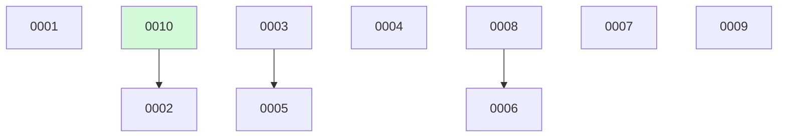

# Extract inline board rendering into a deterministic script — Implementation Plan

> **For agentic workers:** REQUIRED SUB-SKILL: Use superpowers:subagent-driven-development (recommended) or superpowers:executing-plans to implement this plan task-by-task. Steps use checkbox (`- [ ]`) syntax for tracking.

**Goal:** Replace model-driven `BOARD.md` rendering with a deterministic, idempotent `scripts/render-board.sh`, backed by a shared frontmatter/dependency helper that `github-mirror.sh` also adopts.

**Architecture:** A sourced bash library `scripts/lib/docket-frontmatter.sh` provides the frontmatter accessors (`field`/`list_field`/`has_section`, lifted verbatim from `github-mirror.sh`) plus a single dependency resolver (`resolve_deps`) and readiness classifier (`readiness`). `scripts/render-board.sh` sources it and emits `BOARD.md` to stdout — no git writes, offline, no `gh`. `github-mirror.sh` is migrated onto the same helper (its private copies and inline dep-walk deleted) so there is one parser, one resolver. `docket-status`'s `inline` board pass is rewired to invoke the script.

**Tech Stack:** Bash 4+ (associative arrays); the repo's existing standalone test style (`bash tests/test_*.sh`, no runner).

## Global Constraints

- **Shell header:** every script starts `#!/usr/bin/env bash` then `set -uo pipefail` (match `github-mirror.sh` — `-u -o pipefail`, **not** `-e`). The sourced library has **no** `set` line and **no side effects on source** (only declarations + function defs).
- **SIGPIPE-141 trap (LEARNINGS #11, #16):** NEVER pipe a live-producing command straight into an early-closing consumer (`grep -q`, `head`, `head -n1`) under `pipefail` — the producer takes SIGPIPE and `pipefail` turns 141 into a flaky failure. Capture into a variable first, then `grep`/`head` the variable (`head -n1 <<<"$var"`).
- **No git writes in scripts:** `render-board.sh` emits `BOARD.md` to **stdout**; the caller redirects + commits (same contract as `github-mirror.sh`).
- **Sourcing path:** use `"$(dirname "${BASH_SOURCE[0]}")/lib/docket-frontmatter.sh"` (robust under both `bash scripts/x.sh` and an absolute path) — never `$0`.
- **Array visibility:** the library declares its shared arrays with `declare -gA STATUS_OF DEP_STATE DEP_REASON DEP_ON` at source time; `resolve_deps` clears (`STATUS_OF=()` …) then repopulates so a re-run is idempotent within a process and a sourcing test sees the globals.
- **Id rendering:** the `#` column link and Mermaid node ids are the change's `id` **zero-padded to 4 digits** (`0007`); the readiness `⏳ waiting on #N` uses the **bare** dependency id from `depends_on` (e.g. `#8`, never `#0008`) — matches the live board.
- **Faithful re-implementation only:** reproduce the documented *Board → Structure* (`skills/docket-status/SKILL.md`) exactly — no new columns, no vocabulary changes. Byte-exactness is locked by a hand-authored golden fixture.
- **Determinism:** same change files ⇒ byte-identical `BOARD.md`. No generated-at timestamp. No `now()`, no `$RANDOM`.

---

## File Structure

- **Create `scripts/lib/docket-frontmatter.sh`** — sourced library: `field`, `list_field`, `has_section`, `resolve_deps`, `readiness`. The contract 0023/0024 build against.
- **Create `scripts/render-board.sh`** — the renderer; reads `active/`+`archive/`, calls `resolve_deps` once, emits `BOARD.md` to stdout.
- **Create `tests/test_docket_frontmatter.sh`** — unit tests for the library (accessors + `resolve_deps` arrays + `readiness`).
- **Create `tests/test_render_board.sh`** — golden-fixture byte-diff + idempotence, plus `docket-status` wiring sentinels.
- **Modify `scripts/github-mirror.sh`** — delete private `field`/`list_field`/`has_section` and the inline `readiness_label` dep-walk; source the library; map the shared `readiness` token to the local `docket:` label string. No behavior change.
- **Modify `skills/docket-status/SKILL.md`** — `inline` surface invokes `render-board.sh`; keep the commit/conflict discipline; clarify readiness precedence.

The dependency between tasks: Task 1 (library) is consumed by Tasks 2 and 3; Task 4 documents Task 2. Build in order 1 → 2 → 3 → 4.

---

## Task 1: Shared helper library `scripts/lib/docket-frontmatter.sh`

**Files:**
- Create: `scripts/lib/docket-frontmatter.sh`
- Test: `tests/test_docket_frontmatter.sh`

**Interfaces:**
- Produces (sourced by Tasks 2 & 3):
  - `field FILE KEY` → first top-level frontmatter scalar for `KEY`, trimmed (stdout).
  - `list_field FILE KEY` → `[a, b]` → space-separated `a b` (empty for `[]`/unset).
  - `has_section FILE STR` → exit 0 iff the body contains the literal line `STR`.
  - `resolve_deps CHANGES_DIR` → populates globals `STATUS_OF[id]` (own status), `DEP_STATE[id]` (`clear`|`waiting`), `DEP_REASON[id]` (`""` | `not yet built` | `needs your merge`), `DEP_ON[id]` (bare id of the worst unmet dep, `""` when clear).
  - `readiness FILE` → one of `build-ready` | `needs-brainstorm` | `auto-groom-blocked` | `waiting` (only meaningful for `proposed`; precedence: waiting → missing-spec → build-ready).

> **Design note — `DEP_ON` (display-support array).** The spec sketches three arrays; this adds a fourth, `DEP_ON`, holding the bare id of the worst unmet dependency so the board can render `waiting on #N` consistently with `DEP_REASON` (the id and the reason are chosen together in one walk, never re-derived). `github-mirror.sh` ignores it; `render-board.sh` uses it. Flag this at the review step as a candidate for a one-line ADR if review judges it non-obvious.

- [ ] **Step 1: Write the failing unit test**

Create `tests/test_docket_frontmatter.sh`:

```bash
#!/usr/bin/env bash
# tests/test_docket_frontmatter.sh — unit tests for the shared frontmatter/dependency helper
# (change 0022). Sources the library directly and asserts the accessors, resolve_deps arrays,
# and the readiness classifier. Run: bash tests/test_docket_frontmatter.sh
set -uo pipefail
REPO="$(cd "$(dirname "${BASH_SOURCE[0]}")/.." && pwd)"
LIB="$REPO/scripts/lib/docket-frontmatter.sh"
fail=0
assert(){ if eval "$2"; then echo "ok - $1"; else echo "NOT OK - $1"; fail=1; fi; }

assert "library exists" '[ -f "$LIB" ]'
# shellcheck source=/dev/null
source "$LIB"

tmp="$(mktemp -d)"; trap 'rm -rf "$tmp"' EXIT
mkdir -p "$tmp/active" "$tmp/archive"

# 10 done (satisfies a dep); 8 implemented (needs your merge); 3 proposed (not yet built)
cat > "$tmp/archive/2026-06-15-0010-juliet.md" <<'EOF'
---
id: 10
slug: juliet
title: Juliet feature
status: done
priority: medium
depends_on: []
EOF
cat > "$tmp/active/0008-hotel.md" <<'EOF'
---
id: 8
slug: hotel
title: Hotel feature
status: implemented
priority: high
depends_on: []
EOF
cat > "$tmp/active/0003-charlie.md" <<'EOF'
---
id: 3
slug: charlie
title: Charlie feature
status: proposed
priority: medium
depends_on: []
spec:
EOF
# 2: build-ready, dep on a done change (satisfied) + has spec
cat > "$tmp/active/0002-bravo.md" <<'EOF'
---
id: 2
slug: bravo
title: Bravo feature
status: proposed
priority: medium
depends_on: [10]
spec: docs/superpowers/specs/2026-06-10-bravo.md
EOF
# 5: waiting / not yet built (dep 3 is proposed)
cat > "$tmp/active/0005-echo.md" <<'EOF'
---
id: 5
slug: echo
title: Echo feature
status: proposed
priority: medium
depends_on: [3]
spec: docs/superpowers/specs/2026-06-10-echo.md
EOF
# 6: waiting / needs your merge (dep 8 is implemented)
cat > "$tmp/active/0006-foxtrot.md" <<'EOF'
---
id: 6
slug: foxtrot
title: Foxtrot feature
status: proposed
priority: medium
depends_on: [8]
spec: docs/superpowers/specs/2026-06-10-foxtrot.md
EOF
# 4: needs-brainstorm has the auto-groom-blocked body section
cat > "$tmp/active/0004-delta.md" <<'EOF'
---
id: 4
slug: delta
title: Delta feature
status: proposed
priority: low
depends_on: []
spec:
---

## Auto-groom blocked

2026-06-12 — abstained: needs a human call on scope.
EOF

# --- accessors ---
assert "field reads a scalar" '[ "$(field "$tmp/active/0008-hotel.md" status)" = "implemented" ]'
assert "field trims trailing space" '[ "$(field "$tmp/active/0008-hotel.md" priority)" = "high" ]'
assert "list_field expands a flow list" '[ "$(list_field "$tmp/active/0002-bravo.md" depends_on)" = "10" ]'
assert "list_field empty for []" '[ -z "$(list_field "$tmp/active/0008-hotel.md" depends_on)" ]'
assert "has_section finds a body line" 'has_section "$tmp/active/0004-delta.md" "## Auto-groom blocked"'
assert "has_section absent returns nonzero" '! has_section "$tmp/active/0003-charlie.md" "## Auto-groom blocked"'

# --- resolve_deps ---
resolve_deps "$tmp"
assert "STATUS_OF records own status" '[ "${STATUS_OF[10]}" = "done" ]'
assert "dep on done is clear" '[ "${DEP_STATE[2]}" = "clear" ] && [ -z "${DEP_REASON[2]}" ] && [ -z "${DEP_ON[2]}" ]'
assert "dep on proposed is waiting / not yet built" \
  '[ "${DEP_STATE[5]}" = "waiting" ] && [ "${DEP_REASON[5]}" = "not yet built" ] && [ "${DEP_ON[5]}" = "3" ]'
assert "dep on implemented is waiting / needs your merge" \
  '[ "${DEP_STATE[6]}" = "waiting" ] && [ "${DEP_REASON[6]}" = "needs your merge" ] && [ "${DEP_ON[6]}" = "8" ]'
assert "no deps is clear" '[ "${DEP_STATE[8]}" = "clear" ]'

# --- readiness ---
assert "readiness build-ready (spec + satisfied dep)" '[ "$(readiness "$tmp/active/0002-bravo.md")" = "build-ready" ]'
assert "readiness needs-brainstorm (no spec, not trivial)" '[ "$(readiness "$tmp/active/0003-charlie.md")" = "needs-brainstorm" ]'
assert "readiness auto-groom-blocked (no spec + blocked section)" '[ "$(readiness "$tmp/active/0004-delta.md")" = "auto-groom-blocked" ]'
assert "readiness waiting takes precedence over missing spec" '[ "$(readiness "$tmp/active/0005-echo.md")" = "waiting" ]'

if [ "$fail" = 0 ]; then echo "PASS"; else echo "FAIL"; fi
exit "$fail"
```

- [ ] **Step 2: Run the test to verify it fails**

Run: `bash tests/test_docket_frontmatter.sh`
Expected: FAIL — `NOT OK - library exists` (the library does not exist yet; the `source` then errors).

- [ ] **Step 3: Implement the library**

Create `scripts/lib/docket-frontmatter.sh`:

```bash
#!/usr/bin/env bash
# scripts/lib/docket-frontmatter.sh — shared frontmatter + dependency-resolution helper for
# docket's deterministic board/mirror scripts (change 0022). SOURCE this; it has no side effects
# on source beyond declaring functions and the dependency-resolution globals. No git, no network.
#
# Provides:
#   field FILE KEY        — first top-level frontmatter scalar for KEY, trimmed.
#   list_field FILE KEY   — `[a, b]` -> space-separated `a b` (empty for `[]` / unset).
#   has_section FILE STR  — exit 0 iff the body contains the literal line STR.
#   resolve_deps DIR      — scan DIR/active + DIR/archive once; populate the globals below.
#   readiness FILE        — build-ready | needs-brainstorm | auto-groom-blocked | waiting.
#
# resolve_deps globals (keyed by integer id):
#   STATUS_OF[id]   the change's own status
#   DEP_STATE[id]   clear | waiting
#   DEP_REASON[id]  "" | "not yet built" | "needs your merge"   (worst unmet; needs-your-merge wins)
#   DEP_ON[id]      bare id of the worst unmet dependency ("" when clear) — display support for #N

# --- frontmatter accessors (verbatim from github-mirror.sh) -------------------
field(){
  sed -n "s/^$2:[[:space:]]*//p" "$1" | head -n1 \
    | sed 's/[[:space:]]*$//'
}
list_field(){
  local raw; raw="$(field "$1" "$2")"
  raw="${raw#[}"; raw="${raw%]}"
  printf '%s' "$raw" | tr ',' ' ' | xargs 2>/dev/null || true
}
has_section(){ grep -qF "$2" "$1"; }

# --- dependency resolution ----------------------------------------------------
declare -gA STATUS_OF DEP_STATE DEP_REASON DEP_ON

resolve_deps(){ # resolve_deps CHANGES_DIR
  local dir="$1" f id dep dstat worst worst_on
  STATUS_OF=(); DEP_STATE=(); DEP_REASON=(); DEP_ON=()
  local -a files
  mapfile -t files < <(find "$dir/active" "$dir/archive" -maxdepth 1 -name '*.md' 2>/dev/null | sort)
  # pass 1: id -> own status
  for f in "${files[@]}"; do
    id="$(field "$f" id)"; [ -n "$id" ] || continue
    STATUS_OF["$id"]="$(field "$f" status)"
  done
  # pass 2: resolve each change's depends_on into the worst unmet reason + its id
  for f in "${files[@]}"; do
    id="$(field "$f" id)"; [ -n "$id" ] || continue
    worst=""; worst_on=""
    for dep in $(list_field "$f" depends_on); do
      dstat="${STATUS_OF[$dep]:-}"
      if [ "$dstat" = "done" ]; then
        continue                                   # satisfied
      elif [ "$dstat" = "implemented" ]; then
        if [ "$worst" != "needs your merge" ]; then worst="needs your merge"; worst_on="$dep"; fi
      else
        if [ -z "$worst" ]; then worst="not yet built"; worst_on="$dep"; fi
      fi
    done
    if [ -n "$worst" ]; then
      DEP_STATE["$id"]="waiting"; DEP_REASON["$id"]="$worst"; DEP_ON["$id"]="$worst_on"
    else
      DEP_STATE["$id"]="clear"; DEP_REASON["$id"]=""; DEP_ON["$id"]=""
    fi
  done
}

# --- readiness (precedence pinned: waiting > missing-spec > build-ready) -------
readiness(){ # readiness FILE  (only meaningful for a proposed change)
  local f="$1" id spec trivial
  id="$(field "$f" id)"
  if [ "${DEP_STATE[$id]:-clear}" = "waiting" ]; then printf 'waiting'; return; fi
  spec="$(field "$f" spec)"; trivial="$(field "$f" trivial)"
  if [ -z "$spec" ] && [ "$trivial" != "true" ]; then
    if has_section "$f" "## Auto-groom blocked"; then printf 'auto-groom-blocked'
    else printf 'needs-brainstorm'; fi
    return
  fi
  printf 'build-ready'
}
```

- [ ] **Step 4: Run the test to verify it passes**

Run: `bash tests/test_docket_frontmatter.sh`
Expected: `PASS` (exit 0), every `ok -` line.

- [ ] **Step 5: Mutation-check the new asserts (non-vacuity — LEARNINGS #2)**

Temporarily break one rule (e.g. change the `implemented` branch to set `not yet built`), re-run, confirm the `needs your merge` assert flips to `NOT OK`, then revert. Do not commit the mutation.

- [ ] **Step 6: Commit**

```bash
git add scripts/lib/docket-frontmatter.sh tests/test_docket_frontmatter.sh
git commit -m "feat(0022): shared frontmatter + dependency-resolution helper"
```

---

## Task 2: `scripts/render-board.sh` + golden-fixture test

**Files:**
- Create: `scripts/render-board.sh`
- Test: `tests/test_render_board.sh`

**Interfaces:**
- Consumes: the Task 1 library (`field`, `list_field`, `resolve_deps`, `readiness`, and the `STATUS_OF`/`DEP_STATE`/`DEP_REASON`/`DEP_ON` globals).
- Produces: `render-board.sh --changes-dir DIR [--repo OWNER/REPO]` → `BOARD.md` on **stdout**. Deterministic, offline.

**Rendering rules (the executable form of `docket-status` *Board → Structure*):**
- **Title:** `# Backlog`.
- **Count line:** `**<N> changes** — ` then, in fixed order, a ` · `-joined segment `‹emoji› ‹count› ‹label›` for each status **with count > 0**. Order + emoji + label: `🟢 in progress`, `🟡 proposed`, `🔴 blocked`, `⚪ deferred`, `🔵 implemented`, `✅ done`, `🗑️ killed`. `N` = total changes (active + archive).
- **Sections** in that same status order; omit a section whose count is 0. Headers: `## 🟢 In progress (n)`, `## 🟡 Proposed (n)`, `## 🔴 Blocked (n)`, `## ⚪ Deferred (n)`, `## 🔵 Implemented — awaiting merge (n)`. `done`/`killed` render only in the archive `<details>`, never as a `##` section. Rows within a section sorted by **ascending numeric id**.
- **Columns** (header row + `|---|` separator each):
  - in progress: `# | Title | Priority | Spec | Branch`
  - proposed: `# | Title | Priority | Readiness`
  - blocked: `# | Title | Priority | Blocked by`
  - deferred: `# | Title | Priority`
  - implemented: `# | Title | Priority | PR`
  - archive: `# | Title | Merged`
- **Cells:**
  - `#` → `[<id4>](active/<basename>)` (or `archive/<basename>` for archive rows); `<id4>` = id zero-padded to 4.
  - Title → raw `title`.
  - Priority → `` `<priority>` `` (backtick-wrapped).
  - Spec → `[spec](../<spec-with-one-leading-`docs/`-stripped>)` (e.g. `docs/superpowers/specs/X` → `../superpowers/specs/X`).
  - Branch → `` `<branch>` ``.
  - Readiness (proposed only) — from `readiness FILE`: `build-ready`; `needs-brainstorm`; `auto-groom blocked — needs you`; or `⏳ waiting on #<DEP_ON> — <DEP_REASON>`.
  - PR (implemented) → `[#<pr>](https://github.com/<repo>/pull/<pr>)` when a repo is known, else bare `#<pr>`.
  - Blocked by → raw `blocked_by`.
  - Merged (archive) → the `YYYY-MM-DD` date prefix parsed from the archive filename.
- **Mermaid** ` ```mermaid ` / `graph TD` then, two-space-indented: for each **active** change in ascending id, one `  <dep4> --> <id4>` line per entry in its `depends_on` (in listed order), or a bare `  <id4>` if it has none; then each **done** change as `  <id4>:::done` in ascending id (killed changes are omitted); then `  classDef done fill:#d3f9d8;`; close the fence.
- **Archive** `<details>`: omit entirely if no done/killed. Summary `<details><summary>‹emoji› Archive — ‹label› (‹count›)</summary>` where emoji = `✅` if any done, `🗑️` if any killed, concatenated (✅ first); label = present kinds joined ` + ` in order `done`, `killed`; count = total archived rows. Rows sorted **date descending, then id descending**.
- **No generated-at timestamp.** File ends with a single trailing newline after `</details>` (or after the mermaid fence if the archive is empty).

- [ ] **Step 1: Write the golden fixture test (failing)**

Create `tests/test_render_board.sh`. It builds an 11-change fixture spanning every status, renders, and byte-diffs against an inline hand-authored golden; then asserts idempotence; then asserts the `docket-status` SKILL wiring. The golden encodes canonical section order (proposed **before** implemented).

```bash
#!/usr/bin/env bash
# tests/test_render_board.sh — verifies change 0022: deterministic BOARD.md rendering.
# A fixture changes/ tree spanning every status is rendered and byte-compared to a hand-authored
# golden; a second render must be byte-identical (idempotence). Also asserts the docket-status
# inline-surface wiring. Run: bash tests/test_render_board.sh
set -uo pipefail
REPO="$(cd "$(dirname "${BASH_SOURCE[0]}")/.." && pwd)"
SCRIPT="$REPO/scripts/render-board.sh"
SKILL="$REPO/skills/docket-status/SKILL.md"
fail=0
assert(){ if eval "$2"; then echo "ok - $1"; else echo "NOT OK - $1"; fail=1; fi; }

assert "script exists and is executable" '[ -x "$SCRIPT" ]'

tmp="$(mktemp -d)"; trap 'rm -rf "$tmp"' EXIT
mkdir -p "$tmp/active" "$tmp/archive"

cat > "$tmp/active/0001-alpha.md" <<'EOF'
---
id: 1
slug: alpha
title: Alpha feature
status: in-progress
priority: high
depends_on: []
spec: docs/superpowers/specs/2026-06-10-alpha.md
branch: feat/alpha
EOF
cat > "$tmp/active/0002-bravo.md" <<'EOF'
---
id: 2
slug: bravo
title: Bravo feature
status: proposed
priority: medium
depends_on: [10]
spec: docs/superpowers/specs/2026-06-10-bravo.md
EOF
cat > "$tmp/active/0003-charlie.md" <<'EOF'
---
id: 3
slug: charlie
title: Charlie feature
status: proposed
priority: medium
depends_on: []
spec:
EOF
cat > "$tmp/active/0004-delta.md" <<'EOF'
---
id: 4
slug: delta
title: Delta feature
status: proposed
priority: low
depends_on: []
spec:
---

## Auto-groom blocked

2026-06-12 — abstained.
EOF
cat > "$tmp/active/0005-echo.md" <<'EOF'
---
id: 5
slug: echo
title: Echo feature
status: proposed
priority: medium
depends_on: [3]
spec: docs/superpowers/specs/2026-06-10-echo.md
EOF
cat > "$tmp/active/0006-foxtrot.md" <<'EOF'
---
id: 6
slug: foxtrot
title: Foxtrot feature
status: proposed
priority: medium
depends_on: [8]
spec: docs/superpowers/specs/2026-06-10-foxtrot.md
EOF
cat > "$tmp/active/0007-golf.md" <<'EOF'
---
id: 7
slug: golf
title: Golf feature
status: blocked
priority: medium
depends_on: []
blocked_by: upstream API frozen until Q3
EOF
cat > "$tmp/active/0008-hotel.md" <<'EOF'
---
id: 8
slug: hotel
title: Hotel feature
status: implemented
priority: high
depends_on: []
pr: 142
EOF
cat > "$tmp/active/0009-india.md" <<'EOF'
---
id: 9
slug: india
title: India feature
status: deferred
priority: low
depends_on: []
EOF
cat > "$tmp/archive/2026-06-15-0010-juliet.md" <<'EOF'
---
id: 10
slug: juliet
title: Juliet feature
status: done
priority: medium
depends_on: []
EOF
cat > "$tmp/archive/2026-06-14-0011-kilo.md" <<'EOF'
---
id: 11
slug: kilo
title: Kilo feature
status: killed
priority: low
depends_on: []
EOF

# Hand-authored golden — the executable form of docket-status Board -> Structure.
golden="$tmp/golden.md"
cat > "$golden" <<'EOF'
# Backlog

**11 changes** — 🟢 1 in progress · 🟡 5 proposed · 🔴 1 blocked · ⚪ 1 deferred · 🔵 1 implemented · ✅ 1 done · 🗑️ 1 killed

## 🟢 In progress (1)

| # | Title | Priority | Spec | Branch |
|---|-------|----------|------|--------|
| [0001](active/0001-alpha.md) | Alpha feature | `high` | [spec](../superpowers/specs/2026-06-10-alpha.md) | `feat/alpha` |

## 🟡 Proposed (5)

| # | Title | Priority | Readiness |
|---|-------|----------|-----------|
| [0002](active/0002-bravo.md) | Bravo feature | `medium` | build-ready |
| [0003](active/0003-charlie.md) | Charlie feature | `medium` | needs-brainstorm |
| [0004](active/0004-delta.md) | Delta feature | `low` | auto-groom blocked — needs you |
| [0005](active/0005-echo.md) | Echo feature | `medium` | ⏳ waiting on #3 — not yet built |
| [0006](active/0006-foxtrot.md) | Foxtrot feature | `medium` | ⏳ waiting on #8 — needs your merge |

## 🔴 Blocked (1)

| # | Title | Priority | Blocked by |
|---|-------|----------|------------|
| [0007](active/0007-golf.md) | Golf feature | `medium` | upstream API frozen until Q3 |

## ⚪ Deferred (1)

| # | Title | Priority |
|---|-------|----------|
| [0009](active/0009-india.md) | India feature | `low` |

## 🔵 Implemented — awaiting merge (1)

| # | Title | Priority | PR |
|---|-------|----------|----|
| [0008](active/0008-hotel.md) | Hotel feature | `high` | [#142](https://github.com/o/r/pull/142) |



<details><summary>✅🗑️ Archive — done + killed (2)</summary>

| # | Title | Merged |
|---|-------|--------|
| [0010](archive/2026-06-15-0010-juliet.md) | Juliet feature | 2026-06-15 |
| [0011](archive/2026-06-14-0011-kilo.md) | Kilo feature | 2026-06-14 |

</details>
EOF

rendered="$tmp/out.md"
bash "$SCRIPT" --changes-dir "$tmp" --repo o/r > "$rendered" 2>/dev/null
assert "rendered output matches the golden byte-for-byte" 'diff -u "$golden" "$rendered"'

# idempotence: a second render is byte-identical to the first
rendered2="$tmp/out2.md"
bash "$SCRIPT" --changes-dir "$tmp" --repo o/r > "$rendered2" 2>/dev/null
assert "render is idempotent (re-run is byte-identical)" 'diff -u "$rendered" "$rendered2"'

# --- docket-status inline-surface wiring sentinels (the SKILL is code on main) ---
assert "docket-status inline surface invokes render-board.sh" \
  'grep -qF "scripts/render-board.sh" "$SKILL"'
assert "docket-status keeps the regenerate-don't-3-way-merge rule" \
  'grep -qiF "never 3-way merge" "$SKILL"'

if [ "$fail" = 0 ]; then echo "PASS"; else echo "FAIL"; fi
exit "$fail"
```

- [ ] **Step 2: Run the test to verify it fails**

Run: `bash tests/test_render_board.sh`
Expected: FAIL — `NOT OK - script exists and is executable` (and the diff asserts error because the script is missing).

- [ ] **Step 3: Implement `scripts/render-board.sh`**

Create `scripts/render-board.sh`:

```bash
#!/usr/bin/env bash
# scripts/render-board.sh — deterministic, idempotent renderer for docket's `inline` board
# surface (change 0022). Reads the change files (active/ + archive/) and emits BOARD.md to STDOUT
# byte-for-byte per docket-status's *Board -> Structure*. No git writes (the caller redirects +
# commits), offline (no gh, no network). Same change files => identical bytes.
#
# Usage: render-board.sh --changes-dir DIR [--repo OWNER/REPO]
#   --repo builds pr: hyperlinks; defaults to deriving OWNER/REPO from the origin remote of
#   --changes-dir. Mock seam: GIT="${GIT:-git}".
set -uo pipefail

GIT="${GIT:-git}"
CHANGES_DIR=""
REPO=""
while [ $# -gt 0 ]; do
  case "$1" in
    --changes-dir) CHANGES_DIR="$2"; shift ;;
    --repo) REPO="$2"; shift ;;
    -h|--help) grep '^#' "$0" | sed 's/^# \{0,1\}//'; exit 0 ;;
    *) printf 'render-board: unknown argument: %s\n' "$1" >&2; exit 2 ;;
  esac
  shift
done
[ -n "$CHANGES_DIR" ] || { printf 'render-board: missing --changes-dir\n' >&2; exit 2; }
[ -d "$CHANGES_DIR" ] || { printf 'render-board: changes dir not found: %s\n' "$CHANGES_DIR" >&2; exit 2; }

# shellcheck source=/dev/null
source "$(dirname "${BASH_SOURCE[0]}")/lib/docket-frontmatter.sh"

# Derive OWNER/REPO from the origin remote when --repo is unset (best-effort, offline).
if [ -z "$REPO" ]; then
  url="$("$GIT" -C "$CHANGES_DIR" remote get-url origin 2>/dev/null || true)"
  if [ -n "$url" ]; then
    REPO="${url%.git}"; REPO="${REPO#git@github.com:}"; REPO="${REPO#https://github.com/}"
  fi
fi

pad(){ printf '%04d' "$1"; }                  # bare id -> 4-digit
emoji_for(){ case "$1" in
  in-progress) printf '🟢';; proposed) printf '🟡';; blocked) printf '🔴';;
  deferred) printf '⚪';; implemented) printf '🔵';; done) printf '✅';; killed) printf '🗑️';;
esac; }
label_for(){ case "$1" in in-progress) printf 'in progress';; *) printf '%s' "$1";; esac; }
spec_link(){ printf '../%s' "${1#docs/}"; }   # docs/superpowers/specs/X -> ../superpowers/specs/X

resolve_deps "$CHANGES_DIR"

# Collect active files by status (ascending id), and archive rows.
declare -A SECTION         # status -> newline-separated "id\tfile"
mapfile -t AFILES < <(find "$CHANGES_DIR/active" -maxdepth 1 -name '*.md' 2>/dev/null | sort)
for f in "${AFILES[@]}"; do
  id="$(field "$f" id)"; [ -n "$id" ] || continue
  st="$(field "$f" status)"
  SECTION["$st"]+="$id"$'\t'"$f"$'\n'
done

# rows_sorted STATUS -> emits "id<TAB>file" lines for that status, ascending id
rows_sorted(){ printf '%s' "${SECTION[$1]:-}" | sed '/^$/d' | sort -t$'\t' -k1,1n; }
count_of(){ rows_sorted "$1" | grep -c . ; }

# --- count line ---
total=${#AFILES[@]}
mapfile -t ARCFILES < <(find "$CHANGES_DIR/archive" -maxdepth 1 -name '*.md' 2>/dev/null | sort)
total=$(( total + ${#ARCFILES[@]} ))

declare -A ARC_COUNT  # done/killed counts (archive)
for f in "${ARCFILES[@]}"; do st="$(field "$f" status)"; ARC_COUNT["$st"]=$(( ${ARC_COUNT[$st]:-0} + 1 )); done

printf '# Backlog\n\n'
seg=""
for st in in-progress proposed blocked deferred implemented done killed; do
  case "$st" in
    done|killed) n=${ARC_COUNT[$st]:-0} ;;
    *) n="$(count_of "$st")" ;;
  esac
  [ "$n" -gt 0 ] || continue
  seg+="$(emoji_for "$st") $n $(label_for "$st") · "
done
seg="${seg% · }"
printf '**%d changes** — %s\n' "$total" "$seg"

# --- active sections ---
print_section(){ # print_section STATUS HEADER_SUFFIX
  local st="$1" suffix="$2" n; n="$(count_of "$st")"
  [ "$n" -gt 0 ] || return 0
  printf '\n## %s %s%s (%d)\n\n' "$(emoji_for "$st")" "$(label_for_title "$st")" "$suffix" "$n"
  local id f
  case "$st" in
    in-progress) printf '| # | Title | Priority | Spec | Branch |\n|---|-------|----------|------|--------|\n' ;;
    proposed)    printf '| # | Title | Priority | Readiness |\n|---|-------|----------|-----------|\n' ;;
    blocked)     printf '| # | Title | Priority | Blocked by |\n|---|-------|----------|------------|\n' ;;
    deferred)    printf '| # | Title | Priority |\n|---|-------|----------|\n' ;;
    implemented) printf '| # | Title | Priority | PR |\n|---|-------|----------|----|\n' ;;
  esac
  while IFS=$'\t' read -r id f; do
    [ -n "$id" ] || continue
    local title priority; title="$(field "$f" title)"; priority="$(field "$f" priority)"
    local base; base="$(basename "$f")"
    case "$st" in
      in-progress)
        printf '| [%s](active/%s) | %s | `%s` | [spec](%s) | `%s` |\n' \
          "$(pad "$id")" "$base" "$title" "$priority" "$(spec_link "$(field "$f" spec)")" "$(field "$f" branch)" ;;
      proposed)
        printf '| [%s](active/%s) | %s | `%s` | %s |\n' \
          "$(pad "$id")" "$base" "$title" "$priority" "$(readiness_cell "$f" "$id")" ;;
      blocked)
        printf '| [%s](active/%s) | %s | `%s` | %s |\n' \
          "$(pad "$id")" "$base" "$title" "$priority" "$(field "$f" blocked_by)" ;;
      deferred)
        printf '| [%s](active/%s) | %s | `%s` |\n' "$(pad "$id")" "$base" "$title" "$priority" ;;
      implemented)
        printf '| [%s](active/%s) | %s | `%s` | %s |\n' \
          "$(pad "$id")" "$base" "$title" "$priority" "$(pr_cell "$f")" ;;
    esac
  done < <(rows_sorted "$st")
}
label_for_title(){ case "$1" in
  in-progress) printf 'In progress';; proposed) printf 'Proposed';; blocked) printf 'Blocked';;
  deferred) printf 'Deferred';; implemented) printf 'Implemented';;
esac; }
readiness_cell(){ # readiness_cell FILE ID  (proposed)
  local f="$1" id="$2" tok; tok="$(readiness "$f")"
  case "$tok" in
    waiting) printf '⏳ waiting on #%s — %s' "${DEP_ON[$id]}" "${DEP_REASON[$id]}" ;;
    auto-groom-blocked) printf 'auto-groom blocked — needs you' ;;
    needs-brainstorm) printf 'needs-brainstorm' ;;
    build-ready) printf 'build-ready' ;;
  esac
}
pr_cell(){ local f="$1" pr; pr="$(field "$f" pr)"
  [ -n "$pr" ] || { printf ''; return; }
  if [ -n "$REPO" ]; then printf '[#%s](https://github.com/%s/pull/%s)' "$pr" "$REPO" "$pr"
  else printf '#%s' "$pr"; fi
}

print_section in-progress ""
print_section proposed ""
print_section blocked ""
print_section deferred ""
print_section implemented " — awaiting merge"

# --- mermaid ---
printf '\n```mermaid\ngraph TD\n'
for st in in-progress proposed blocked deferred implemented; do
  while IFS=$'\t' read -r id f; do
    [ -n "$id" ] || continue
    local_deps="$(list_field "$f" depends_on)"
    if [ -n "$local_deps" ]; then
      for dep in $local_deps; do printf '  %s --> %s\n' "$(pad "$dep")" "$(pad "$id")"; done
    else
      printf '  %s\n' "$(pad "$id")"
    fi
  done < <(rows_sorted "$st")
done
# done nodes (ascending id); killed omitted
mapfile -t DONE_IDS < <(for f in "${ARCFILES[@]}"; do
  [ "$(field "$f" status)" = "done" ] && field "$f" id; done | sort -n)
for id in "${DONE_IDS[@]}"; do [ -n "$id" ] && printf '  %s:::done\n' "$(pad "$id")"; done
printf '  classDef done fill:#d3f9d8;\n```\n'

# --- archive ---
ndone=${ARC_COUNT[done]:-0}; nkilled=${ARC_COUNT[killed]:-0}
if [ $(( ndone + nkilled )) -gt 0 ]; then
  em=""; lbl=""
  [ "$ndone" -gt 0 ] && { em+="✅"; lbl="done"; }
  [ "$nkilled" -gt 0 ] && { em+="🗑️"; [ -n "$lbl" ] && lbl="$lbl + killed" || lbl="killed"; }
  printf '\n<details><summary>%s Archive — %s (%d)</summary>\n\n' "$em" "$lbl" "$(( ndone + nkilled ))"
  printf '| # | Title | Merged |\n|---|-------|--------|\n'
  # sort archive rows: date desc, then id desc. Key = "<date>\t<id>\t<file>".
  while IFS=$'\t' read -r date id f; do
    [ -n "$id" ] || continue
    printf '| [%s](archive/%s) | %s | %s |\n' "$(pad "$id")" "$(basename "$f")" "$(field "$f" title)" "$date"
  done < <(
    for f in "${ARCFILES[@]}"; do
      base="$(basename "$f")"; d="${base:0:10}"; id="$(field "$f" id)"
      printf '%s\t%s\t%s\n' "$d" "$id" "$f"
    done | sort -t$'\t' -k1,1r -k2,2nr
  )
  printf '\n</details>\n'
fi
```

> **Bash-ordering note for the implementer:** bash reads function definitions before they are *called*, not before they are *referenced* in another function body, so the `label_for_title`/`readiness_cell`/`pr_cell` helpers defined after `print_section` are in scope by the time `print_section` runs. If you prefer, hoist them above `print_section` — behavior is identical. Verify with the test, not by eye.

- [ ] **Step 4: Run the test to verify it passes**

Run: `bash tests/test_render_board.sh`
Expected: `PASS`. If the byte-diff fails, the `diff -u` output names the exact divergent line — fix the renderer (never the golden, unless the golden itself misstates the documented Structure). Re-run until the diff is empty.

> The wiring sentinels (`render-board.sh`, `never 3-way merge`) will FAIL here until Task 4 edits the SKILL. That is expected — Task 2's deliverable is the renderer + golden + idempotence; the wiring asserts go green in Task 4. (If executing strictly task-by-task with a green gate, temporarily expect those two asserts red at Task 2's close and confirm them green after Task 4.)

- [ ] **Step 5: Commit**

```bash
git add scripts/render-board.sh tests/test_render_board.sh
git commit -m "feat(0022): deterministic render-board.sh + golden-fixture test"
```

---

## Task 3: Migrate `github-mirror.sh` onto the shared helper

**Files:**
- Modify: `scripts/github-mirror.sh`
- Test (regression, unchanged): `tests/test_github_mirror.sh`

**Interfaces:**
- Consumes: the Task 1 library. After this task there is exactly one copy of `field`/`list_field`/`has_section` and one dependency resolver in the repo.

- [ ] **Step 1: Confirm the regression baseline is green**

Run: `bash tests/test_github_mirror.sh`
Expected: `PASS` (pre-migration baseline).

- [ ] **Step 2: Source the library; delete the private accessors**

In `scripts/github-mirror.sh`, after the argument parsing and the `[ -d "$CHANGES_DIR" ]` guard (around line 77), add the source line:

```bash
# shellcheck source=/dev/null
source "$(dirname "${BASH_SOURCE[0]}")/lib/docket-frontmatter.sh"
```

Delete the private `--- frontmatter helpers ---` block (the `field`, `list_field`, `has_section` definitions, lines ~103–115) — they now come from the library.

- [ ] **Step 3: Replace pass 1 + the inline dep-walk with `resolve_deps`**

Replace the `--- pass 1: index id -> status ---` block (the `declare -A STATUS_OF`, the `mapfile`, and its loop, lines ~117–125) with a `resolve_deps` call plus a thin loop that keeps only the `ISSUE_NUM` map (which `resolve_deps` does not build):

```bash
# --- pass 1: dependency resolution + issue index ------------------------------
resolve_deps "$CHANGES_DIR"     # populates STATUS_OF / DEP_STATE / DEP_REASON / DEP_ON
declare -A ISSUE_NUM            # id -> issue number; seeded from issue:, updated on a fresh mint
mapfile -t FILES < <(find "$CHANGES_DIR/active" "$CHANGES_DIR/archive" -maxdepth 1 -name '*.md' 2>/dev/null | sort)
for f in "${FILES[@]}"; do
  id="$(field "$f" id)"; [ -n "$id" ] || continue
  iss="$(field "$f" issue)"; [ -n "$iss" ] && ISSUE_NUM["$id"]="$iss"
done
```

Rewrite `readiness_label` to map the shared `readiness` token to the local `docket:` label string (the label vocabulary stays local to the mirror), preserving the exact label strings the existing tests assert:

```bash
# --- readiness label (maps the shared readiness token to the docket: label) ---
readiness_label(){
  local f="$1" status="$2" id tok
  [ "$status" = "proposed" ] || return 0
  id="$(field "$f" id)"; tok="$(readiness "$f")"
  case "$tok" in
    waiting)
      local r="${DEP_REASON[$id]:-not yet built}"
      printf 'docket:waiting/%s' "${r// /-}" ;;     # "needs your merge" -> needs-your-merge
    auto-groom-blocked) printf 'docket:readiness/auto-groom-blocked' ;;
    needs-brainstorm)   printf 'docket:readiness/needs-brainstorm' ;;
    build-ready)        printf 'docket:readiness/build-ready' ;;
  esac
}
```

(The `--- pass 1 ---` comment, the standalone `declare -A STATUS_OF`, and the old `readiness_label` dep-walk are removed; `STATUS_OF` is now owned by the library and still consumed unchanged by `sync_projects`.)

- [ ] **Step 3b: Static-lint the migrated script**

Run: `bash -n scripts/github-mirror.sh`
Expected: no output (parses clean). If `shellcheck` is available, run `shellcheck scripts/github-mirror.sh scripts/lib/docket-frontmatter.sh scripts/render-board.sh` and address real warnings (SC2155 etc. are acceptable if they match the existing style).

- [ ] **Step 4: Run the regression test to verify it still passes**

Run: `bash tests/test_github_mirror.sh`
Expected: `PASS` — pure refactor, no behavior change. In particular the `docket:readiness/needs-brainstorm` and `docket:status/`/`docket:priority/` label asserts and the close-state asserts stay green.

- [ ] **Step 5: Commit**

```bash
git add scripts/github-mirror.sh
git commit -m "refactor(0022): migrate github-mirror.sh onto the shared helper"
```

---

## Task 4: Rewire `docket-status`'s `inline` board pass

**Files:**
- Modify: `skills/docket-status/SKILL.md`
- Test (wiring sentinels, already written in Task 2): `tests/test_render_board.sh`

- [ ] **Step 1: Rewrite the `inline` surface paragraph**

In `skills/docket-status/SKILL.md`, replace the `**`inline` surface** (the default)…` paragraph (the one beginning "Regenerate `BOARD.md` wholesale") with a version that invokes the script while keeping every existing discipline:

```markdown
**`inline` surface** (the default). Regenerate `BOARD.md` by invoking the deterministic
`scripts/render-board.sh --changes-dir <metadata working tree>/<changes_dir> > <metadata working
tree>/<changes_dir>/BOARD.md` (in `docket`-mode the metadata working tree is `.docket/`; pass
`--repo <owner>/<repo>` so `pr:` cells hyperlink). The script owns *how* to render — it reproduces
the *Structure* below byte-for-byte from the change files, offline (no `gh`, no network) and
deterministically (same change files ⇒ identical bytes); the skill owns *when* to render and the
commit discipline. `BOARD.md` is the **live planning view and stays on `docket`** — it is **never**
published to the integration branch (the one metadata file terminal-publish never copies). **Never
hand-edit `BOARD.md`, never merge it.** Commit it and push `origin/docket`. On a `pull --rebase`
conflict in `BOARD.md` during the push loop, **regenerate, never 3-way merge**: discard the conflict
markers (either side — they invert under rebase anyway), **re-run `scripts/render-board.sh`** to
rebuild `BOARD.md` from the change files, `git add` it, then `git rebase --continue`. Dropping
`inline` forfeits this offline-safe view — the documented tradeoff of a GitHub-only board.
```

- [ ] **Step 2: Anchor the Structure prose to the script + clarify readiness precedence**

At the start of `### Structure (in order)`, add one line establishing the script as the executable source:

```markdown
`scripts/render-board.sh` is the executable source of this structure (change 0022); the prose
below documents what it emits and the dependency-resolution it shares with the sweep and the
health checks.
```

Edit the readiness bullets so the precedence the script pins is explicit (waiting outranks a missing spec):

```markdown
   - A dependency-waiting change renders **⏳ waiting on #N — not yet built** or **⏳ waiting on #N — needs your merge** (from the shared pass); it is never shown as build-ready, and this **takes precedence over a missing spec** (a stub that also waits renders as waiting).
   - A `proposed` change that is **not** dependency-waiting, with no spec and not `trivial: true`, renders **needs-brainstorm** — unless its body carries an `## Auto-groom blocked` section, in which case it renders **auto-groom blocked — needs you** (the autonomous groomer abstained; a human must resolve or re-arm it).
```

- [ ] **Step 3: Run the wiring sentinels (and the whole change suite) to verify green**

```bash
bash tests/test_render_board.sh        # wiring sentinels now green
bash tests/test_docket_frontmatter.sh
bash tests/test_github_mirror.sh
```
Expected: all three `PASS`.

- [ ] **Step 4: Mutation-check the wiring sentinels (LEARNINGS #15 — anchor to unique phrases)**

Temporarily remove `scripts/render-board.sh` from the SKILL, re-run `tests/test_render_board.sh`, confirm the wiring assert flips to `NOT OK`, then revert. Do not commit the mutation.

- [ ] **Step 5: Commit**

```bash
git add skills/docket-status/SKILL.md
git commit -m "feat(0022): docket-status inline pass invokes render-board.sh"
```

---

## Self-Review

**Spec coverage:**
- §2 shared helper (`field`/`list_field`/`has_section` verbatim, `resolve_deps`, `readiness`) → Task 1. ✓
- §3 `render-board.sh` (CLI, stdout, offline, full Structure incl. count line, emoji map, columns, readiness cells, mermaid, archive) → Task 2 rendering rules + golden. ✓
- §4 frontmatter stays hand-rolled → no `yq`; accessors lifted as-is. ✓
- §5 `github-mirror.sh` migration (delete private copies, use `resolve_deps`+`readiness`, tests green) → Task 3. ✓
- §6 `docket-status` inline wiring (invoke script, keep separate-commit + regenerate-don't-merge, keep Structure prose) → Task 4. ✓
- §8 test plan (golden byte-diff + idempotence; `resolve_deps` unit tests; `test_github_mirror.sh` green) → Tasks 1–3 tests. ✓

**Placeholder scan:** every code step ships complete content; the golden is fully spelled out; no TBD/TODO. ✓

**Type/name consistency:** `field`/`list_field`/`has_section`/`resolve_deps`/`readiness` and the globals `STATUS_OF`/`DEP_STATE`/`DEP_REASON`/`DEP_ON` are named identically across Tasks 1–3. The `readiness` token set (`build-ready`/`needs-brainstorm`/`auto-groom-blocked`/`waiting`) is mapped consistently in both `render-board.sh` (`readiness_cell`) and `github-mirror.sh` (`readiness_label`). ✓

**Known cross-task gate:** the two wiring sentinels in `tests/test_render_board.sh` go green only after Task 4 — called out in Task 2 Step 4.
