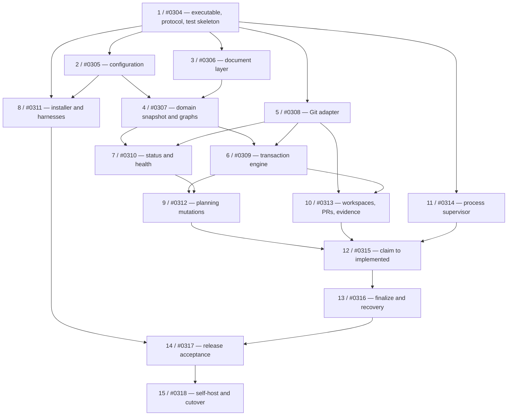

<!-- docket:backlink:start (generated — do not hand-edit) -->
> ↩ **[Change 0303 — Go migration program record and Bash-backlog disposition](https://github.com/danielhanold/docket/blob/docket/docs/changes/archive/2026-08-12-0303-go-migration-program-record-and-bash-backlog-disposition.md)**
<!-- docket:backlink:end -->

# Docket Go Migration Program Map

> This is the migration sprint's durable topology and scope index. It is not a build plan and does
> not live on a feature branch. Every implementation change receives its own settled spec and
> task-level plan through the ordinary Docket workflow before Claude Code claims it.

**Goal:** Replace Docket's production Bash implementation with a self-hosting Go v1 through
fifteen independently specified, built, reviewed, and finalized changes.

**Architecture:** One Go module and one `docket` binary expose a versioned JSON CLI over a
transaction-oriented domain core. Agent skills retain judgment and prose ownership; Go owns
authoritative reads, isolated metadata transactions, persistent-document safety, Git/GitHub
mechanics, local process supervision, installation, and four direct harness integrations.

**Tech Stack:** Go, Git CLI, GitHub CLI (`gh`), YAML frontmatter plus Markdown, JSON protocol,
GitHub Releases, POSIX installer bootstrap, Claude Code as the implementation host.

**Architecture:** `docs/superpowers/specs/2026-08-12-go-migration-architecture-design.md`

## Global Constraints

- Bash baseline is the immutable tag `v0.9.2`; no new Bash product feature is implemented.
- Public cutover is hard: Go v1 ships no Bash/Go hybrid and no hidden Bash fallback.
- macOS and Linux on amd64 and arm64 are required release targets.
- Existing valid, quiescent `v0.9.2` repositories open and operate without repository migration.
- Existing document bytes remain unchanged outside fields and managed blocks an operation owns.
- Markdown and Git remain authoritative; no database or daemon is introduced.
- Git and `gh` remain external processes invoked with argument arrays, never shell command strings.
- All durable metadata mutations use isolated Docket-owned transaction worktrees.
- Claude, Codex, Cursor, and OpenCode are first-class direct hosts in Go v1.
- Claude Code executes this sprint's implementation changes directly. Plans must not depend on
  Codex-specific orchestration, a Codex runner, or cross-harness runner delegation.
- Model/effort overrides in Go v1 are shipped defaults plus global, per-machine overrides only.
- GitHub Issues/Projects mirroring is removed. GitHub pull-request behavior remains.
- Automated learning harvest/index/capacity/promotion is deferred; learning consumption and the
  explicit manual learning-record operation remain.
- Before self-hosting, change 15 is pre-authorized to disable Docket's active deferred settings:
  `auto_capture`, terminal publishing, build checkpoints, and results-only gate skipping.
- Every child change receives its own settled spec and task-level implementation plan before claim.
- Every implementation uses TDD, runs the whole resolved suite at its build gate, and commits in
  reviewable increments.

---

## Sprint accounting

The sprint has exactly **fifteen implementation changes**, numbered 1–15 below and tracked as
Docket changes 0304–0318. This program map owns their topology and scope; it is not itself a unit
of delivery. The first attempt to represent it as change 0303 was retired because a change that
produces no independently reviewable build or product artifact does not belong in the lifecycle.

The fifteen change records are the live lifecycle tracker, and `BOARD.md` is their derived view.
This map records intended topology and gates; it does not duplicate lifecycle status.

## Iteration loop

Run one explicitly named change at a time from a clone. Do not use an unscoped "next" invocation
while Bash-era build-ready records remain on the board.

1. Choose a change below whose declared predecessors are `done`. Start with change 0304.
2. In an interactive session, run `docket-groom-next <id>`. Grooming ends after it writes and links
   that change's focused design spec; it builds no code.
3. In Claude Code, invoke the `docket-implement-next` agent with that exact id. One invocation plans,
   builds, tests, reviews, and opens the change's PR.
4. Review and merge the PR, then invoke `docket-finalize-change <id>` so the record reaches `done`.
5. Re-read the board and repeat with another dependency-ready id.

Current Bash Docket permits only one autonomous implementer per clone. Parallel work, where this
graph exposes it, therefore uses separate clones; otherwise run the ready siblings sequentially.

## Dependency graph

An edge is a real build-readiness dependency. A mere shared topic is represented by `related`, not
`depends_on`.

## Sprint administration — outside the change lifecycle

The approved architecture and this topology are durable program documents, not feature-branch
deliverables. Migration administration happens directly on the metadata branch and never enters
`docket-implement-next`.

Before the first implementation run, the migration owner:

- keeps the fifteen proposed change records and their dependency edges aligned with this map;
- dispositions every active Bash-era change: absorb a still-relevant product invariant into a
  Go child, retain a genuinely independent product change, defer a deferred-v1 capability, or kill
  a Bash-only implementation change; and
- kills change 0285 as superseded by change 0314's native Go supervisor while retaining its exact
  process-status and real-session requirements as input evidence.

The administration gate is: no active Bash-only change is accidentally selected for implementation,
and every absorbed change names its Go successor before it is killed. Until that full audit is
complete, the explicit-id rule in the iteration loop is mandatory.

## Change 1 (Docket 0304): Go executable, JSON protocol, test/build skeleton

**Purpose:** Establish the smallest releasable Go product skeleton and the contracts every later
package consumes.

**Owns:** `go.mod`, `cmd/docket`, the application result envelope, protocol v1 encoding, CLI text vs
JSON selection, build metadata, baseline Go test command, formatting/static checks, and fixture
conventions.

**Deliverable:** `docket version` and one read-only diagnostic run as one-shot processes with stable
text and JSON results on all four target tuples.

**Depends on:** Nothing. This is the first implementation change.

## Change 2 (Docket 0305): Configuration and capability envelope

**Purpose:** Load real YAML through the retained precedence and coordination fences, and classify
each legacy setting as supported, obsolete, inert, or deferred-but-requested.

**Owns:** Built-in defaults, global/repository/repository-local loaders, typed validation, global
model/effort overrides, capability diagnostics, and pre-mutation `unsupported-config` results.

**Deliverable:** Read-only configuration inspection of `v0.9.2` fixtures plus a mutation preflight
that cannot enter a transaction when active unsupported behavior is requested.

**Depends on:** Change 1.

## Change 3 (Docket 0306): Loss-preserving document layer

**Purpose:** Parse typed semantics without surrendering the source bytes needed for compatible,
reviewable edits.

**Owns:** Frontmatter location mapping, managed-block discovery and balance validation, typed value
decoding, field/block patching, canonical new-document rendering, golden compatibility fixtures,
and fuzz targets.

**Deliverable:** Existing fixtures remain byte-identical outside an intentional patch, including
unknown fields, comments, quoting, whitespace, line endings, and authored body sections.

**Depends on:** Change 1.

## Change 4 (Docket 0307): Domain snapshot, validation, graphs, and selection

**Purpose:** Represent the entire Docket repository as immutable typed state and make lifecycle
policy independent of Git, Markdown, and harnesses.

**Owns:** Changes, ADRs, learning reads, lifecycle transitions, readiness, deterministic selection,
dependency/stack graphs, effective bases, claim/reclaim rules, repository-wide validation, and
typed policy failures.

**Deliverable:** Table-driven tests reproduce retained `v0.9.2` semantic outcomes without invoking
the filesystem or a subprocess.

**Depends on:** Changes 2 and 3.

## Change 5 (Docket 0308): Git adapter and authoritative object source

**Purpose:** Expose fresh remote bytes and Git identities without touching the user's checkout, and
encapsulate Git as a typed external-command boundary. This change does not assemble domain
snapshots; change 7 composes this source with changes 2–4.

**Owns:** Git discovery, controlled execution, fetch/ref/object reads, repository-root resolution,
both metadata modes, blob entity versions, immutable object-source interfaces, and typed Git
failures.

**Deliverable:** Tests open both repository modes from temporary real repositories and return
revisioned document bytes and blob identities while leaving the invocation worktree untouched.

**Depends on:** Change 1.

## Change 6 (Docket 0309): Isolated metadata transaction engine

**Purpose:** Make one semantic metadata operation atomic, isolated from other agents, and safely
retryable after unrelated push contention.

**Owns:** Docket-owned transaction worktrees, ownership/live-lock manifests, expected-ref leases,
entity-version checks, explicit-path commits, semantic retry, request-ID idempotency trailers,
cleanup, and recovery pruning.

**Deliverable:** Real-repository tests prove unrelated concurrent writes converge, same-entity
writes contend, response-loss retries do not duplicate records, and no shared index exists.

**Depends on:** Changes 4 and 5.

## Change 7 (Docket 0310): Read-only status and health vertical slice

**Purpose:** Deliver the first user-visible retained workflow without mutation.

**Owns:** Composition of config, document parsing, domain snapshot assembly, and the Git object
source; status context; readiness and dependency/stack presentation; health findings; human text
output; protocol JSON output; and the separation between read-only status and mutating maintenance.

**Deliverable:** Semantic comparison against frozen `v0.9.2` repositories for selection, status,
stack state, and health results.

**Depends on:** Changes 4 and 5.

## Change 8 (Docket 0311): Installer, embedded assets, and four harnesses

**Purpose:** Install one version-matched Go product for every first-class direct host while retaining
the source-linked contributor workflow.

**Owns:** Embedded assets and manifest, atomic versioned extraction, ownership-safe installation,
release vs development mode, global model/effort rendering, drift checks, and native Claude, Codex,
Cursor, and OpenCode installation plans.

**Deliverable:** Golden and filesystem tests for all four hosts plus development-source drift and
binary/asset mismatch detection. No runner delegation or per-repository routing is generated.

**Depends on:** Changes 1 and 2.

## Change 9 (Docket 0312): Planning mutations, board, and ADRs

**Purpose:** Complete the retained planning-state lifecycle through coarse metadata transactions.

**Owns:** Change creation/grooming/block/defer/kill, manual learning record/update, ADR
record/supersede/reverse, inline board rendering, artifact links, backlinks, ADR index, and canonical
new records.

**Deliverable:** Capture-through-groom and ADR workflows complete atomically under concurrent
writers; the board and v1-owned indexes cannot trail their source records.

**Depends on:** Changes 6 and 7.

## Change 10 (Docket 0313): Workspaces, GitHub PR adapter, and build evidence

**Purpose:** Encapsulate deterministic feature-branch mechanics and idempotent PR publication
without making Go an agent workflow engine.

**Owns:** Feature-worktree preparation/inspection/cleanup, effective-base branch creation, GitHub CLI
adapter, PR lookup/create/update, external-effect probing, build-evidence read/write, and authoritative
verification.

**Deliverable:** Rerunning after a lost PR response adopts the existing PR; cleanup touches only
Docket-owned workspaces; stack PR bases use the domain resolver.

**Depends on:** Changes 5 and 6.

## Change 11 (Docket 0314): Native process supervisor and local gate

**Purpose:** Replace `gate-run` and change 0285's proposed interpreter with exact native process
semantics on Darwin and Linux.

**Owns:** Session/process-group launch, durable private run directories, separate logs, exact exit vs
signal terminal records, observe/stop, identity-safe signalling, abandonment recovery, and platform
implementations.

**Deliverable:** Real-process tests distinguish `exit 143` from signal 15 and prove bounded group
termination on macOS and Linux. No Bash, Python, Perl, or global daemon is involved.

**Depends on:** Change 1.

## Change 12 (Docket 0315): Claim-to-implemented workflow

**Purpose:** Complete the essential implementation half of the agent-first lifecycle while leaving
judgment and dispatch inside Claude Code.

**Owns:** Candidate context, claim and lease refresh, reconciliation transaction, plan/results
attachment, workspace orchestration inputs, gate result recording, run verification, PR association,
and the transition to `implemented`.

**Deliverable:** A Claude-hosted Docket run can take a retained build-ready change through claim,
reconcile, plan, build/review dispatch, local gate, results, and PR without direct metadata edits.

**Depends on:** Changes 9, 10, and 11.

## Change 13 (Docket 0316): Finalize, recovery, reclaim, archive, and stacks

**Purpose:** Complete the terminal lifecycle and make every cross-system boundary idempotent and
resumable.

**Owns:** Local rebase/retest gate, conflict/repair report inputs, merge verification, archive,
stacked-merged and root close-out, reclaim, merged-PR maintenance sweep, halted/finalize-blocked
state, branch/worktree cleanup, and interrupted close-out recovery.

**Deliverable:** Both repository modes complete claim-to-terminal workflows; failures injected after
each irreversible external effect converge on retry without false `done` records.

**Depends on:** Change 12.

## Change 14 (Docket 0317): Release packaging and four-harness acceptance

**Purpose:** Turn the complete retained engine into installable, checksummed release artifacts and
prove direct invocation through every supported host.

**Owns:** Darwin/Linux amd64/arm64 release builds, checksum manifest, POSIX downloader, install
smoke tests, release-upgrade tests, and live Claude/Codex/Cursor/OpenCode acceptance runs.

**Deliverable:** A clean machine can install a release without Bash/Python/Perl runtime setup and
complete at least one retained workflow directly through each harness.

**Depends on:** Changes 8 and 13.

## Change 15 (Docket 0318): Configuration contraction, self-hosting, and hard cutover

**Purpose:** Move Docket's own repository into the supported Go v1 envelope, prove self-hosting, and
remove the retired production implementation.

**Authorization:** The human approved this configuration contraction on 2026-08-12. The change may
disable Docket's committed `auto_capture`, terminal publishing, build checkpoints, and results-only
gate skipping without a second product-scope decision. Its plan must still show the exact diff and
test the resulting resolved configuration before landing.

**Owns:** Explicit config contraction, self-hosting rehearsal and recovery proof, manual migration
learning capture, removal of production Bash and Bash-only tests, documentation replacement,
release publication, and cutover verification.

**Deliverable:** The Go binary manages Docket's complete retained lifecycle from all four hosts;
existing repositories require no format migration; tag `v0.9.2` is the documented rollback artifact.

**Depends on:** Change 14.

## Backlog disposition rules

The direct sprint-administration pass applies these rules to every active change, with a recorded
successor where applicable:

1. **Bash-mechanism-only:** kill as superseded by the Go migration.
2. **Retained product invariant:** absorb into the owning child above, link it as input, then kill
   the Bash implementation change as superseded.
3. **Deferred Go v1 capability:** keep deferred or explicitly defer it; do not make it a sprint
   dependency.
4. **Independent post-Go product work:** retain, but ensure it cannot outrank or block the migration
   sprint accidentally.
5. **Ambiguous:** leave proposed and require a human disposition; never bulk-kill by filename or
   keyword.

Change 0285 is already settled by rule 2: its exact exit/signal and real-session requirements move
to change 11, while its Python-runtime implementation is killed.

## Child-spec and child-plan contract

Before any implementation change is claimed:

1. Groom its stub against the current repository and completed predecessors.
2. Write a child spec scoped to that one change's independently testable deliverable.
3. Write a task-level plan using `superpowers:writing-plans`, with exact files, interfaces, failing
   tests, commands, expected failures, minimal implementations, passing commands, and commits.
4. Verify the plan does not pull a deferred capability forward or re-create a dropped mechanism.
5. Confirm all interface names agree with already-landed predecessors rather than copying
   provisional names from this program plan.
6. Let Claude Code claim and implement the change through the ordinary Docket workflow.

Plans may be authored ahead only when every consumed interface has landed or is frozen by an
approved predecessor spec. This prevents fifteen detailed plans from becoming stale while the
foundation is still changing.

## Architecture-spec coverage

| Approved architecture concern | Owning change(s) |
|---|---|
| Compatibility corpus and hard replacement | 1, 14, 15 |
| Agent-first boundary and JSON protocol | 1, 12 |
| Configuration and deferred-capability refusal | 2, 15 |
| Loss-preserving repository documents | 3 |
| Domain policy and repository-wide validation | 4 |
| Authoritative Git reads and entity versions | 5, 7 |
| Isolated metadata transactions and concurrency | 6 |
| Read-only status and explicit maintenance | 7, 13 |
| Embedded/source-linked installation and four harnesses | 8, 14 |
| Planning lifecycle, board, ADRs, and manual learnings | 9 |
| External Git/GitHub effects and owned workspaces | 10, 13 |
| Native exact-status process supervision | 11 |
| Claim-to-implemented agent workflow | 12 |
| Finalization, recovery, archive, and stacks | 13 |
| Release artifacts, dogfood, config contraction, and cutover | 14, 15 |
| Domain/document/transaction/adapter/harness/end-to-end tests | Each owning change; integrated by 14–15 |

## Sprint completion

The sprint is complete only when changes 1–15 are `done`, the direct backlog-disposition audit has
no unresolved Bash-only item, the cutover gates in the architecture spec pass, and Go Docket has
successfully self-hosted a real retained workflow. A green build of the binary alone is not sprint
completion.
