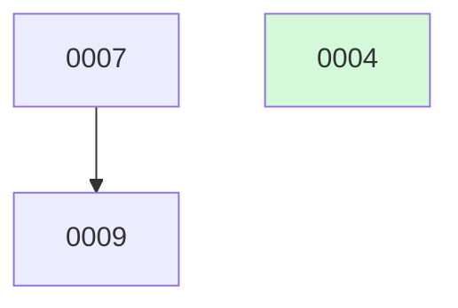

# docket-status — the board & janitor

## Overview

`docket-status` gives you a queryable, up-to-date view of the backlog and keeps it clean. It has three jobs: render `BOARD.md` from the change files, sweep any `implemented` change whose PR merged into the archive, and run health checks that flag stale claims, broken links, and dependency stalls. The change files are the source of truth; `BOARD.md` is always generated output, never edited by hand.

## When to use

- You want to know what is done, what is next, or what is stuck.
- A PR was merged via the GitHub button (not via `docket-finalize-change`) and the board is stale.
- `docket-implement-next` calls this at step 0 as a self-cleaning safety net before selecting the next change.
- You suspect spec, plan, or results links are stale or broken.
- The board shows a change as waiting but you think the blocker has cleared.
- You want to see the Mermaid dependency graph to understand build order.

<!-- docket:convention:begin -->
## Convention

docket tracks planned work as **changes** — one markdown file each, roughly one PR — and records architecture decisions as **ADRs**. This block is the shared contract every docket skill embeds. It is kept byte-identical across the five skills by `sync-convention.sh` (canonical source: `docket-new-change/SKILL.md`); never hand-edit it in a non-canonical skill.

### Configuration — `.docket.yml` (optional, committed on the default branch)

Read at startup by every docket skill. Absent ⇒ all defaults. It is **committed** (never gitignored), because it governs cross-agent coordination and must be identical for every clone, agent, and device.

```yaml
# .docket.yml — committed on the repo's DEFAULT branch (origin/HEAD); read by every docket skill at startup
metadata_branch: docket      # docket (default) | main  — where PM commits land (see "Branch model")
integration_branch: auto     # auto (→origin/HEAD, fallback main) | main | develop  — where code lands; feature branches cut from origin/<this>
changes_dir: docs/changes    # default
adrs_dir: docs/adrs          # default
results_dir: docs/results    # default  — close-out 'results' artifacts (build-time files, like plans)
```

`.docket.yml` lives on the repo's **default branch (`origin/HEAD`)**, NOT on the integration branch — `integration_branch` is a value *read from* the file, so the file cannot be located *by* it. The default branch is discoverable with zero prior config, but `origin/HEAD` is not reliably populated, so skills **repair it first**: `git remote set-head origin -a`, then resolve `git symbolic-ref refs/remotes/origin/HEAD`. Read config authoritatively via `git show origin/HEAD:.docket.yml` (after a fetch); the working-tree copy is trusted only on the default branch's *primary* checkout. **A ref-unresolvable `origin/HEAD` ≠ a file-absent default branch:** if `origin/HEAD` resolves but the file is genuinely absent ⇒ defaults apply (`metadata_branch: docket`, `integration_branch: auto`); if `origin/HEAD` is unresolvable or `origin` is unreachable ⇒ do **not** assume defaults (abort with a clear error, keying on the `set-head`/fetch return code, never on `git show` — a cached `origin/HEAD` lets `git show` succeed with stale bytes). The file then **declares `integration_branch`**, which may differ from the default branch (default `main`, integration `develop`). `metadata_branch` resolves where PM commits land; `integration_branch` (default `auto` → `origin/HEAD`, fallback `main`; explicit `main`/`develop` verbatim) resolves where code lands — feature branches always cut from `origin/<integration_branch>`. **Backward-compatible opt-out:** pinning `metadata_branch: main` (with `integration_branch: main`) reproduces today's single-branch behavior exactly — no `docket` branch, no `.docket/` worktree.

### Directory layout (paths relative to the configured knobs)

```
<changes_dir>/            # default docs/changes/
  active/                 # every NON-terminal change:   <id>-<slug>.md            (id zero-padded to 4 digits)
  archive/                # the two terminal outcomes:    <YYYY-MM-DD>-<id>-<slug>.md
  BOARD.md                # generated board (NEVER hand-edited); spans active + archive
  README.md               # small static blurb linking to BOARD.md (NOT generated)
<adrs_dir>/               # default docs/adrs/  — flat; ADRs are NEVER archived
  <NNNN>-<slug>.md        # immutable once Accepted (only its status: line ever changes)
  README.md               # generated ADR index
<results_dir>/            # default docs/results/  — optional close-out artifacts (feature-branch build files; NEVER archived)
  <YYYY-MM-DD>-<slug>-results.md
```

The `archive/` filename date prefix is **UTC**: the **merge commit's** date for `done`, the **kill commit's** date for `killed`.

In `docket`-mode all of the above lives on the `docket` branch, written through a persistent, gitignored **`.docket/` metadata worktree** parked on that branch (it is `.docket/`, **not** under `.worktrees/`, to avoid slug collisions and the ephemeral-worktree prune blast radius — see "Branch model").

### Change manifest (frontmatter at the top of each change file)

```yaml
---
id: 7                     # integer; zero-padded to 4 digits in the filename
slug: quicklook-interactions
title: Quick Look interactions — external links + local images
status: proposed          # proposed | in-progress | blocked | deferred | implemented | done | killed
priority: medium          # low | medium | high | critical   (default: medium)
created: 2026-05-30
updated: 2026-05-30
depends_on: [4]           # change ids that must reach `done` (PR merged) first
related: [4, 6]           # cross-links the reconcile pass reads
adrs: [24]                # ADRs this change cites or produces
spec:                     # superpowers design doc path; set at brainstorm (propose) time, on metadata_branch
plan:                     # plan FILE lives on the feature branch; this FIELD is set in the main tree at build time
results:                  # results FILE on the feature branch; this FIELD set in the main tree at close-out (optional)
trivial: false            # true = no spec needed (small mechanical change); still build-ready
branch:                   # planned feat/<slug> name, set on claim; branch itself created at build (step 4)
pr:                       # set when the PR is opened
blocked_by:               # free text; set only when status: blocked
reconciled: false         # set true after the just-in-time reconcile pass
---
```

### Change body sections

- `## Why` — the motivation, as detailed as warranted (no length limit).
- `## What changes` — scope of the work.
- `## Out of scope` — explicit non-goals.
- `## Open questions` — unknowns to resolve during reconcile/design.
- `## Reconcile log` — dated entries appended by the implementer's reconcile pass.
- `## Why deferred` / `## Why killed` — added when entering those states.

The change body is a **PM-altitude proposal** (intent + scope). Detailed design lives in the linked superpowers spec; the task breakdown in the linked superpowers plan. Different zoom levels, no duplication.

### ADR file (`<adrs_dir>/<NNNN>-<slug>.md`)

```yaml
---
id: 24                    # integer; zero-padded to 4 digits in the filename
slug: quicklook-interaction-limits
title: Quick Look interaction limits under sandbox
status: Accepted          # Accepted | Superseded by ADR-NN | Reversed by ADR-NN | Deprecated
date: 2026-05-20
supersedes: []            # ADR ids this replaces (sets the old one's status)
reverses: []              # ADR ids this undoes
relates_to: [22]          # cross-links
change: 4                 # back-link: the change that produced this decision, if any
---

## Context       — the forces / problem that prompted the decision
## Decision      — what was chosen, and the rule a reader needs to know
## Consequences  — what it enables, what it costs, what is given up
```

An `Accepted` ADR is immutable except its `status:` line; a non-reversing context change is appended as a dated `## Update` note, never an edit to the decision. A reversal/supersession is always a **new** ADR.

### Lifecycle — seven states

```
                         ┌──────────────── deferred ──────────────┐
                         │ (conscious shelve; revive → proposed)   │
                         ▼                                          │
  proposed ──claim──▶ in-progress ──PR open──▶ implemented ──merge+sweep──▶ done
     │                    │                                                  (archive/)
     │                    └──blocker──▶ blocked ──clears──▶ in-progress
     │
     └──── killed (obsolete — from proposed, or from in-progress via reconcile; → archive/) ────▶
```

| status | meaning | directory |
|---|---|---|
| `proposed` | drafted, awaiting work | `active/` |
| `in-progress` | claimed, being built | `active/` |
| `blocked` | external blocker (`blocked_by:`) | `active/` |
| `deferred` | consciously shelved, may revive | `active/` |
| `implemented` | built, PR open — **human merge gate** | `active/` |
| `done` | PR merged, filed away (happy terminal) | `archive/` |
| `killed` | abandoned — obsolete or never shipped (sad terminal) | `archive/` |

**Rules.** `active/` holds every non-terminal status; `archive/` holds the two terminal outcomes. The single physical move (`active/ → archive/`, date-prefixed) happens once on the terminal transition and is **idempotent**: re-pull, re-read `status` on `metadata_branch`, no-op if already terminal. `deferred` may be entered from `proposed` or `in-progress` (add `## Why deferred`) and revived to `proposed`; clearing a blocker or reviving is a one-line frontmatter edit, no move. A change whose `depends_on` is unsatisfied is *implicitly* blocked — the selector skips it (no status change) and the board shows it **waiting on #N**. A dependency is **satisfied when it reaches `done`**. If `#N` is still `implemented` (PR open, unmerged), the dependent is gated on a human merge — the board flags **waiting on #N — needs your merge**, distinct from **waiting on #N — not yet built**. Reserve explicit `blocked` for external blockers the system can't infer.

**Board refresh on status writes.** Any skill that writes a change's `status:` regenerates `BOARD.md` (the Board pass) in a separate commit immediately after — the board is a derived view and must never trail the change files.

### Build-readiness & selection (shared definition)

A change is **build-ready** — eligible for `docket-implement-next` — only when it is `proposed`, has a `spec:` **or** `trivial: true`, and all `depends_on` are satisfied (`done`). A `proposed` change with neither a spec nor `trivial: true` is **needs-brainstorm** (not build-ready). The implementer's deterministic selection order is `priority` (`critical` > `high` > `medium` > `low`) → age (`created`) → **lowest `id`**.

### Bootstrap guard (`docket`-mode first-run safety)

At startup, after resolving config, when `metadata_branch == docket`, fetch origin and evaluate a 2×2 over two probes (both stated over the **same vocabulary**):

- **`DOCKET`** = the `docket` branch exists (origin OR local): `git rev-parse --verify --quiet refs/remotes/origin/docket || git rev-parse --verify --quiet refs/heads/docket`.
- **`LIVE`** = the **live planning surface** still sits on the integration branch: `git ls-tree origin/<integration_branch> -- <changes_dir>/active <changes_dir>/README.md <changes_dir>/BOARD.md` (non-empty ⇒ present). Probe **only** this pruned surface — `archive/`, `<adrs_dir>/`, and pre-migration specs deliberately *stay* on integration, so probing them would read `LIVE` forever. Use `git ls-tree`, never bare `<ref>:<path>`. If `origin/<integration_branch>` does not resolve, `ls-tree` exits ≠0 with empty stdout — treat that as a **hard config error**, not `¬LIVE`.

| | `LIVE` | `¬LIVE` |
|---|---|---|
| **`¬DOCKET`** | existing single-branch repo → **STOP**, point to `migrate-to-docket.sh`; never auto-create or move data | fresh repo → create the empty orphan `docket`, push, **proceed** |
| **`DOCKET`** | **half-migrated** (interrupted run) → **STOP**, point back to `migrate-to-docket.sh` to finish its prune | migrated → **proceed** |

The guard is a no-op in `main`-mode (`DOCKET`/`LIVE` are only evaluated when `metadata_branch == docket`). The migration itself lives in the standalone `migrate-to-docket.sh`.

### Branch model

Metadata (change files, `BOARD.md`, ADRs, specs) commits to `metadata_branch` (default `docket`) via the **metadata working tree** — which is the **primary working tree on the integration branch** in single-branch (`main`) mode, and the persistent **`.docket/` worktree** in `docket`-mode — and is **always pushed to its remote immediately** (a local-only orphan branch defeats the purpose; the backlog, board, specs, and ADRs stay browsable on the remote at all times). A change's `feat/<slug>` branch is **ALWAYS cut from `origin/<integration_branch>`** (default trunk `main`; `develop` for GitFlow) — `metadata_branch` only redirects bookkeeping commits, never where code branches start. The feature branch adds only the plan + results + code and **never modifies** docket metadata. On a terminal transition (`done` *or* `killed`), the driving skill runs the shared **terminal-publish** procedure: it **copies** the change's terminal records (the archived change file + its `spec:` if set + the **`Accepted`** ADRs in `adrs:`) from `origin/docket` onto the integration branch in one dedicated commit and pushes (`git checkout origin/docket -- <paths>`, never a `git merge docket`) — the only flow of metadata onto the code line. (In `main`-mode the metadata working tree *is* the integration branch, so terminal-publish is skipped — the archive move there is itself the terminal record.)
<!-- docket:convention:end -->

## Shared dependency-resolution pass

Computed once per `docket-status` run; both the board and the health checks consume the same result — never recomputed.

For every change, resolve each id in its `depends_on`:

- Target status `done` → **satisfied**
- Target status `implemented` (PR open, not yet merged) → **NOT satisfied**; reason = `"needs your merge"`
- Target any other active status, or id missing → **NOT satisfied**; reason = `"not yet built"`

A change with all deps satisfied (or none) is **dependency-clear**. A change with at least one unsatisfied dep is **dependency-waiting**, carrying the worst unmet reason for display (`"needs your merge"` > `"not yet built"`).

## Where the board, sweep, and checks operate

All three passes read and write in the **metadata working tree** on `metadata_branch`, pushed to its remote immediately. In `docket`-mode that tree is the persistent `.docket/` worktree parked on `docket` — ensure it (state-specific create per the convention's Branch model, idempotent) and **sync it to `origin/docket` before any read** (`git -C .docket fetch origin docket && git -C .docket pull --rebase origin docket`); pushes target `origin/docket`. In single-branch/`main`-mode this degrades to the primary working tree on the integration branch (no `.docket/`): `git pull --rebase` and push on `origin/<metadata_branch>` (which equals `origin/<integration_branch>` there). The passes below say "`.docket/`" / "`origin/docket`" for the common (`docket`-mode) case; read those as the metadata working tree / `origin/<metadata_branch>` in `main`-mode.

## Board

Regenerate `BOARD.md` wholesale in `.docket/` on `docket` by scanning `<changes_dir>/active/` and `archive/`, parsing each file's frontmatter, and applying the dependency-resolution pass above; commit it and push `origin/docket`. `BOARD.md` is the **live planning view and stays on `docket`** — it is **never** published to the integration branch (it is the one metadata file the terminal-publish never copies). **Never hand-edit `BOARD.md`, never merge it.** On a `pull --rebase` conflict in `BOARD.md` during the push loop, **regenerate, never 3-way merge**: discard the conflict markers (either side — they invert under rebase anyway), re-run this Board pass to rebuild `BOARD.md` from the change files, `git add` it, then `git rebase --continue`.

**No churny timestamp.** Counts convey freshness; a generated-at line would churn on every run.

### Structure (in order)

1. **Count summary** — one line, e.g.:

   `**12 changes** — 🟢 2 in progress · 🟡 3 proposed · 🔴 1 blocked · ⚪ 1 deferred · 🔵 2 implemented · ✅ 3 done`

2. **Emoji-grouped `##` sections** per status with live counts in the heading, e.g. `## 🟢 In progress (2)`. Omit a section if its count is zero.

3. **Per-group tables** with columns relevant to the status (id · title · priority chip · spec/pr links · readiness). Readiness rules:
   - A dependency-waiting change renders **⏳ waiting on #N — not yet built** or **⏳ waiting on #N — needs your merge** (from the shared pass); it is never shown as build-ready.
   - A `proposed` change with no spec and not `trivial: true` renders **needs-brainstorm**.

4. **Mermaid dependency graph** built from `depends_on` edges; `done` nodes tinted with `classDef done fill:#d3f9d8;`. Renders on GitHub and Markhaus (a Markdown viewer that bundles Mermaid); degrades gracefully in plain CommonMark.

5. **Collapsible `<details>` archive section** for both terminal states (done and killed).

### Example — abbreviated rendered `BOARD.md`

````markdown
# Backlog

**5 changes** — 🟢 1 in progress · 🟡 1 proposed · 🔵 1 implemented · ✅ 1 done · 🗑️ 1 killed

## 🟢 In progress (1)
| # | Title | Priority | Spec | Branch |
|---|-------|----------|------|--------|
| [0007](active/0007-quicklook-interactions.md) | Quick Look interactions | `high` | [spec](../superpowers/specs/2026-05-30-quicklook.md) | `feat/quicklook-interactions` |

## 🟡 Proposed (1)
| # | Title | Priority | Readiness |
|---|-------|----------|-----------|
| [0009](active/0009-export-pdf.md) | Export to PDF | `medium` | ⏳ waiting on #7 — not yet built |

## 🔵 Implemented — awaiting merge (1)
| # | Title | Priority | PR |
|---|-------|----------|----|
| [0008](active/0008-onboarding-tour.md) | Onboarding tour | `medium` | [#142](https://github.com/o/r/pull/142) |



<details><summary>✅🗑️ Archive — done + killed (1)</summary>

| # | Title | Merged |
|---|-------|--------|
| [0004](archive/2026-05-30-0004-quicklook-extension.md) | Quick Look extension | 2026-05-30 |

</details>
````

## Merge sweep

The bulk safety net: sweep every `implemented` change whose PR has merged into the archive. Runs automatically at `docket-implement-next` step 0, and whenever you invoke `docket-status` explicitly after merging via the GitHub button. The sweep is a **terminal-transition driver** — like `docket-finalize-change`, on each swept change it both archives on `metadata_branch` and, in `docket`-mode, publishes the terminal record onto the integration branch.

For each `implemented` change:

1. **Determine its PR** — use `pr:`; if empty, fall back to `gh pr list --head feat/<slug>`.
2. **Ask gh whether that PR is merged.** Not merged → skip.
3. **Merged → ARCHIVE IDEMPOTENTLY:**

   a. `git pull --rebase` on `metadata_branch` (in `docket`-mode, `git -C .docket pull --rebase origin docket`); re-read `status`.
      Already `done` (or already under `archive/`) → no-op, continue.

   b. **Compute the merge date in UTC** — use `gh`'s `mergedAt`, or
      `TZ=UTC git show -s --date=format-local:%Y-%m-%d <merge-sha>`. Never `now()`.

   c. `git mv active/<id>-<slug>.md archive/<merge-date>-<id>-<slug>.md`. **Reuse-existing-file idempotency:** first probe for an already-archived file (null-glob-safe, e.g. `find <changes_dir>/archive -name '*-<id>-<slug>.md'`) and reuse that filename rather than recomputing today's date.

   d. Set `status: done`, write the `results:` link into the manifest if a results file exists (the *file* arrived via the PR merge), and set `updated: <merge-date>` (the **same** UTC date — never `now()`).

   e. **Commit the change file only.** `BOARD.md` is regenerated by the Board pass, not bundled here — this is what keeps concurrent archivers byte-identical. Push to `origin/<metadata_branch>` (in `docket`-mode, `origin/docket`); on non-fast-forward, `pull --rebase` and retry.

   f. **Publish the terminal record (`docket`-mode).** Sub-steps a–e are **step 1 of the terminal publish** (archive-on-`docket`-first); after they push to `origin/docket`, invoke the shared **terminal-publish procedure (the *Terminal publish (docket-mode)* procedure in `docket-finalize-change`)** with outcome `done` (token `T = <id>`) to copy the terminal records from `origin/docket` onto the integration branch. Without this, a swept change would be archived on `docket` but its terminal record would never reach the integration branch. Do **not** restate the git sequence — that procedure is its single source. The procedure's step-1 reuse-existing-file idempotency makes a sweep racing `docket-finalize-change` on the same change a safe no-op. In `main`-mode the metadata working tree *is* the integration branch, so the archive commit above is itself the terminal record and terminal-publish is **skipped**.

   g. **Remove the merged feature branch + worktree**, provenance-guarded: only auto-remove a worktree whose path is under `.worktrees/<slug>` — never remove a worktree outside that known path (never the `.docket/` metadata worktree) — same guard as `superpowers:finishing-a-development-branch`.

**Determinism invariant.** Two agents both reading `implemented` produce a byte-identical add (change-file-only, UTC merge date, no `now()`). The loser's `pull --rebase` resolves cleanly because both adds are identical. `BOARD.md` is regenerated separately, never hand-merged.

**Note:** This archive procedure is **identical** to `docket-finalize-change`'s per-change archive — same UTC merge date, same change-file-only commit, same reuse-existing-file idempotency, same terminal-publish invocation. Both skills describe the same operation; they must not diverge.

## Health checks

Flag the following (do not auto-fix unless asked). Board and health checks share the one dependency-resolution pass computed above — it is not re-run.

- **Stale `in-progress` past the build step** — the planned branch is gone, or exists but has had no commits in **3 days** (3 is the current fixed default; promoting it to a `.docket.yml` knob is a future enhancement). A just-claimed change with a `branch:` value but no branch yet created is **not** stale.
- **Broken `spec:` link** — `spec:` is set but the path does not resolve against `metadata_branch` (in `docket`-mode, against `docket` — where the spec lives). Skip `trivial: true` changes; they have no spec.
- **Broken `plan:`/`results:` link on `done` changes** — resolve `plan:` and `results:` against **`origin/<integration_branch>`, NOT `docket`** (those files never live on `docket` — they are feature-branch build artifacts that reach the integration branch via the PR merge; resolving them against `docket` would flag every `done` change as a permanent broken link). A `done` change's `plan:` and `results:` paths must resolve there (link rot check). Ignore a missing `plan:` or `results:` on an `implemented` change — those files legitimately still live on the unmerged feature branch (pre-merge they don't resolve on the integration branch yet; that is tolerated until merge). In `main`-mode `metadata_branch == integration_branch`, so both resolve on the same branch.
- **Human-merge gate stall** — a build-ready change whose only unsatisfied dependency is stuck at `implemented` (from the shared pass, reason = `"needs your merge"`). Surfaces the dependency so the human knows a single merge unblocks downstream work.
- **`blocked` changes whose blocker may have cleared** — re-examine `blocked_by:` text; flag if the referenced issue/PR/event appears resolved.
- **`depends_on` cycles** — detect circular dependency chains; flag every change in the cycle.
