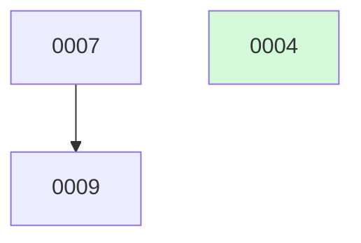

# docket-status — the board & janitor

## Overview

`docket-status` gives you a queryable, up-to-date view of the backlog and keeps it clean. It has three jobs: render `BOARD.md` from the change files, sweep any `implemented` change whose PR merged into the archive, and run health checks that flag stale claims, broken links, and dependency stalls. The change files are the source of truth; `BOARD.md` is always generated output, never edited by hand.

## When to use

- You want to know what is done, what is next, or what is stuck.
- A PR was merged via the GitHub button (not via `docket-finalize-change`) and the board is stale.
- `docket-implement-next` calls this at step 0 as a self-cleaning safety net before selecting the next change.
- You suspect spec, plan, or results links are stale or broken.
- The board shows a change as waiting but you think the blocker has cleared.
- You want to see the Mermaid dependency graph to understand build order.

## Convention (load first — blocking)

Before anything else in this skill, invoke the `docket-convention` skill via the Skill tool — unless it was already invoked earlier in this session and its content is in context. Everything below uses its vocabulary (build-ready, metadata working tree, terminal-publish, the `DOCKET`/`LIVE` bootstrap probes, …) without redefinition; no step below is executable without the convention loaded.

## Shared dependency-resolution pass

Computed once per `docket-status` run; both the board and the health checks consume the same result — never recomputed.

For every change, resolve each id in its `depends_on`:

- Target status `done` → **satisfied**
- Target status `implemented` (PR open, not yet merged) → **NOT satisfied**; reason = `"needs your merge"`
- Target any other active status, or id missing → **NOT satisfied**; reason = `"not yet built"`

A change with all deps satisfied (or none) is **dependency-clear**. A change with at least one unsatisfied dep is **dependency-waiting**, carrying the worst unmet reason for display (`"needs your merge"` > `"not yet built"`).

## Where the board, sweep, and checks operate

All three passes read and write in the **metadata working tree** on `metadata_branch`, pushed to its remote immediately. In `docket`-mode that tree is the persistent `.docket/` worktree parked on `docket` — ensure it (state-specific create per the convention's Branch model, idempotent) and **sync it to `origin/docket` before any read** (`git -C .docket fetch origin docket && git -C .docket pull --rebase origin docket`); pushes target `origin/docket`. In single-branch/`main`-mode this degrades to the primary working tree on the integration branch (no `.docket/`): `git pull --rebase` and push on `origin/<metadata_branch>` (which equals `origin/<integration_branch>` there). The passes below say "`.docket/`" / "`origin/docket`" for the common (`docket`-mode) case; read those as the metadata working tree / `origin/<metadata_branch>` in `main`-mode.

## Board

The Board pass renders **each surface listed in `board_surfaces`** (config; default `[inline]`). It scans `<changes_dir>/active/` and `archive/`, parses each file's frontmatter, and applies the dependency-resolution pass above **once**, then drives the enabled surfaces from that single result. `board_surfaces: []` makes the whole pass a no-op (the change files remain the source of truth); an unknown token is warned-and-ignored; a non-GitHub remote drops `github`.

**`inline` surface** (the default). Regenerate `BOARD.md` by invoking the deterministic
`scripts/render-board.sh --changes-dir <metadata working tree>/<changes_dir> > <metadata working
tree>/<changes_dir>/BOARD.md` (in `docket`-mode the metadata working tree is `.docket/`; pass
`--repo <owner>/<repo>` so `pr:` cells hyperlink). The script owns *how* to render — it reproduces
the *Structure* below byte-for-byte from the change files, offline (no `gh`, no network) and
deterministically (same change files ⇒ identical bytes); the skill owns *when* to render and the
commit discipline. `BOARD.md` is the **live planning view and stays on `docket`** — it is **never**
published to the integration branch (the one metadata file terminal-publish never copies). **Never
hand-edit `BOARD.md`, never merge it.** Commit it and push `origin/docket`. On a `pull --rebase`
conflict in `BOARD.md` during the push loop, **regenerate, never 3-way merge**: discard the conflict
markers (either side — they invert under rebase anyway), **re-run `scripts/render-board.sh`** to
rebuild `BOARD.md` from the change files, `git add` it, then `git rebase --continue`. Dropping
`inline` forfeits this offline-safe view — the documented tradeoff of a GitHub-only board.

**`github` surface** — the one-way Issues + Projects v2 mirror (per the convention's *GitHub board mirror* definition; mechanics in `skills/docket-convention/github-board-mirror.md`). Invoke the deterministic `scripts/github-mirror.sh` against the change files, **best-effort**: it needs network + `gh` auth, it never aborts the pass, and it self-heals next run. Point `--changes-dir` at the **metadata working tree** (`.docket/<changes_dir>` in `docket`-mode) — never the integration-branch checkout, where `active/` is pruned (the script warns if it detects that wrong tree, but the run still misses the live backlog). The script upserts one issue per change (keyed on `issue:`), reconciles the `docket:` label set, sets close state/reason, and best-effort-syncs Projects; on a fresh mint it prints `issue-minted <id> <number>` lines — record each into the change file's `issue:` on `metadata_branch` (the script does no git writes). **Projects auto-create is opt-in:** when `github_project` is unset, pass `--auto-create-project` (owner defaults to the integration repo's owner; override with `--project-owner`) — the script mints a private board, prints `project-minted <owner> <number>`, which you record as `github_project: {owner, number}` in `.docket.yml` on the default branch (the first-sync write-back); when `github_project` is set, pass it as `--project <owner>/<number>` instead. Both metadata writes follow the normal push discipline; a `gh`/network failure logs and continues.

**No churny timestamp.** Counts convey freshness; a generated-at line would churn on every run.

### Structure (in order)

`scripts/render-board.sh` is the executable source of this structure (change 0022); the prose
below documents what it emits and the dependency-resolution it shares with the sweep and the
health checks.

1. **Count summary** — one line, e.g.:

   `**12 changes** — 🟢 2 in progress · 🟡 3 proposed · 🔴 1 blocked · ⚪ 1 deferred · 🔵 2 implemented · ✅ 3 done`

2. **Emoji-grouped `##` sections** per status with live counts in the heading, e.g. `## 🟢 In progress (2)`. Omit a section if its count is zero.

3. **Per-group tables** with columns relevant to the status (id · title · priority chip · spec/pr links · readiness). Readiness rules:
   - A dependency-waiting change renders **⏳ waiting on #N — not yet built** or **⏳ waiting on #N — needs your merge** (from the shared pass); it is never shown as build-ready, and this **takes precedence over a missing spec** (a stub that also waits renders as waiting).
   - A `proposed` change that is **not** dependency-waiting, with no spec and not `trivial: true`, renders **needs-brainstorm** — unless its body carries an `## Auto-groom blocked` section, in which case it renders **auto-groom blocked — needs you** (the autonomous groomer abstained; a human must resolve or re-arm it).

4. **Mermaid dependency graph** built from `depends_on` edges; `done` nodes tinted with `classDef done fill:#d3f9d8;`. Renders on GitHub and Markhaus (a Markdown viewer that bundles Mermaid); degrades gracefully in plain CommonMark.

5. **Collapsible `<details>` archive section** for both terminal states (done and killed).

### Example — abbreviated rendered `BOARD.md`

````markdown
# Backlog

**5 changes** — 🟢 1 in progress · 🟡 1 proposed · 🔵 1 implemented · ✅ 1 done · 🗑️ 1 killed

## 🟢 In progress (1)
| # | Title | Priority | Spec | Branch |
|---|-------|----------|------|--------|
| [0007](active/0007-quicklook-interactions.md) | Quick Look interactions | `high` | [spec](../superpowers/specs/2026-05-30-quicklook.md) | `feat/quicklook-interactions` |

## 🟡 Proposed (1)
| # | Title | Priority | Readiness |
|---|-------|----------|-----------|
| [0009](active/0009-export-pdf.md) | Export to PDF | `medium` | ⏳ waiting on #7 — not yet built |

## 🔵 Implemented — awaiting merge (1)
| # | Title | Priority | PR |
|---|-------|----------|----|
| [0008](active/0008-onboarding-tour.md) | Onboarding tour | `medium` | [#142](https://github.com/o/r/pull/142) |



<details><summary>✅🗑️ Archive — done + killed (1)</summary>

| # | Title | Merged |
|---|-------|--------|
| [0004](archive/2026-05-30-0004-quicklook-extension.md) | Quick Look extension | 2026-05-30 |

</details>
````

## Merge sweep

The bulk safety net: sweep every `implemented` change whose PR has merged into the archive. Runs automatically at `docket-implement-next` step 0, and whenever you invoke `docket-status` explicitly after merging via the GitHub button. The sweep is a **terminal-transition driver** — like `docket-finalize-change`, on each swept change it both archives on `metadata_branch` and, in `docket`-mode, publishes the terminal record onto the integration branch.

> **Note (the gate is finalize-only).** The rebase-onto-base + re-run-tests gate (change 0015) lives in `docket-finalize-change`'s merge step — the only place docket itself merges. The sweep **only archives PRs that are already merged**; it never performs a merge, so a pre-merge gate has nothing to act on here. A PR merged via the GitHub button bypasses the gate by nature — outside docket's control.

For each `implemented` change:

1. **Determine its PR** — use `pr:`; if empty, fall back to `gh pr list --head feat/<slug>`.
2. **Ask gh whether that PR is merged.** Not merged → skip.
3. **Merged → ARCHIVE IDEMPOTENTLY:**

   a. `git pull --rebase` on `metadata_branch` (in `docket`-mode, `git -C .docket pull --rebase origin docket`); re-read `status`.
      Already `done` (or already under `archive/`) → no-op, continue.

   b. **Compute the merge date in UTC** — use `gh`'s `mergedAt`, or
      `TZ=UTC git show -s --date=format-local:%Y-%m-%d <merge-sha>`. Never `now()`.

   c. `git mv active/<id>-<slug>.md archive/<merge-date>-<id>-<slug>.md`. **Reuse-existing-file idempotency:** first probe for an already-archived file (null-glob-safe, e.g. `find <changes_dir>/archive -name '*-<id>-<slug>.md'`) and reuse that filename rather than recomputing today's date.

   d. Set `status: done`, write the `results:` link into the manifest if a results file exists (the *file* arrived via the PR merge), and set `updated: <merge-date>` (the **same** UTC date — never `now()`).

   e. **Commit the change file only.** `BOARD.md` is regenerated by the Board pass, not bundled here — this is what keeps concurrent archivers byte-identical. Push to `origin/<metadata_branch>` (in `docket`-mode, `origin/docket`); on non-fast-forward, `pull --rebase` and retry.

   f. **Publish the terminal record (`docket`-mode).** Sub-steps a–e are **step 1 of the terminal publish** (archive-on-`docket`-first); after they push to `origin/docket`, invoke the shared **terminal-publish procedure (the *Terminal publish (docket-mode)* procedure in `docket-finalize-change`)** with outcome `done` (token `T = <id>`) to copy the terminal records from `origin/docket` onto the integration branch. Without this, a swept change would be archived on `docket` but its terminal record would never reach the integration branch. Do **not** restate the git sequence — that procedure is its single source. The procedure's step-1 reuse-existing-file idempotency makes a sweep racing `docket-finalize-change` on the same change a safe no-op. In `main`-mode the metadata working tree *is* the integration branch, so the archive commit above is itself the terminal record and terminal-publish is **skipped**.

   g. **Remove the merged feature branch + worktree**, provenance-guarded: only auto-remove a worktree whose path is under `.worktrees/<slug>` — never remove a worktree outside that known path (never the `.docket/` metadata worktree) — same guard as `superpowers:finishing-a-development-branch`.

   h. **Harvest learnings (best-effort)** — invoke the harvest procedure (the *Harvest learnings* step in `docket-finalize-change`, its single source) for the swept change. Its idempotency probe makes a sweep racing `docket-finalize-change` a safe no-op. Best-effort like the board: log and continue on failure — never abort the sweep for it.

**Determinism invariant.** Two agents both reading `implemented` produce a byte-identical add (change-file-only, UTC merge date, no `now()`). The loser's `pull --rebase` resolves cleanly because both adds are identical. `BOARD.md` is regenerated separately, never hand-merged.

**Note:** This archive procedure is **identical** to `docket-finalize-change`'s per-change archive — same UTC merge date, same change-file-only commit, same reuse-existing-file idempotency, same terminal-publish invocation. Both skills describe the same operation; they must not diverge.

## Health checks

Flag the following (do not auto-fix unless asked). Board and health checks share the one dependency-resolution pass computed above — it is not re-run.

- **Stale `in-progress` past the build step** — the planned branch is gone, or exists but has had no commits in **3 days** (3 is the current fixed default; promoting it to a `.docket.yml` knob is a future enhancement). A just-claimed change with a `branch:` value but no branch yet created is **not** stale.
- **Broken `spec:` link** — `spec:` is set but the path does not resolve against `metadata_branch` (in `docket`-mode, against `docket` — where the spec lives). Skip `trivial: true` changes; they have no spec.
- **Broken `plan:`/`results:` link on `done` changes** — resolve `plan:` and `results:` against **`origin/<integration_branch>`, NOT `docket`** (those files never live on `docket` — they are feature-branch build artifacts that reach the integration branch via the PR merge; resolving them against `docket` would flag every `done` change as a permanent broken link). A `done` change's `plan:` and `results:` paths must resolve there (link rot check). Ignore a missing `plan:` or `results:` on an `implemented` change — those files legitimately still live on the unmerged feature branch (pre-merge they don't resolve on the integration branch yet; that is tolerated until merge). In `main`-mode `metadata_branch == integration_branch`, so both resolve on the same branch.
- **Human-merge gate stall** — a build-ready change whose only unsatisfied dependency is stuck at `implemented` (from the shared pass, reason = `"needs your merge"`). Surfaces the dependency so the human knows a single merge unblocks downstream work.
- **`blocked` changes whose blocker may have cleared** — re-examine `blocked_by:` text; flag if the referenced issue/PR/event appears resolved.
- **`depends_on` cycles** — detect circular dependency chains; flag every change in the cycle.
- **Board/source drift** — runs **per enabled surface** (skipped entirely when `board_surfaces: []`). For `inline`: render the board in-memory from the change files (reusing the shared dependency-resolution pass) and compare it to the committed `BOARD.md`; if any change's rendered status or placement disagrees, **warn** naming the change(s) (a writer skipped the board-refresh invariant). For `github`: warn on a change carrying an `issue:` whose mirror is unreachable (the upsert is best-effort and self-heals; this is only a visibility flag). Like the other checks it only warns — it never auto-fixes; the Board pass in this same `docket-status` run re-renders the enabled surfaces and heals the drift regardless. A best-effort refresh is allowed to lose a race.
